# 1. Cars in the wild: The natural behavior of cars

In this chapter we will talk about the "natural behavior" of shared cars in a city. We will look at three different models, gradually building the complexity of the system in question. In the first model, that I dub "A city and a village" we will assume that a small remote parking spot (we will also call it "a mobility station", or simply "a station") was opened in a small village near a big city with established, functional shared mobility. In the second model, we will consider several parking stations of different popularity, with users traveling between them. Finally, in the last model we will roughly approximate a typical European city with free-floating carsharing operations. Our goal for all three exercises will be to gradually build intuitions for the patterns observed in carsharing, and hopefully end up with a collection of useful take-away points.

# 1.1 A city and a village (a small, remote parking spot)

Let's start with the simplest thought experiment possible. Imagine a flourishing city with good, profitable free-floating carsharing, operating on fleet of 1000 lovely, popular electric cars. Now, imagine that there is a promising artsy village immediately nearby, with about 1% of population of the city, and with a proportional share of business that can serve as potential trip destinations (stores, restaurants, musical schools, offices etc.; see Figure 1.1.0 below). You decide to open a new parking spot in this village. Originally there are no cars in this small parking, all of them are in the main city, but people can rent cars from the city to go the village (about 1% of all people who start a trip in the city would wish to go to the village), and conversely, people can now rent cars to go back from the village to the city. Assume that the public transportation works well, so the probability of picking our cars over public transportation is about the same in both directions; we are not trapping anyone anywhere.

**The question:** if you leave this system to its own devices; if you let it evolve as it "wishes" to evolve, what will be the expected long-term distribution of cars, between the city and the village? How many cars, out of the total of 1000, will you see in the small village parking spot, on average? Assume that cars never break, that you don't need to do anything special to recharge them, that they require no interventions at all. Just a natural course of events, unfolding for several years (to be on a safe side). How many cars will be idling in the village, on average?

Don't read further, and think about this question for a second/ Make you bet, come up with a number, at least an approximate one, then proceed.

The chances are high that your guess was either 1% of total cars, or something slightly higher, like 5 or 10% (at least that's the answers that my friends gave me when I presented them with this problem). It feels "fair", doesn't it? One percent of demand _should_ be covered by about 1% of cars (so 10 cars in this particular case, as we assumed a total of 1000 cars in the system). It feels logical. But you may also feel that there has to be some catch here, so you would pad the number a bit, and offer a somewhat higher estimation, to be on a safe side.

This intuition feels quite strong, and I think it comes partially from the assumption of "fairness" of service, and partially from vague recollections of what we learned in school and college, as back then we saw diagrams like the one above quite often. Some people may remember a similar diagram from their chemistry classes, when they described a reversible reaction betweeen some chemicals, somethine like $A ⇆ B$. If every molecule transitions from $A$ to $B$ and back randomly, independent from each other, and the probability of going left to right is 0.01, while the probability of going right to left is close to 1, then each individual molecular would spend about 99% of the time in the state of $A$, and only 1% in the state of $B$. Which means that at any given moment about 99% of molecules will be found in the state of $A$. If you studied discrete math, you may also remember similar logic applied to equations on a directed graph (when calculating their spectra), or to travelers on internet websites (while calculating PageRank centrality). It's a very common diagram, and the answer seems familiar!

The problem is that this logic _totally does not apply to our case_! Both in chemistry and in random processes on a graph, the trick is that the flow is proportional both to the probability of transition from the node, and _to the amount of elements_ (molecules, users) in each node. This is what leads to the equilibrium: the more items you get in the "smaller" node, the stronger backflow you get, until the products of a large number of agents by a small probability of transition (left to right trips on the picture above) would become equal to a product of a small number of agents by a large probability (right to left trips). At this point the flows would cancel each other, and the system would come to an equilibrium. But this logic does not work for cars! Whether you have 2, 20, or 200 cars in the village, the probability of the next rental to the city won't change! It will happen when it happens, and the probability of this event isn't particularly great (only 1% of the total demand). Having more cars at the parking does not increase the number of rentals! (Unless we consider subtle changes in people's perception of the service, but that's obviously not the main driving force here, so let's ignore these nuances for now). The only situation when the number of cars at a parking matters _at all_ is when there are no cars, as without a car you cannot start a rental. A difference between no cars and one car matters, but two against one, ten against two, or a hundred against a dozen, all of these differences do not matter! There is no "invisible hand" to increase the backflow from the village to the city as the number of cars at the village parking lot randomly increases.

What does it mean in practice? Let's try to, again, imagine what is happening in this City-Village system, and maybe find a different intuition to follow. Let's assume that every now and then, with some relatively low probability, each of the inhabitants of this metropolitan area fancies to travel to some random destination. Real peope are obviously not completely random: they sleep at night and travel during the day, and also are likely to perform return-trips, arriving home in the evening. But for simplicity sake let's igore both the day-night cicle and the existence of return-trips, imagine "desires to travel" as uniformly intense over time and random in destination. Then "desires" to move are a Poisson process. In our system, in 99% of the cases the "desire to move" will point from the city to the village, and in about 1% of the cases, in the opposite direction. Not all of these people will even rent our cars, as there are surely other modes of transportation in the area. They will only rent a car if this particular trip somehow works better with a car (maybe they are transporting a cat, or are in a hurry), and only if they can find a car nearby. In this imaginary system, every now and then a car will randomly travel from a city to the village, and every now and then another car will randomly travel back. The _average_ flows in both directions will be the same, as 99% of population (those in the city) going to the village with 1% probability, and 1% of population (those in the village) going left with 99% probability would give you the same average flow. But if the processes are Poisson, then the sequence of these transitions (to the village and from the village) will be completely random! Sometimes trips will alternate, but in many cases we'll see a streak of cars going in one direction (unless the parking runs dry in the middle of the streak of course).

Which means that in practice this process of randomly sequenced trips to and from the city are equivalent to a croupier in a casino starting with 1000 cards in a pile on one side. They toss a coin,and if they get heads, they move one card to the right. If they get tails, they move one card to the left (if they can). Imagine this happening. If a croupier with a coin continues this process for a few hours, how many cards will the eventually have on the right? Or rather, what will be the eventual _expected_ (averaged over time) number of cards on the right?

I hope that at this point your intuition is starting to shift. Because what we are dealing with now is a random walk (also known as Brownian motion; see Figure 1.1.1 below)[^diffusion]. In our case it is a discrete (integer) random walk in 1D, and limited to a segment from 0 (no cars at the parking) to 1000 (the total number of cars in the system), but it follows the main property of 1D random walks: sooner or later it will hit every possible value[^1d_random_walk]. You have surely heard of random processes like that: this is why gambling is unhealthy, as even when gambling with a fair coin, sooner or later every gambler is guaranteed to hit zero on their account (a mathematical problem known as the "Gambler's ruin"[^gamblers_ruin]). Which happens precisely because sooner or later a random walk in 1D arrives at every available point.

But so, what is the expected _average_ number of cars at the village parking lot, in the long-term? You may have started to suspect what the answer is already, even if it is really hard to believe! In this system (with random transitions, and the same average rate of transitions in both directions), in the long-term, on average, the village parking lot is expected to contain _a half of all the available cars_!

Which is of course absolutely bizarre!

> [!CAUTION]
> If you open a small location and do nothing about it, it will naturally hoard a disproportional number of idling cars.

Why don't car-sharing companies observe a half of their fleet being stuck in a small peripheral parking spot, in practice? Let's not limit ourselves to just three sample walks, as shown above, but look at 1000 superimposed random walks, and show them on one figure, semi-transparent (see Figure 1.1.2 below). Let's also calculate the average of all random walks at every point of time, and plot this curve in the same axes (in black), as an approximation for the evolution of the expected average number of cars at the village parking lot $E(N_V)$. To make the simulation easier, here, as in the previous figure, we use discrete time:  at every turn with probability of $p=0.005$ we have a car arriving (the number increasing by one), and with the same probability we have a car leaving (the number decreasing by one); the number starts at zero, and can never get below zero. The x-axis shows the expected total number of transitions to happen by this point ($2pn_t$, where $n_t$ is the number of passed time ticks). Also, for purely illustrative purposes, one of the random walks is shown slightly stronger than others, as a solid green line.

We can see from the figure that the average number of cars in the village does indeed grow with time, but it grows _very slowly_. Theoretically, after 1000 rentals, we could have gotten 1000 cars in the village. It can theoretically happen even if the direction of  rentals is decided by a coin flip, just the probability of this event is  extremely low ($2^{-1000}$). Judging from the plot below, out of 1000 random trip sequences, quite a few brought more than 100 cars to the village, but most remained in the low dozens. Some runs also managed to clear the parking plot back to 0 by the time the 1000th rental was over. The most likely number of parked cars after 1000 trips was about 30 (the black line, as it crosses the right edge of the graph). We can conclude that the growth for the  $E(N_V)$ curve in this random process gets extremely slow for large N (it grows logarithmically). Even though the true "equilibrium state" is still a 50/50 distribution, for all practical purposes this equilibrium will never be reached in a simulation with a reasonably high number of cars.

But if you think of it, the fact that we didn't get to 500 cars in this demo doesn't make our life that much easier, as in real life the "end-state" of the system does not matter. What however _cannot_ be ignored in practice is the very beginning of this curve, where it takes off from the original 0 value. Let's zoom in on this area and consider the evolution of the expected number of cars in the village during the first 50 first rentals (Figure 1.1.3, Left). The expected number of cars in the lot starts at 0, but grows very fast, reaching the average of 3 parked cars in just about 10 rentals! The reason for this rocket-like take-off is that at the very beginning of the process the odds are strongly biased towards growth: when you start at zero, you can only go up, you can't go down! Immediately after the new parking lot is opened, it tends to gobble and trap cars, for purely mathematical, probabilistic reasons: just because many potential rentals from the village to the city do not happen (due to parking lot getting empty at some point), while trips from the city to the village are always happening. It is only much later that the curve starts to slow down.

We can use the average (black) curve of $E(N_V)$ to estimate the number of rentals (in both directions, City-to-Village and Village-to-City) that would typically happen until $N_V$ cars are accumulated at the new lot. This curve, the inverse of the $E(N_V)$ curve that we just discussed, is shown in the right half of Figure 1.1.3 above. It only takes 5 rentals (on average) to get 2 cars at the parking. After 24 rentals we can expect 5 cars to be trapped; after 85 rentals, about 10 cars; after 188 rentals, about 15. And even though the accumulation of cars slows down for large $N_V$, it is the first few rentals that are the most important. If we translate these curves into back-of-an-envelope approximate financial estimations, a tiny new location that only offers us about one rental a day will trap 2 cars in less than a week, earning us 5 €/day, but wasting 40 €/day in trapped fleet (using the approximate costs and values from the Appendix). In a month, if we do nothing, the same 5 €/day of income will be offset by more than 100 €/day in wasted fleet costs.

Which means that even from this insultingly simple simulation we can extract three important, practical take-away points:

> [!WARNING]
> 1. Bad locations trap cars.
> 2. The number of trapped cars doesn't depend on the quality of the location, is not affected by the demand at this location, and does not get smaller for smaller locations! Smaller locations just accumulate the fleet slower, as the speed at which cars are getting trapped is proportional to the demand.
> 3. The first 2-3 cars are trapped very quickly, within about a dozen rentals.

Or, if you prefer to further condence these three thoughts into one message:

> [!CAUTION]
> Don't open new locations unless you are 100% sure that they will work. And the smaller the project, the more dangerious it is for your bottom line!

These points can very well be called "The fundamental problem of free-floating carsharing", as most operational and strategic fine-tuning that carsharing companies have to do, to survive as a business, are ultimately caused by this problem. Indeed, let's think for a second: how can one try to counteract this "unfair" accumulation of cars at bad locations?

* We can try to notice it when the cars are trapped, and move them to a different part of the city. This process is called "fleet relocations", and we will discuss it in detail in Chapter 2
* We can offer discounts for trips from the village to the city, and thus try to decrease the number of cars at a small parking. The pricing solutions to this problem will be discussed in Chapter 3
* Finally, if nothing helps, we can just close this horrible tiny location once again, or never open it in the first place. These sorts of decisions will be discussed in Chapter 4

But before we discuss the solutions, let's play a bit more with naive simple systems, to get a better intuition for how free-floating fleet "naturally behaves".

# 1.2 A set of stations

Let's now make our first step towards a more interesting business area: let's consider five stations, with five different, linearly increasing demand levels; something like `[0.5, 0.4, 0.3, 0.2, 0.1]` (in arbitrary units). Let's assume that the probability of a trip from zone $i$ to zone $j$ is proportional to the product of demand in each zone: $P(i → j) = p_i p_j$. The reasoning here is that people normally move back and forth, so if a lot of people are coming to a zone (a densely inhabited area, an airport, a popular shopping location), a lot of people will also be leaving from this area at some point, making $p_i$ not only the probability of a starting rental, but an estimate for the relative probability of rentals ending in this area. With this in mind, let's now put all cars in one station (it does not matter which one), and let the situation develop "naturally". What will be the expected end-state distribution of cars in this model?

By now you probably have a hunch of what the answer could be. If you wait long enough (in this case, for 20 000 steps), and then look at the average number of cars in these 5 zones across the next 100 time periods of 2000 steps each, you will see the this average number of cars in each of these locations will be about the same (Figure 1.2.1, right), and the behavior of the "curve" of the number of cars in each location (Figure 1.2.1 left) will be similar to our previous experiments with one tiny village near a large city.

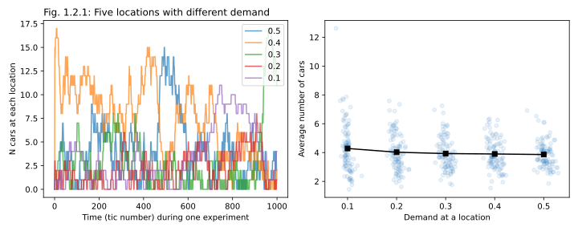

But let this flatness of car distribution not fool you: if we look at the activity at each station, at either the number of rentals from it (Figure 1.2.2 left), or the average idle time for cars at this station (Figure 1.2.2 right), we'll see the the locations were very different. The best of them created 5 times more car rentals than the worst of them, and had a much lower idling time (waiting time) per car. And yet in the long-run, all of them about the same accupancy.

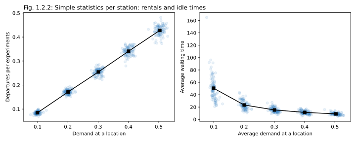

What does it mean for our business? It means that some of these locations were good (lots of rentals), and some of them were bad (few rentals), and still the cars distributed about equally among them. And when at the smallest demand location cars were idling, with long waiting times between rentals, were were probably wasting money, as we were still paying for these cars, but they weren't generating a profit.

> [!NOTE]
> Cars tend to distribute uniformly across all of your locations. Because of that, low-demand locations make cars idle for longer, which is of course bad for the business.

Can we make these financial intuitions a bit more precise? Of course we can: let's remember what we learned about CM1 and CM2 profits in the Chapter 0, and try to apply this logic to this case.

## Spatial CM2: The Theory

Now that we operate a group of parking stations within a city (even if, for now, a virtual one), we have an important question to answer: **Which of these locations are profitabe, and which ones are not? How to tell that?**

It's an easy question to ask, but not an easy one to answer, because obvoiusly all locations are somewhat interconnected: after all, we are working with a carsharing business here, where people are driving from one point in space to another. Opening or closing a location changes all flows in a city, and we need to find a way to isolate these effects, and ascribe them to individual locations. Because ultimately we want to know which parts of the city generate the  most profits, which parts are for now more of an investement, and which ones keep dragging the whole company down. Also, in the future, once we move from a collection of stations to a continuous city (or, in this document, a spatial model of a city) we will want to apply similar logic to zones withiin a city, and create nice colorful maps. So let's try to figure out how one can allocate profits and costs to geographical zones, despite the fact that our business by definition happens while customers are driven _between_ the zones, from one zone to another.

Let's consider a toy example below. A car was active in a city for 12 hours. Out of these 12 hours, for 3 hours it stood in zone **a**. Then it was rented for a 2 hour -long trip from zone **a** to zone **b**, and generated the company 10€ in CM1 (the units in this example may be a bit off, but let's keep the numbers siimple). Then it stood in zone **b** for 2 hours, was rented for 3 hours to go to zone **c**, generating 10€ more, and stood in zone **c** for the rest of the day (for 6 more hours). The total CM1 profit generated here is +20€. The total cost involved in this case is the cost of owning a car for 12 hours; to keep the math simiple let's assume it to be 12€ (it's a bit more than the number we use in the rest of the work, see Appendix, but it is still a reasonable estimate). Now, how can we allocate, distribute these profits and these costs between 3 zones?

To solve this case, and develop a generally applicable strategy for CM2 calculation, we need to consider three components of the total CM2:

1. CM2 costs while waiting
2. CM1 profits from rentals
3. CM2 costs while traveling

The situation with **waiting times** and associated CM2 costs (costs of leasing and operating the fleet) is rather straightforward: these costs are generated while the car is standing inside the zones (stations), so it only makes sense that we allocate . So we surely allocate 3 hours (and 3€) to zone **a**, 2 hours (2€) to zone **b**, and 6 hours (6€) to zone **c**. So far so good.

Allocating **profits** is a bit trickier. If a trip from **a** to **b** generated us 10€ in CM1, is it zone **a** or zone **b** that is the hero of the story? Which one should take the laurels? At one hand, it is the zone **a** that enabled the trip, and "provided" the customer who had driven this car; had we not operated in this zone, the trip would not have happened. On the other hand, a similar argument can be made about zone **b**: had we not operated there, had we not allowed our customers to end their rentals in zone **b**, this trip wouldn't have happened. In my practice, depending on the task, I've seen people using three different approaches here:

1. One approach is to **apply full rental CM1 values to both origin and destionation zones** (to double-count them). The upside of this approach is that the value of CM1 for each station becomes easily interpretable: in this case the CM1 of a station is defined as the total CM1 that we would have lost, if we closed this station (as in this case all trips both to and from this station would not have happened). This can be called a "marginal profit", or "marginal CM1/CM2", and we will return to this value later, in Chapter 4, in the context of Operating Area optimization. It is a good approach if you want to consider parts of your operating area one by one, and decide which ones to close, and which ones to keep. The downside of this approach is that you are literally double-counting the profits, and so the sum of CM1s (or CM2s) across all zones won't match the total CM2 for the city. It also would not allow you grouping CM2s of several nearby zones into one "combined CM2", as you'll double-count profits from within-group trips. To sum up, it's a good approach for executive decisions, and perhaps for CM2 maps (see below), but not for scorecarding.
5. To fix thsi problem we can agree to allocate CM1 of each trip to both the origin and the destination, but divide it somehow, for example by splitting it half-and-half. Now the sum of CM1 (and CM2) values across all zones would match the CM1 of the city as a whole, which is a useful feature. But if you build a map of an area using these CM1/CM2 calculation, some profitable (in the marginal sense) will seem unprofitable, so be careful.
6. Finally, the third, and simplest approach could be to apply the CM1 profit in full to the origin zone. It yields a straightforward calculation, which can be easily coded directly into an SQL query, and in many cases it would probably give you numbers pretty similar to that of a "symmetrical approach" above. In most cases, revenues generated by trips from **a** to **b** are more-or-less similar to that coming from trips from **b** to **a**, so in the long run the numbers would probably add up to a meaningful picture. The ony case when it may get weird is if you are using asymmetrical pricing with custom unlock fees and drop-off fees (penalties for starting or ending a rental; see Chapter 3), or dynamic pricing, coupled with non-trivial temporal dynamics of rentals. In this case a simplistic approach would yield biased estimations, so it's better to roll up the sleeves and calculate something slightly fancier.

Finally, strictly speaking, we are paying for our cars (for owning or leasing them) even when they are rented out, so in the example above, we beared **CM2 costs of owning cars during rentals**.: for 2 hours during the 1st rental, and for 3 hours during the second one. Should we include these costs in our calculation? A good argument for including them is one of consistency. If we apply CM1 profits to zones without double-counting (as described above), and then include full CM2 costs during rentals (also without double-counting), then the sum of CM2 profits across all zones will match the CM2 profits for the entire city, which is a really nice and useful feature. Therefore I recommend to allocate CM2 costs during rentals in exactly same way in which CM1 profits are allocated, as it would result in the most interpretable picture. A half-and-half split between origin and destination zones would be my method of choice.

> [!WARNING]
> While the idea of calculating CM1 and CM2 profitability in space is noble and extremely useful, there is no one single way to approach this problem. Depending on what you are trying to do, there are several ways to allocate CM1/CM2 profits to the map, so be careful about your decisions. Once business owners get used to your maps, they will keep interpreting them in the same way, and they won't be able to switch. Which makes the original choice of a formula for CM2 important, and somewhat political.

Let's now apply this logic to our toy example. On one hand, intuitively, when we look on the picture, how would you have ranked the zones, in terms of how good they are business-wise? You would probably agree that for this snapshot in particuler, zone **b** was the best one (short waiting time, two rentals), zone **a** was the next best, while zone **c** was kind of weak (a really long waiting time at the end). On the other hand, we now have a fancy formula to try:

$\displaystyle CM2 = \left( \sum CM1_{in} + \sum CM1_{out} \right)/2 - \left(\sum t_{wait} + (\sum t_{in} + \sum t_{out})/2 \right) C_t$

where $t_{wait}$ is waiting time while parked in the zone, $t_{in}$ and $t_{out}$ are in-transit times for incoming and outgoing rentals respectively, and $C_t$ is the CM2 cost of owning a single car per unit of time. Applying this formula to our case, and assuming a cost of car ownship of 1€/hour, we get CM2 values of $10/2 - 3 - 1 = +1€$ for zone **a** (so-so, breaking even), $10/2 +10/2 -2 - 1.5 = +6.5€$ for zone **b** (great, profitable), and $10/2 -6 -1.5 = −2.5€$ for **c** (bad, unprofitable), which matches our intuitions!

## CM2 in a collection of stations

Now that we agreed how to calculate CM1 and CM2 profits per location, let's check how our 5 locations fared in terms of their profitability. To make the plots more relatable, let's assume that each trip brought us about 5€ in CM1, and that keeping a car for a day costed us about 20€ in CM2 burden (see Appendix). Let's also assume that the mos high-demand of these five locations saw about 20 departing cars per day (and then we'll just simply scale simulated departures to this value). With these assumptions, the situation with CM1 is easy: it's just the number of departures we've seen above, now scaled to Euros (Figure 1.2.3, left). The weakest of locations brought us about 18€ a day in CM1, the best one, about 85€ in CM1.

As we move from CM1 to CM2 (Figure 1.2.3, right), we take our linearly increasing CM1 revenues and substract from them the costs of trapped cars, which are proportional to the average number of cars per station, and so are roughly flat (as on average, we ended up with about the same number of cars standing at each location). Our chain of point clouds moves down, and not surprisingly, the low-demand locations turn out to be deeply unprofitable, while our "best" location turned to be profitable on average (not in all runs, but in the majority of runs).

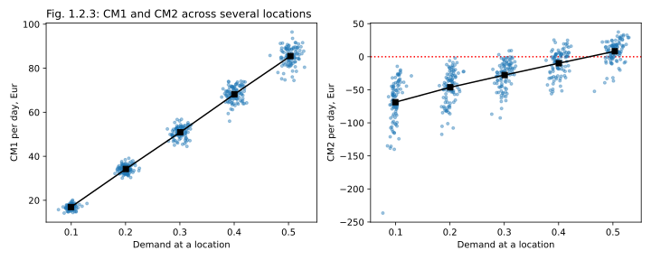

If we look at these pictures carefully, we may notice two more things. One, once we switch to the actual profitability (CM2), we get quite more noise in our data, on an experiment-by-experiment basis. The second-best location, for example, was ultimately unprofitable on average, but in about one third of runs it was performing quite OK. On these runs we just got lucky: a had a bit fewer cars standing on the location than usual, but the same time we missed not too many sales, resulting in a better CM2. Conversely, on some runs even our best location underperformed and eneded up costing us money, despite its profitability in the long-term.

> [!WARNING]
> Car-sharing business has to be data-driven, but remember that it is a stochastic system with small revenue margins, so the data is noisy, and the effects are small. A good location may sometimes cost your money, while a subpar location may bring an unexpected win. Don't be hasty, give it some time, don't close and open locations willy-nilly; make sure you get enough evidence to make a decision. Or, better yet, instead of only looking at the actual financial behavior of a location, also compare it with modeling results, assuming actual demand, but more balanced car distribution and fleet management.

Another interesting observation is that the distribution of CM2 profits is much wider for our "bad" location (the one with low demand), compared to the "good" one. This happens because this location is slower, cars stick there for longer, and the number of cars at it tends to be "sticky", in a way. If a slow location accumulates too many cars, they take forever to disspate, and vice versa, it takes longer for an unpopular location to get some cars, if at some point it ran empty. Counterintuitively, this can be seen as a good point: if your bad cars accumulates idling cars, if cars are standing there, without generating revenue, you have the time to react and intervene.

> [!TIP]
> As a counter to the "Warning" point above: if you can identify bad car distributions early, and intervene, either by moving cars around (Chapter 2), or by providing incensives through prices (Chapter 3), you can turn unprofitable days into profitable ones. And because it is slow cars that cost you money, you actually typically have the time to react.

## Service level and lost sales

At this point everything we talked about was how standing cars are bad for your business, and that the key to financial success seems to be in having as few cars at a location as possible. But surely it cannot be the end of a story, as if it were, then the winning business strategy would be to have one car per city, running back and forth between two "hot" locations, which does not sound right at all. So before we go further, let's briefly talk about service levels: the local availability of cars to meet the customer demand.

A simple way to measure service level is by calculating the demand fulfillment rate, or DFR: for every attempt of renting a car that a customer makes, we should check if there was a car nearby that could have met this demand. In real life, the calculation of DFR may be a bit tricky, as customers may use several different apps to check for cars, including aggregation apps that combine offers from several competing services; cars may be located closer or further from the customer, and cars can come up in different models, while the customer may have some preferences. But in our simulation measuring DFR is relatively straightforward: every time a random numbers generator "attempted" to move a car from one location to another, we will check if the source location had some cars in it, and if the movement actually happened. If there was no car there, then the demand was not fulfilled, making the DFR lower (and resulting in a missing sale).

Let's look at the interactions between DFR and profitability in our simple system (a constellation of 5 stations with different demands). Across all five locations, DFR wasn't linked to CM1 revenue too tightly (Figure 1.2.4 below, left). For each individual station, higher DFR resulted in slightly higher sales, as fewer sales were missed due to fleet unavailability (aka empty parking lot), but the effect of demand (stratification) was much stronger than the effect of DFR. If we look at CM2 profitability, however (below right), the cloud of dots is way more interesting. The way our cost and revenue constants are chosen (or rather, the way the life in car-sharing is), fleet costs and CM1 revenues have roughly similar magnitudes. Because of that, "lucky" and "unlucky" time periods within each station (runs with low fleet vs. high fleet) differ more in terms of CM2 than runs between different stations (compare to Figure 1.2.3 right below, where 5 clusters overlap across the Y axis). As a result, in the (DFR, CM2) space we get one unstriated cloud of points, with a notable negative correlation between DFR and CM2. Essentially, even though lower DFR was associated with lower CM1 (left), it also brought CM2 savings (lower costs of idling fleet), and thus higher overall CM2 profitability!

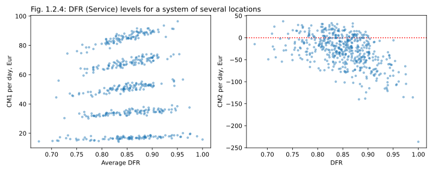

It makes it a good point to take a step back and think about the scope of our model, and about how well it captures the real world. We have just discovered that a few missed sales (some unfulfilled demand) does not necessarily ruin profitability, as lower avilability means a smaller trapped fleet at any given location, allowing cars to, supposedly, earn money elsewhere in the city. And this part is definitely true both in the model and in real life! But in real life unfulfilled demand also annoyes customers, ruins people's plans for the day, damages trust, erodes business reputation, and may ultimately harm the business in the long-term. We should therefore use Figure 1.2.4 above carefully, and draw a wise conclusion from it. When setting DFR as a KPI for your organization, it's smart not to go for 100% (or 95% for this matter), but at the same time we should ensure that it never drops below a certain critical, politically chosen DFR (probably somewhere in the range of 70-90%).

> [!TIP]
>  Aiming for DFR above 90% means trapped fleet, which quickly gets expensive. Lower DFR means higher CM2 profitability in the short-term, but keeping DFR low for too long erodes business. Aim for the middle ground!

As an aside, this observation also hints at why mobility service aggregators such as FreeNow, Tranzer, or Cabify, are a net good for modern ubranism, and the society as a whole. When lots of offers are available in the same app, any single company can afford to go a bit lower on DFR without upsetting the customer too much, as in the worst case they can alawys take an alternative (the competitor, or a taxi). This lowers the stakes for individual providers, simplifying market entries and expansions. If mobility services in a city are aggregated, new companies can afford to enter the market with a deliberately low DFR and relatively low prices, enjoying a few months of high CM2, by catching opportunistic rides, and not offering a reliable service. This constant risk of competition means that a healthy mobility market is not likely to be monopolized, which is ultimatley good for the city, and its inhabitants.

# 1.3 The Gaussian City

## 1.3.1 Getting to know the Gaussian City

What are the implications of this dynamics for a real city, with on-street parking and a continuous operating area? If we model a city like that, how will the cars distribute? At this point you probably have a very good guess for what the answer could be, but let's also try it in a simulation. A city is different from a previously dscribed collection of stations in several ways:

1. First, the operation area in most cities is continuous, but this can be reasonably well represented by a square grid of small pixel-like zones.
2. Second, in a city, the trips that people make tend to be at least somewhat local: while every now and then people do drive from one end of a city to another, on average, people tend to make way more short trips rather than longer ones[^Song2010]. We can however model this rather easily, by making the probability of a trip between zones $i$ and $j$ being proportional not only to the demands $ρ_i$ and $ρ_j$ in these zones, but also to a "scaling function" $p(d_{ij})$ that depends on the Euclidian distance between pixels $i$ and $j$ and decreases with $d$. The total probability of a drive between two pixels will therefore be approximated as $p(\text{drive}) = ρ_i ρ_j p_d(d_{ij})$ 
3. Finally, in a real city the distribution of demand values across zones is markedly long-tailed: there are typically relatively few hot and popular zones (usually in the city center), a few medium zones (high-density high-income living areas; local hotspots of commercial and recreational activity, etc.), and many low-demand zones, such as low-density housing and industrial areas. At the very least, we need to make sure that our demand values $ρ$ fall down fast enough as we get further away from the city center.

Let's sketch a hightly abstracted, but still qualitatively reasonable population density ditribution of a large European city. A typical "width" of a large European city is about 10 to 20 km. (For example, if we approximate "city size" by a square root of the nominal city area, we'll get 30 km for Berlin; 25 km for Hamburg, 20 for Vienna, 17 for Munich, 15 for Amsterdam). Let's pick 20 km for the width of our pixel grid. To make the center of the city more populated, and the periphery more sparse, let's model the population density as a Gaussian: $ρ(r) = C\exp(-r^2/σ^2)$, where $r$ is a radius from the center, $σ$ is the Gaussian width, and $C$ is an abstract constant that does not matter, as it will be renormalized during the Monte-Carlo simulation. To make sure that the densely populated "city center" fits nicely within our 20 km-wide square, let's set the Gaussian width $σ$ to 6 km, and to make calculations reasonably fast, let's set the pixel size (population density discretization) at 1 km. The resulting density is shown in the Figure 1.3.1 below, both as a collection of cross-sections (left), annd as a heatmap (right). And if you are concerned that the population density is not the best prediction of trip destinations, let's just agree that $ρ_i$ here represents the overall density of _worthy stuff_ at point $i$: it may be the people you want to visit, but also cafes, bookstores, restaurants, board game clubs, work offices, galleries, music schools, and other importaint points, worthy of driving to. It is reasonable to assume that a typical city would have more of these "awesome locations" in the center, and fewer of them in the periphery.

From studies of human mobility, we know that a distribution of travel distances across a typical city can be well approximated by decaying function[^Shaepfer2021]: as the distance increases, corresponding trips become increasingly rare, and are performed by increasingly smaller shares of population. Only a part of this exponentially decaying curve is relevant for car-sharing however, as the shortest trips (up to a few hundred meters) are typically walked on foot, with a gradual mode transition from walking to driving around distances of 1-3 km. In my personal experience, a distribution of trip distances for a European-style car-sharing (excluding long-term rentals!) can be approximated by an empirical function of $y = x \exp(x^α / λ)$ with coefficients set to $α = 1.2$ and $λ = 8$  [^distance_curve]; the resulting curve is shown below in the leftmost panel of Figure 1.3.2, below. Our trip distance distribution function $p(d)$ starts at 0, peaks at about 7 km, and then decays again to almost-zero at distances of about 20 km. As seen from panels 2-4 on the Figure 1.3.2 below, for a city that is ~20 km wide, the trips from any single origin point (marked with a red dot) still cover most of the city (black clouds represent the density of trip destinations). Locality only becomes visible when we consider trips from the very periphery of the city (rightmost plot), as in this case customers rarely drive beyond the geometrical center of the city.

> [!NOTE]
> Even in a relatively large but well-connected city, the operating area does not naturally break into directional clusters, and the fleet continues to mix. Even though user trips tend to be local, you won't have "western" and "eastern" cars in your city; all cars will form one large mixing pool.

Let's now put a bunch of cars in the middle of this map, and let the situation evolve freely for a few thousand time steps. 

## 1.3.2. Natural behavior in a Gaussian city

First, let's revisit the same question that we addressed in simulations of 2-3 parking locations: what type of the "eventual distribution" of cars can we expect in a "Gaussian city", with destination (and origin) density fading towards the periphery? Will the cars remain clustered in the center? I hope at this point you no longer hesitate to make a correct and depressing prediction: they don't. Eventually, if you wait long enough, cars end up being distributed uniformly, all over the place (figure 1.3.3 below).
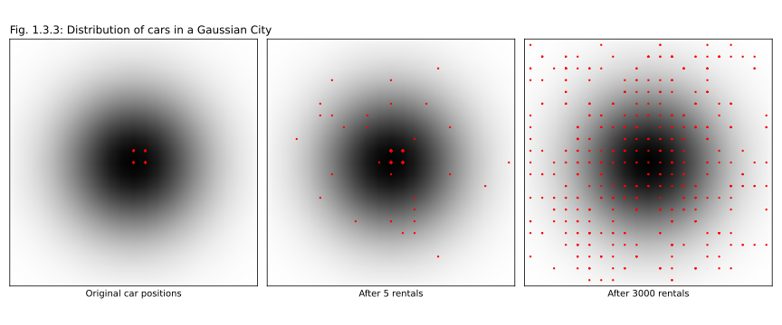
> [!NOTE]
> After enough rentals, you will as likely observe a car in a dense popular city center, as in a God-forsaken side-alley between the industrial area and the railroad. Give them enough time, they spread all over the place!

Let's now unleash the whole toolbox of measurements and visualizations on this city, starting with CM1 (Figure 1.3.4 below, panel 2). The map of CM1 is easy, almost trivial: the higher the demand, the more likely are rentals to start and end in this pixels, leading to high CM1. The visualization of idle times (panel 3) looks like a somewhat flattened "opposite" of CM1: average idle times are low in the middle, and get increasingly high towards the edges of the city.

CM2 is interesting (panel 4). It is highly positive (shown as blue) in the middle, where the CM1 component (the revenues) dominate, but it gets negative (red) on the periphery, as rentals decrease, while idle times start to grow. Note also that, unlike the profitable center, unprofitable areas look patchy and noisy, as most losses come from single cars that got stuck in "demand deserts", which kinda "by design" makes the map pixelated. The same is 100% true for real-life maps of real cities: profitable areas are smooth, while the unprofitable periphery looks like salt and pepper. Note also that the average color intensity of unprofitable (red) areas does not have to be as strong as the color intensity of profitable pixels (blue) to outweigh them, as the area of peripherall areas is larger than that of the center. A city always has "more" unprofitable areas, than profitable ones, so when calculating CM2 for the entire city, we end up integrating over a larger area. To illustrate this point, I made the fake city on this picture slightly unprofitable, losing about 900 Eur a day, despite a high number of total daily rentals (~4 rentals/car/day) and a powerful dense center, generating lots of activity. For this city, right now, losses in the periphery outweigh the profits. But fear not, in the next few chapters we'll discuss some ways to turn the tables, and make the Gaussian City a jewel of our business portfolio!

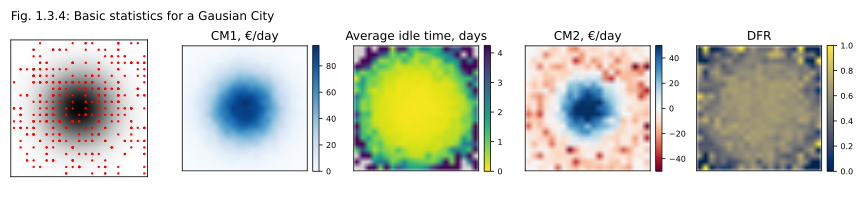
Finally, the last panel (panel 5, the rightmost one above) shows the map DFR. I guess, the key takeaway here is that DFR maps of a healthy cities are not always visually striking: the service level is kinda flat and monotone in the middle, and is set at a reasonable level of about 60%. On the periphery, you get a noisy landscape in which some pixels are never get covered by a car, while some have more than one car trapped, leading to a DFR of almost 100%. But this picture is decidedly not pathological. (For an example of a dramatic, pathological DFR map, look a bit further below)

Maps are colorful and they look fancy, but we can also look at scatteplots, plotting our KPI against the underlying demand levels (Figure 1.3.5). CM1 (panel 1) grows with demand; Idle time (panel 2) drops with demand, and does so very sharply. Because of that, CM2 (panel 3) starts as a fuzzy cloud of negative CM2 values for low demand (we lost more money in those pixels that trapped 2-3 cars, we did not lose much in a few pixels that by pure luck got a return trip soon after a car was parked there). But as demand grows, CM2 becomes positive. Finally, DFR (panel 4) is mostly flat, except for the low-demand pixels, where, again, the observed value of DFR depends on the random nature of rentals more than on the underlying qualities of each particular pixel.

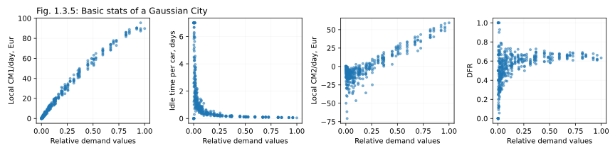

A perhaps more impactful type of visual analysis is that contrasting various KPIs with the financial bottom line (CM2), as shown on Figure 1.3.6 below. To get good financials (vertical axis, CM2), we want lots of rentals (panel 1), idle times per car that are under a day, ideally, less than 2-3 hours (panel 2), and a reasonable DFR (panel 3): not too high, but also not too low. Somewhere around 70% is probably a good target, at least for this city.

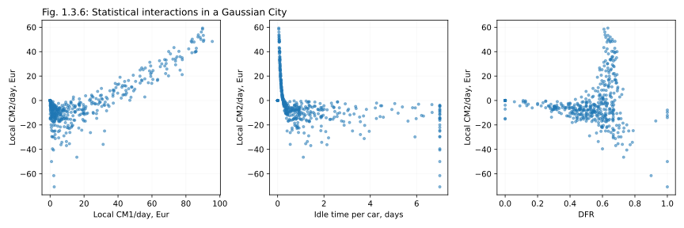

Can Gaussian city serve as a reasonable representation of a real city? The patterns we just described are mostly realistic, with one exception: there is one more pattern that is all too common in real European cities, and quite painful at that, that the Gaussian city for some reason does not demonstrate. But we can hack it a bit, and reproduce this little annoing pattern as well. I don't want to spoil the story, so bear with me: I'll describe a change we'll implement to the city, and then illustrate the pattern on a map.

The thing is, walkable cities tend to be relatively uniform in terms of population and destination densities in their inner cores: as you move from the suburbs to the center, at some point you get to a stable block structure, coupled with a height profile that is unique for every city, and this this dencity is maintained for a while. In contrast, a gaussian has almost linearly sloping sholders: until you get to the top, the dencity keeps growing. This makes the Gaussian City not a fair approximation of how Paris, Berlin, or Amsterdam look like. Let's therefore flatten the demand profile a bit. Behold a Flattened City! (Figure 1.3.5 below). Here we put a centered normalized 2D gaussian through a logistic function (panel 1), saturating it somewhat around 1, and adding a faster fall to zero (parks, industrial areas) at the periphery (panel 2). It results in a more disk-shaped, puck-shaped map (panel 3) with a uniform center. Let's now run our simulation on this city, and see we can spot a difference.

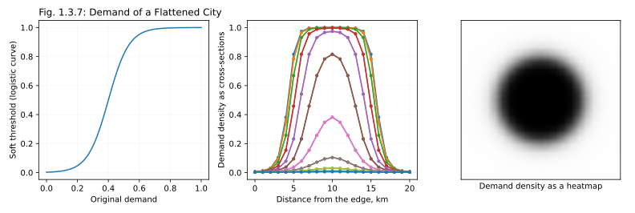

The results of the simulation are shown on Figure 1.3.8 below, and if you look carefully, the difference with a Gaussian city is quite striking. First of all, even the eventual distribution of cars (panel 1) looks different: thre are very few cars in the middle of the city, and lots of cars on the "dead" periphery. Which is absolutely what is happening in real cities, like Berlin or Madrid: unless you actively fight the distribution of cars (see chapter 2), city centers are quickly emptied of cars, while quiet "sleeping neighborhoods" are getting overloaded with idling fleet. In real cities this picture is further exacerbated by daily patterns of use and customer behaviors / psychology, such as asymmetiric modal preferences (driving a car into a city is often less pleasant than driving it away from a city), but suprisingly, even the basic math of our simulation replicates most of the pattern. Unlike for a Gaussian City, in a Flattened City, the drive of the center is not strong enough to offset the tendency of cars to spread. And while the map of CM1 (panel 2), and that of idle times (panel 3) look vaguely similar to that from a Gaussian city, the maps of CM2 (panel 4) and DFR (panel 5) couldn't be more different. This time around cars are definitely gathering on the periphery of the city (the red ring of negative CM2 values on panel 4), at the levels of service inside the profitable, popular part of the city, are abismal (panel 5). With cars getting "washed out" from the center, DFR in the city core drops to below 20%, making customers unhappy, and contributing to the image of carsharing as an unreliable offer. At the same time, the DFR on the periphery (where we don't need it), sits at 80% and higher.

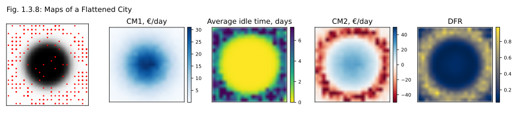
For the sake of completeness, let's revisit the plots about various KPIs contributing to the bottom line, that we have already built for the Gaussian City (Figure 1.3.6), but now plotting them for the Flattened City instead (Figure 1.3.9 below). The first two plots, while having a slightly different shape, basically tell the same story: high CM1 is good (duh! panel 1), while high idle times are bad (panel 2). The third panel, showing the effect of DFR, is a bit different this time around. In a "washed-out" city with an emptied center, the profitable inner areas are suffering (DFR of 20% and low), while unprofitable peripheral areas are basking in excess service (DFR of 70% and higher).

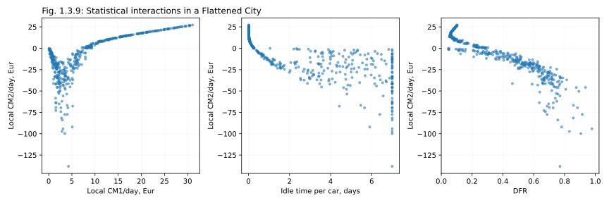

To summarize these results in a one-liner:

 > [!NOTE]
> In a typical city, cars tend to be parked in a pattern that is OPPOSITE to what you would have preferred. Unless you do something, cars are typically parked in the worst possible place.

Interestingly (and here you will have to believe me, as my next statement is not backed by any calculations), the maxim above can be generalized to cars of different models. Let's run a thought experiment, if you will. Let's say, you have a city with some large expensive electric cars with a good range, and tiny small cars with lower range. Alice needs to come from one of the suburbs on city periphery to the center. It's a rather long trip, along a fast highway, but she has a good choice of cars (because, as we just discussed, suburbs always have way too many cars parked in them), so she will proably pick a larger, smoother-running car with a better range. Then later, Bob needs to come from the center of the city back to the subub. Bob would have preferred a larger car as well, but the city center doesn't have enough cars, so Bob will reserve and drive the first car he can get, regardless of what model it is. And with that, we have just described an asymmetric customer behavior: customers tend to bring large cars to the center, but drive any cars to the periphery. Which means that, once enough time has passed, most tiny cars (ideal for traveling inside the city core) will be lost in the suburbs, while larger cars (ideal for the suburbs) will be more likely to be found in the city core. Leading to the following maxim:

> [!NOTE]
> The distribution of car models within the city is typically the OPPOSITE to what you would have preferred. Each part of the city typically gets the wrongest possible mix of models.

But as I have mentioned before, not everything is lost! There are ways to fix that, and we'll disuss them in Chapter 2!

# 1.4. Are simple models reasonable?

Now, before we dive into actions plans for improving the profitability of our city, and if you have the time of course, let's quickly talk about the the key abstractions and simplifications that we use in our models so far. Let's think once again if it is worth it, simplifing the system that way! Is the Poisson process approximation that se use reasonable? Because if it is, then we will retain it for all other models in this study, as it is simple, fast, and easy to code[^6]. If however it is unreasonable, if it makes our models unrealistic, then we would have to replace it with something more complicated before we dare to shape our business based on the outcomes of these models.

Here's the list of assumptions we made so far:

🔥🔥🔥 _ADD "Answers" right after the imperfection, only then summarize_

1. We assumed that rentals between different points can be approximated by a set of independent stationary Poisson processes. In reality, it is of course not true, so let's briefly discuss, why it is not true, and why it is probably still OK to ignore these details and use Poisson processes to model car rentals:
    1. Real rentals are correlated in time and space: every time there is an event in the city (e.g. a concerts, a demonstration, or an interruption in public transportation), this event would boost rentals in the affected area, slightly correlating them. We will ignore this effect, and asume that we work with average demands in each part of the city.
    2. In real life, if a customer went from point $i$ to point $j$ in a shared car, it is not unreasonable to expect that at some point they would go from the point $j$ back to the point $i$, as ultimately most customers have a place to live, to which they return regularly. We will ignore this fact. This simplificatoin is equivalent to assuming that our city has a decent system public transportaton, as well as, possibly, several competing car- bike- and scooter-sharing offerings. Essentially, we will assume that it is not the trips themselves that form a poisson processes, but a choice of our car sharing company as a mode of transportation. Which is probably a fair assumption for a healthy city with multiple mobility options.
    3. In real life, we have regular customers with preferred routes. In this model we will ignore them.
    4. We ignore rondtrips. In real life, it is quite common for a user to rent a car, drive it to a store, pick something without stopping a rental, and drive back. We don't include this type of usage in our models.
2. In real life, most rentals happen in the morning, then the activity calms down a bit, peaks again in the early afternoon, and mostly ceases late at night (a narrow morning rush hour and a longer, flatter afternoon rush hour). In our models we pretend that night and day do not exist, and rentals happen with the same average frequency all the time. It is easy to see that this simplification will not change the limiting (eventual) distribution of cars in the system, it will only "smoothen" the trajectory towards this end-state. Moreover, this simplifiatoin should not even change the average variations (fluctuatoins) of this spatial distribution over time. In real car sharing, the time (the frequency of events) runs faster during the day, and slower at night, but we will "zoom in" on morning events (by slowing them down), and "zoom out" of night events (by accelerated them). Still, all rentals will be captured, the total number of rentals over a course of a day will be represented, and the trajectory of every car through the city will be faithfully followed.
3. All trips are instantaneous, with no time spent in-transit. 🔥
4. We don't consider long-term rentals at all🔥

Let's sum up the effects of these simplifications: 🔥
* Some of them make our financials estimations conservative, as there's another constant income on top that doesn't change the location of cars (round-trips, long-term shipments)
* Some may make our estimations slightly optimistic, as there's a drain that traps cars in two bad locations, but doesn't change the location of cars, at the end of the day (commuting)
* A few ultimately don't matter, as they affect neither the distribution of cars in space, nor financial estimations, nor service quality (DFR, at least as long we are ignoring rush hours, and assume the time to be uniform)

# Footnotes

[^1d_random_walk]: This model is called a "one-dimensional simple bordered symmetric random walk with a reflective barrier". See for example: Alm, S. E. (2002). Simple random walk. Unpublished manuscript (2002). https://www2.math.uu.se/~sea/kurser/stokprocmn1/slumpvandring_eng.pdf
[^gamblers_ruin]: You can start at Wikipedia: https://en.wikipedia.org/wiki/Gambler%27s_ruin
[^diffusion]: It is obvious that people themselves don't perform Brownian walks; humans don't "diffuse", as they tend to always return to their starting point (also known as home). However if they randoml pick items on their way, and then randomly dispose them in space, as they do with shared vehicles, bikes, scooters etc., then the behavior of these _items_ will form a Brownian walk, even if one with some non-obvious scaling (see for example Song et al. 2010 below).
[^distance_curve]: These values are based on my vague recollection, and cannot be backed by any open data. Presumably, one could try to infer this, or similar, curve from open datasets, such as the one used in mobility scaling studies (see for example the reference for Schläpfer et al. 2021). Sadly a full justification lies out of scope of this study. 
[^Shaepfer2021]: Schläpfer, Markus, Lei Dong, Kevin O’Keeffe, Paolo Santi, Michael Szell, Hadrien Salat, Samuel Anklesaria, Mohammad Vazifeh, Carlo Ratti, and Geoffrey B. West. "The universal visitation law of human mobility." Nature 593, no. 7860 (2021): 522-527. https://par.nsf.gov/servlets/purl/10309392
[^Song2010]: Song, C., Koren, T., Wang, P., & Barabási, A. L. (2010). Modelling the scaling properties of human mobility. Nature physics, 6(10), 818-823. https://arxiv.org/pdf/1010.0436
[^6]: In fact, the approach we use in this work is a binomial approximation of a Poisson process, as our time is discrete, and we toss an unfair coin at every time tick, deciding whether a car needs to be moved or not. But let's ignore this fact for now. If the Poisson process, as a modeling tool, is good enough, then a slightly flatter distributed binomial approximation of a Poisson process is arguably also fine.