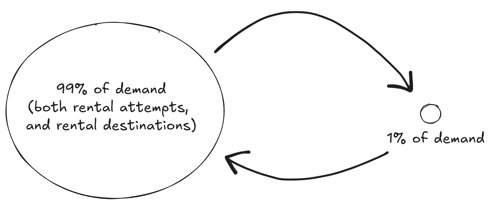
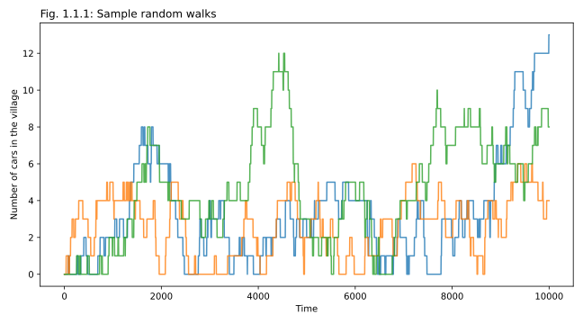
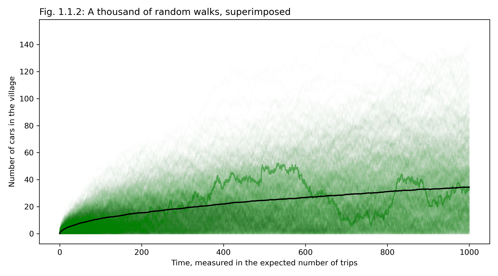
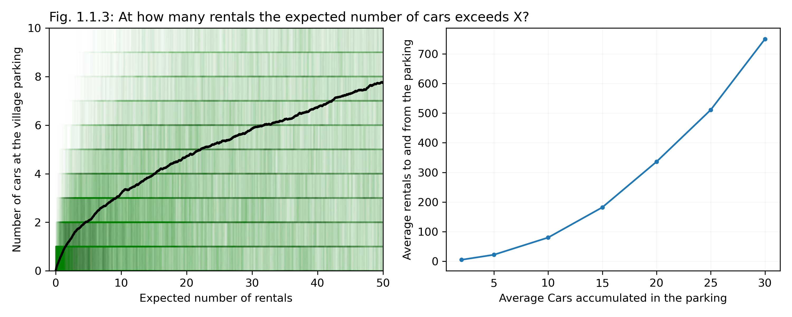
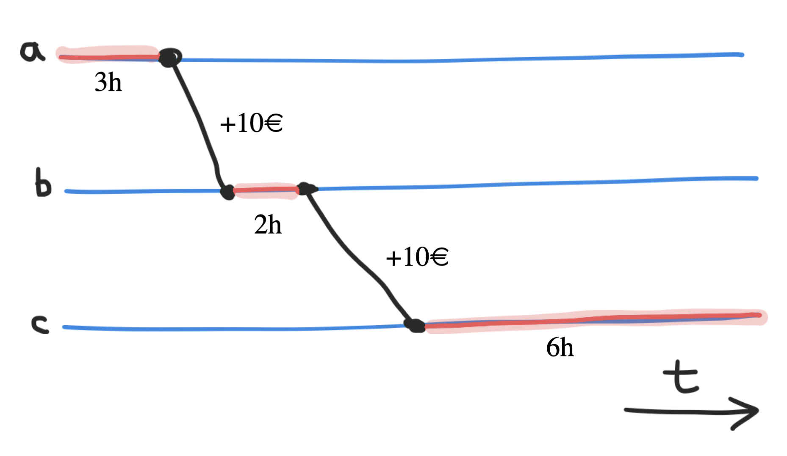
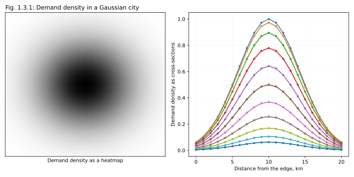
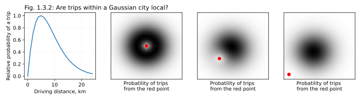

# 1. Cars in the wild: The natural behavior of cars

In this chapter we will talk about the "natural behavior" of shared cars in a city. We will look at three different models, gradually building the complexity of the system in question. In the first model, that I dub "A city and a village" we will assume that a small remote parking spot (we will also call it "a mobility station", or simply "a station") was opened in a small village near a big city with established, functional shared mobility. In the second model, we will consider several parking stations of different popularity, with users traveling between them. Finally, in the last model we will roughly approximate a typical European city with free-floating carsharing operations. Our goal for all three exercises will be to gradually build intuitions for the patterns observed in carsharing, and hopefully end up with a collection of useful take-away points.

# 1.1 A city and a village (a small, remote parking spot)

Let's start with the simplest thought experiment possible. Imagine a flourishing city with good, profitable free-floating carsharing, operating on fleet of 1000 lovely, popular electric cars. Now, imagine that there is a promising artsy village immediately nearby, with about 1% of population of the city, and with a proportional share of business that can serve as potential trip destinations (stores, restaurants, musical schools, offices etc.; see Figure 1.1.0 below). You decide to open a new parking spot in this village. Originally there are no cars in this small parking, all of them are in the main city, but people can rent cars from the city to go the village (about 1% of all people who start a trip in the city would wish to go to the village), and conversely, people can now rent cars to go back from the village to the city. Assume that the public transportation works well, so the probability of picking our cars over public transportation is about the same in both directions; we are not trapping anyone anywhere.

**The question:** if you leave this system to its own devices; if you let it evolve as it "wishes" to evolve, what will be the expected long-term distribution of cars, between the city and the village? How many cars, out of the total of 1000, will you see in the small village parking spot, on average? Assume that cars never break, that you don't need to do anything special to recharge them, that they require no interventions at all. Just a natural course of events, unfolding for several years (to be on a safe side). How many cars will be idling in the village, on average?

Don't read further, and think about this question for a second/ Make you bet, come up with a number, at least an approximate one, then proceed.

The chances are high that your guess was either 1% of total cars, or something slightly higher, like 5 or 10% (at least that's the answers that my friends gave me when I presented them with this problem). It feels "fair", doesn't it? One percent of demand _should_ be covered by about 1% of cars (so 10 cars in this particular case, as we assumed a total of 1000 cars in the system). It feels logical. But you may also feel that there has to be some catch here, so you would pad the number a bit, and offer a somewhat higher estimation, to be on a safe side.

This intuition feels quite strong, and I think it comes partially from the assumption of "fairness" of service, and partially from vague recollections of what we learned in school and college, as back then we saw diagrams like the one above quite often. Some people may remember a similar diagram from their chemistry classes, when they described a reversible reaction betweeen some chemicals, somethine like $A ⇆ B$. If every molecule transitions from $A$ to $B$ and back randomly, independent from each other, and the probability of going left to right is 0.01, while the probability of going right to left is close to 1, then each individual molecular would spend about 99% of the time in the state of $A$, and only 1% in the state of $B$. Which means that at any given moment about 99% of molecules will be found in the state of $A$. If you studied discrete math, you may also remember similar logic applied to equations on a directed graph (when calculating their spectra), or to travelers on internet websites (while calculating PageRank centrality). It's a very common diagram, and the answer seems familiar!

The problem is that this logic totally does not apply to our case. Both in chemistry and in random processes on a graph, the trick is that the flow is proportional both to the probability of transition from the node, and _to the amount of elements_ (molecules, users) in each node. This is what leads to the equilibrium: the more items you get in the "smaller" node, the stronger backflow you get, until the products of a large number of agents by a small probability of transition (left to right trips on the picture above) would become equal to a product of a small number of agents by a large probability (right to left trips). At this point the flows would cancel each other, and the system would come to an equilibrium. But this logic does not work for cars! Whether you have 2, 20, or 200 cars in the village, the probability of the next rental to the city won't change! It will happen when it happens, and the probability of this event isn't particularly great (only 1% of the total demand). Having more cars at the parking does not increase the number of rentals! (Unless we consider subtle changes in people's perception of the service, but that's obviously not the main driving force here, so let's ignore these nuances for now). The only situation when the number of cars at a parking matters _at all_ is when there are no cars, as without a car you cannot start a rental. A difference between no cars and one car matters, but two against one, ten against two, or a hundred against a dozen, all of these differences do not matter! There is no "invisible hand" to increase the backflow from the village to the city as the number of cars at the village parking lot randomly increases.

What does it mean in practice? Let's try to, again, imagine what is happening in this City-Village system, and maybe find a different intuition to follow. Let's assume that every now and then, with some relatively low probability, each of the inhabitants of this metropolitan area fancies to travel to some random destination. Real peope are obviously not completely random: they sleep at night and travel during the day, and also are likely to perform return-trips, arriving home in the evening. But for simplicity sake let's igore both the day-night cicle and the existence of return-trips, imagine "desires to travel" as uniformly intense over time and random in destination. Then "desires" to move are a Poisson process. In our system, in 99% of the cases the "desire to move" will point from the city to the village, and in about 1% of the cases, in the opposite direction. Not all of these people will even rent our cars, as there are surely other modes of transportation in the area. They will only rent a car if this particular trip somehow works better with a car (maybe they are transporting a cat, or are in a hurry), and only if they can find a car nearby. In this imaginary system, every now and then a car will randomly travel from a city to the village, and every now and then another car will randomly travel back. The _average_ flows in both directions will be the same, as 99% of population (those in the city) going to the village with 1% probability, and 1% of population (those in the village) going left with 99% probability would give you the same average flow. But if the processes are Poisson, then the sequence of these transitions (to the village and from the village) will be completely random! Sometimes trips will alternate, but in many cases we'll see a streak of cars going in one direction (unless the parking runs dry in the middle of the streak of course).

Which means that in practice this process of randomly sequenced trips to and from the city are equivalent to a croupier in a casino starting with 1000 cards in a pile on one side. They toss a coin,and if they get heads, they move one card to the right. If they get tails, they move one card to the left (if they can). Imagine this happening. If a croupier with a coin continues this process for a few hours, how many cards will the eventually have on the right? Or rather, what will be the eventual _expected_ (averaged over time) number of cards on the right?

I hope that at this point your intuition is starting to shift. Because what we are dealing with now is a random walk (also known as Brownian motion; see Figure 1.1.1 below). In our case it is a discrete (integer) random walk in 1D, and limited to a segment from 0 (no cars at the parking) to 1000 (the total number of cars in the system), but it follows the main property of 1D random walks: sooner or later it will hit every possible value[^1d_random_walk]. You have surely heard of random processes like that: this is why gambling is unhealthy, as even when gambling with a fair coin, sooner or later every gambler is guaranteed to hit zero on their account (a mathematical problem known as the "Gambler's ruin"[^gamblers_ruin]). Which happens precisely because sooner or later a random walk in 1D arrives at every available point.

But so, what is the expected _average_ number of cars at the village parking lot, in the long-term? You may suspect the answer already, even if it is really hard to believe: in this system (with random transitions in both directions, and the same average rate of transitions), in the long-term, on average, the village parking lot is expected to contain a half of all the available cars!

Which of course is absolutely bizarre!

Why don't car-sharing companies observe this behavior in practice? Let's not limit ourselves to just three sample walks, as shown above, but look at 1000 superimposed random walks, and show them on one figure, semi-transparent (see Fig. 1.1.2 below). Let's also calculate the average of all random walks at every point of time, and plot this curve in the same axes (in black), as an approximation for the evolution of the expected average number of cars at the village parking lot $E(N_V)$. To make the simulation easier, here, as in the previous figure, we use discrete time:  at every turn with probability of $p=0.005$ we have a car arriving (the number increasing by one), and with the same probability we have a car leaving (the number decreasing by one); the number starts at zero, and can never get below zero. The x-axis shows the expected total number of transitions to happen by this point ($2pn_t$, where $n_t$ is the number of passed time ticks). Also, for purely illustrative purposes, one of the random walks is shown slightly stronger than  others, as a solid green line.

We can see from the figure that the average number of cars in the village does indeed grow with time, but it grows _very slowly_. Theoretically, after 1000 rentals, we could have gotten 1000 cars in the village. It can theoretically happen even if the direction of  rentals is decided by a coin flip, just the probability of this event is  extremely low ($2^{-1000}$). Judging from the plot below, out of 1000 random trip sequences, quite a few brought more than 100 cars to the village, but most remained in the low dozens. Some runs also managed to clear the parking plot back to 0 by the time the 1000th rental was over. The most likely number of parked cars after 1000 trips was about 30 (the black line, as it crosses the right edge of the graph). We can conclude that the growth for the  $E(N_V)$ curve in this random process slows down considerably, and even though the true "equilibrium state" is still a 50/50 distribution, for all practical purposes this equilibrium will never be reached in a simulation.

But if you think of it, that we didn't get to 500 cars in this demo doesn't make our life that much easiesr. What _cannot_ be ignored is the very beginning of the curve, where it takes off from the original 0 value. Let's zoom in on this area and consider the evolution of the expected number of cars in the village during the first 50 first rentals (Fig 1.1.3, Left). The expected number of cars in the lot starts at 0, but grows very fast, reaching the average of 3 parked cars in just about 10 rentals! The reason for this fast growth is that at the very beginning of the process the odds are strongly biased towards growth: when you start at zero, you can only go up, you can't go down! Immediately after the new parking lot is opened, it tends to gobble and trap cars, for purely mathematical, probabilistic reasons; just because many potential rentals from the village to the city do not happen (due to parking lot getting empty at some point), while trips from the city to the village are always happening. It is only much later that the curve starts to slow down.

We can use the average (black) curve of $E(N_V)$ to estimate the number of rentals (in both directions, City-to-Village and Village-to-City) that would typically happen until $N_V$ cars are accumulated at the new lot. This curve, the inverse of the $E(N_V)$ curve that we just discussed, is shown in the right half of Fig. 1.1.3 above. It only takes 5 rentals (on average) to get 2 cars at the parking. After 24 rentals we can expect 5 cars to be trapped; after 85 rentals, about 10 cars; after 188 rentals, about 15. And even though the accumulation of cars slows down for large $N_V$, it is the first few rentals that are the most important. If we translate these curves into back-of-an-envelope approximate financial estimations, a tiny new location that only offers us about one rental a day will trap 2 cars in less than a week, earning us 5 €/day, but wasting 40 €/day in trapped fleet (using the approximate costs and values from the Appendix). In a month, if we do nothing, the same 5 €/day of income will be offset by more than 100 €/day in wasted fleet costs.

Which means that even from this insultingly simple simulation we can extract three important, practical take-away points:

1. Bad locations suck in and trap cars.
2. The number of trapped cars doesn't depend on the quality of the location, is not affected by the demand at this location, and does not get smaller for smaller locations! Smaller locations just accumulate the fleet slower, as the speed at which cars are getting trapped is proportional to the demand.
3. The first 2-3 cars are trapped very quickly, within about a dozen rentals.

Or, if you were to further condence these three thoughts into one message:

> [!WARNING]
> Don't open new locations unless you know for sure that they will work! Small parking places are your enemy, and the smaller the project, the more dangerious it is!

These points can very well be called "The fundamental problem of free-floating carsharing", as most operational and strategic fine-tuning that carsharing companies have to do, to survive as a business, are ultimately caused by this problem. Indeed, let's think for a second: how can one try to counteract this "unfair" accumulation of cars at bad locations?

* We can try to notice it when the cars are trapped, and move them to a different part of the city. This process is called "fleet relocations", and we will discuss it in detail in Chapter 2
* We can offer discounts for trips from the village to the city, and thus try to decrease the number of cars at a small parking. The pricing solutions to this problem will be discussed in Chapter 3
* Finally, if nothing helps, we can just close this horrible tiny location once again, or never open it in the first place. These sorts of decisions will be discussed in Chapter 4

But before we discuss the solutions, let's play a bit more with naive simple systems, to get a better intuition for how free-floating fleet "naturally behaves".

# 1.2 Collection of stations

🔥 Existing model

## Assigning CM2 contributions to parts of operating area

What is the average profitability of each of the stations in our model, if taken over a long period of time? While the motivation behind this question is deceptively simple and clear, the formula we would use to answer it is far from obvious. It is very reasonable to try to understand which parts of the city are generating most of the profits, and which parts are for now more of an investement, at best, or are draggings the company down, at worst. In the future, once we move from a collection of stations to a spatial model of a city we would want to be able to apply this logic to arbitrary zones in a city, to create some nice colorful maps. But how would one allocate profits and costs to geographical zones, when most of the interesting events happen while customers are driven _between_ the zones, from one zone to another?

Let's consider the following toy example below. A car was active in a city for 12 hours. Out of these 12 hours, for 3 hours it was standing in zone **a**. Then it was rented for 2 hours-long trip from zone **a** to zone **b**, and generated the company 10€ in CM1 (the units in this example are of course a bit off). Then  it stood in zone **b** for 2 hours, was rented to 3 hours to go to zone **c**, generated 10€ more, and stood in zone **c** for 6  more hours. The total CM1 profit involved is +20€. The total cost is the cost of the cost of owning a car for 12 hours (in practice, in 2023 prices, something between 6 and 12€). But how to allocate these profits and these costs between 3 zones?

1. The situation with waiting times and associated CM2 costs (costs of leasing and operating the fleet) is rather straightforward, as these costs are generated while the cars are _in_ the zones (stations). So we surely allocate 3 hours to zone **a**, 2 hours to zone **b** and 6 hours to zone **c**.
2. Allocating revenues is a bit trickier. If a trip from **a** to **b** generated us 10€ in CM1, is it zone **a** or zone **b** that is the hero of the story? Which one should take the laurels? At one hand, it is the zone **a** that enabled the trip, and "provided" the customer who had driven this car; had we not operated in this zone, the trip would not have happened. On the other hand, a very similar logic can be applied to zone **b**, as again, if we didn't allow our customers to end their rentals in zone **b**, this trip wouldn't have happened.
    * One approach is to allocate the revenue to _both_ the origin and the destination. For example, we can split the CM1 of each trip half-and-half between the origin and the destination zones. In this case the sum of CM1 values across all zones would match the CM1 of the city as a whole, which is a useful feature.
    * Alternatively, we can double-count the profits, and apply full rental CM1 values to both origin and destionation zones. In this case way more locations will become profitable, and the sum of profits for each zone won't match the profit for the city as a whole, which is of course not nice. However, in this case the value of the total CM1 profit allocated to each of the stations becomes easily interpretable: this would be the total CM1 that we would have lost, had we closed this station, as in this case _all_ trips to the stations, and from the station, would not have happened. This can be called a "marginal profit", or "marginal CM1/CM2", and we will return to this value later, in Chapter 4, when discussing the Operating Area optimization. Still, in most cases I would recommend against this approach, even if just for consistency sake.
    * A third, and simpler approach could be to apply the CM1 profit in full to the origin zone. It yields a straightforward calculation, which can for example be easily coded directly into an SQ query, and in many cases it would probably yield the numbers similar to that of a "symmetrical approach" immediately above. At the very list, this would be true if the revenues generated by trips from **a** to **b** are similar to that coming from trips from **b** to **a**. If you are using asymmetrical pricing however (see Chapter 3), this simplistic approach would generate biased estimations, and so I would not recommend it.
4. Finally, strictly speaking, we are paying for our cars (for owning or leasing them) even when they are rented out, so in the example above, we beared the CM2 costs of cars even during the two rentals: for 2 hours during the 1st rental, and for 3 hours during the second (these numbers are not shown on the picture, but the slant of transition lines suggests that the trips were not instantaneous). Should we include these costs in our calculation?
    * A good argument for including the costs is the one of consistency. If we apply CM1 profits to zones without double-counting (as described above), and then include full CM2 costs, including during rentals, without double-counting, then the sum of CM2 profits across all zones will match the CM2 profits across the entire city. Which is of course a very useful feature. In practice, one can for example allocate this cost in the same way in which the CM1 profits are allocated, and assign half of it to the origin zone, and half - to the destination zone.
    * Alternatively, we can decide to ignore the CM2 costs during rentals, but I don't recommend it, as it would make the numerical interpretation of results harder.

Let's check the logic of these suggestions by calculating the CM2 profitability of each of three zones for the image above. On one hand, intuitively, when we look on the picture, how would you have ranked the zones, in terms of how good they are business-wise? You would probably agree that for this snapshot iin particuler, the zone **b** was the best one (short waiting time, 2 rentals), zone **a** was the next best, while zone **c** was kind of weak (a really long waiting time at the end). On the other hand, we have now suggested the formula:

$\displaystyle CM2 = \left( \sum CM1_{in} + \sum CM1_{out} \right)/2 - \left(\sum t_{wait} + (\sum t_{in} + \sum t_{out})/2 \right) C_t$

, where $t_{wait}$ is waiting time while parked in the zone, $t_{in}$ and $t_{out}$ are in-transit times for incoming and outgoing rentals respectively, and $C_t$ is the cost of operating a single car per unit of time. Applying this formula to our zones, and this time only, assuming that 1 hour of operating a car costed us 1€ (which is _very expensive_) we get CM2 values of +2€ for zone **a**, +8€ for **b** and −1€ for **c**, which matches our expectations.

## Applying CM2 calculations to our model

🔥

# 1.3 Gaussian City

🔥 Rewrite this below, as it turned to be untrue:

In the previous model, we've seen that in a collection of "equidistant" stations, where the probability of a trip from one station to another only depends on their demand, the cars tend to distribute uniformly across these stations (but also with ebbs and wanes charasteristic for constrained brownian processes). But is it a good model for a real city? A real city is different from our idealistic collection of stations in two ways: first, in a city, the trips that people make are relatively local on average (ref🔥). While people can, and sometimes surely do drive from one end of the city to another end, most trips that people make tend to be relatively short, and contrained to their neighborhood. The other difference, which may or may not be important, is that in a real city the distribution of demand values across zones is markedly long-tailed: there are typically relatively few hot and popular zones (usually in the city center), a few medium zones (high-density high-income living areas; local hotspots of commercial and recreational activity), and many low-demand zones where people either live or work (or sometimes both). So let us check whether cars will still tend to distribute uniformly, if we introduce lots of pixel-like zones, assign some reasonable, spatially coherent demand to them (more in the center, less on the periphery), and force a realistic distribution on the distances of drives performed within this model city.

Let's start with sketching a hightly abstracted, but still reasonable population density for a large European city. A typical "width" of a decently sized European city is about 10 to 20 km. (For example, if you approximate "city size" as a square root of the nominal city area, you'd get 30 km for Berlin; 25 km for Hamburg, 20 for Vienna, 17 for Munich, 15 for Amsterdam). Let's then model a city that is 20 km wide. To make the center of the city more populated, and the periphery a bit more sparse, let's model the population density as a Gaussian (🔥 formula). To make sure that the densely populated "city center" fit in our 20 km-wide square, let's use the Gaussian width constant $σ$ of 6 km, and to make subsequent calculations faster, let's discretize this population density with a step (pixel size) of 1 km. The resulting population density is shown on the Figure 1.3.1 below, both as a heatmap (left), and as several cross-sections (right).

From the studies of human mobility, we know that a distribution of travel distances across a typical city looks like an exponentially decaying function (🔥 ref): most trips are fairly short, and as the distance increases, corresopnding trips become increasingly rare, and performed by increasingly smaller shares of population. Only part of this exponentially decaying curve is relevant for car-sharing however, as the shortest trips (up to a few hundred meters) are typically walked on foot, with a gradual mode transition from walking to driving around distances of 1-3 km. In practice, a distribution of trip distances for a typical European car-sharing (excluding long-term rentals) can be well described by an empirical function $y = x \exp(x^α / λ)$ where $α = 1.2$ and $λ = 8$  [^distance_curve]; the resulting curve is shown below in the leftmost panel of Figure 1.3.2, below.

How can we use this $p_d(d)$ curve (a relative probability of a drive $p_d$, as a function of distance $d$) to estimate the frequency of trips between different areas ("pixels") of our "Gaussian city"? Let's assume that the probability of a trip from point $i$ to point $j$ is proportional to the population density in these points, $ρ_i$ and $ρ_j$, but also to the willingness of people to travel the distance $d_{ij}$ separating these points: $p(\text{drive}) = ρ_i ρ_j p_d(d_{ij})$ .

 With this distribution of trip distances, would trips from each of the pixels of our "Gaussian city" be mostly local? As it can be seen from the remaining 3 panels of the figure above, not really. Our empirical, but at the same time rather realistically modeled trip distance distribution function $p_d$ starts at 0, briefly increases, and then decays again to almost-zero at distances of about 20 km. But also we assumed our entire city to be about 20 km wide! Because of that, trips from any single origin point (they are marked with a red dot on the three plots above) still cover most of the city (black clouds represent the spatial density of relative trip destinations). In other words, even in a relatively large but well-connected city, car-sharing users often cover most of the city in one trip. Locality only becomes visually obvious when we consider trips from the very periphery of the city (rightmost plot above), as in this case customers rarely drive beyond the geometrical center of the city.

(If you are concerned that the population density is not the best prediction of trip destinations, let's just agree that $ρ_i$ represents the overall density of _worthy stuff_ at point $i$: it may be the people you want to visit, but also cafes, restaurants, bookstores, board game clubs, work offices, and other importaint points, worthy of driving to. It is reasonable to assume that a typical city would have more of these worthy locations in the center, and fewer of them on the periphery: in fact, it is more likely )

* 🔥 That we will be assuming no round-trips, so our estimations will be conservative, as essentially we are looking on ly at short-term car-sharing, and some long-term car-sharing will be always happening "on top", and also potentially grow with the growth of the operation area (as it will become convenient for ore and more people)
* 🔥 Raise a question about how to allocate revenues and tarnsit times. Introduce and build a fair CM2 map (half-half)
* 🔥 Explain that red on this CM2 map doesn't mean that this part needs to be closed - an example of marginal CM2 map + the idea of active users

It is also important to note that in practice, depending on the business model of a car sharing provider, somewhere between 10 and 50% of rentals are relatively long-term rentals (from several hours to several days). Because of that, the actual distribution of rental times (or rental driving distances, or revenues per rental) is typically bimodal, with a second "peak" that is very broad and shallow, but financially significant. For these rentals the concepts of "origin" and "destination" don't quite make sense, as the majority of these rentals are close to round-trips (customers starting from home, and returning home a day or two later), and the concept of Home Area becomes important only insofar it allows an easy and painless rental, and a good customer experience. It means taht for all "city models" that we explore here, our estimations for CM2 profitability are intentionally conservative (we can always assume that a good measure of long-term rentals are happening on top of the short-term rentals discussed here), and that the actual share of round-trips at each location will be higher than what one can conclude from the trip length distribution introduced above. Fortunately, the presence of long-term trips does not affect any of the results discussed here, except that the long-term trips would consume part of the available fleet, and so compared to our simulations, in real life, the fleet in the city should be increased proportionally.

* 🔥 Build a DFR map

# Are these simple models reasonable?

🔥 But before we go any further, let's review the key abstractions and simplifications that we used in the model above, and consider if these simplifications are worth it. If Poisson process approximation is reasonable, we should retain it for all other models in this study, as it is simple, and easy to code[^3]. If it is unreasonable, and makes our models too unrealistic, ten it should be replaced with something more complicated. 🔥

1. We assumed that rentals between different points can be approximated by a set of independent stationary Poisson processes. In reality, it is not true of course, so let's briefly discuss, why it is not true, and why it is probably still OK to ignore these details and use Poisson processes to model car rentals:
2. Real rentals are correlated in time and space: every time there is an event in the city (e.g. a concerts, a demonstration, or an interruption in public transportation), this event would boost rentals in the affected area, slightly correlating them. We will ignore this effect, and asume that we work with average demands in each part of the city.
3. In real life, if a customer went from point $i$ to point $j$ in a shared car, it is not unreasonable to expect that at some point they would go from the point $j$ back to the point $i$, as ultimately most customers have a place to live, to which they return regularly. We will ignore this fact. This simplificatoin is equivalent to assuming that our city has a decent system public transportaton, as well as, possibly, several competing car- bike- and scooter-sharing offerings. Essentially, we will assume that it is not the trips themselves that form a poisson processes, but a choice of our car sharing company as a mode of transportation. Which is probably a fair assumption for a healthy city with multiple mobility options.
4. In real life, we have regular customers with preferred routes. In this model we will ignore them.
5. 🔥 roundtrips
6. In real life, most rentals happen in the morning, then the activity calms down a bit, peaks again in the early afternoon, and mostly ceases late at night. In our models however we will pretend that night and day do not exist, and rentals happen with the same average frequency all the time. It is easy to see that this simplification will not change the limiting (eventual) distribution of cars in the system, it will only "smoothen" the trajectory towards this end-state. Moreover, this simplifiatoin should not even change the average variations (fluctuatoins) of this spatial distribution over time. In real car sharing, the time (the frequency of events) runs faster during the day, and slower at night, but we will "zoom in" on morning events (by slowing them down), and "zoom out" of night events (by accelerated them). Still, all rentals will be captured, the total number of rentals over a course of a day will be represented, and the trajectory of every car through the city will be faithfully followed.
7. All trips are instantaneous, with no time spent in-transit. 🔥

What is the probable effect of these simplifications? 🔥
* These make our estimation conservative, as there's another constant income on top that doesn't change the location of cars (round-trips)
* These may make our estimations slightly optimistic, as there's a drain that doesn't change the location of cars, at the end of the day (commuting)
* These ultimate don't matter, as they affect neither the distribution of cars in space, nor other measures, like financial estimations, or service quality = DFR (uniformity of time)
* These don't affect the distributio nof cars in space, but introduce biases between this distribution at one hand, and DFR & financials at the other (transit time)

# Footnotes

[^distance_curve]: A private communication of a former colleague, who preferred to remain anonymous. 
[^1d_random_walk]: This model is called a "one-dimensional simple bordered symmetric random walk with a reflective barrier". See for example: Alm, S. E. (2002). Simple random walk. Unpublished manuscript (2002). https://www2.math.uu.se/~sea/kurser/stokprocmn1/slumpvandring_eng.pdf
[^gamblers_ruin]: You can start at Wikipedia: https://en.wikipedia.org/wiki/Gambler%27s_ruin
[^3]: In fact, the approach we use in this work is a binomial approximation of a Poisson process, as our time is discrete, and we just a toss a very unfair coin at every time tick, deciding whether a car needs to be moved or not. But let's ignore this fact for now. If the Poisson process is fine, as a modeling tool, then a slightly flatter distributed approximation of a Poisson process is probably also fine.
