# 2. Relocations

In the previous chapter we discussed how cars tend to be trapped in low-demand areas even as high-demand areas suffocate without fleet. One obvious way to try to fix this is to develop a habit of intervening! What if every now and then we would find a car that is stuck on a service road between a highway and a garbage-collecting station, pay a hired driver, and "by force" move it to the center of the city? We will call this a **relocation**!

But do we really have to do that? Why would we _spend our own money_ on moving cars from one area of the city to another? It's one thing to sometimes perform unavoidable service drives: bringing broken cars to a workshop for example, returning them back to the city, or moving cars to charging poles and gas stations to charge and refuel. But if a car is clean and sound, and is just standing suboptimally, isn't it better just to wait? If someone traveled _to_ this location at some point, then surely sooner or later someone else would travel _from_ it, right? Shouldn't we just wait?

From Chapter 1 we know that the answer to this rhetorical question is a resounding "NO"!! The default, "natural" distribution of cars within the city is _horrible_ for business, and can ruin a carsharing company in no time, by rendering it unprofitable. Until carsharing becomes a dominant form of car-use, making high service level (DFR) the top priority, cars have to be redistributed to optimize profits. This phrase may sound annoyingly capitalist and exploitative, but even from the most leftist and altruistic point of view, to have the highest societal impact, in terms of reducing the carbon footprint of the city, while also helping with a modal shift and improving the quality of life, carsharing companies should invest in their operations, pumping any spare money into expansions, better fleet, car cleaning etc. It is much better for _everyone involved_ if we make carsharing reliable and pleasant, rather than paying for cars rusting in forgotten backstreets, covered with leaves and pigeon droppings.

Moreover, even putting the stable state distribution of cars aside, from Chapter 1 we know that on any given day the distribution of cars across different zones and stations is inherently volatile: rental cars are prone to spontaneous pile-ups at random points on the map. These fluctuations of fleet density within the city obviously hurt fleet utilization and business efficiency, as every pile-up of cars in one part of the city means that some other part doesn't have enough vehicles, with customers getting frustrated. To maximize the positive impact (and also, to survive financially), we need to learn to identify these "pile-ups" early on, and redirect idling cars to where they are most needed at the moment. The presence of relocations in a city is not a sign of inefficiency! The other way around, it's a sign of a responsible mobility company, fighting a never-ending fight against entropy.

There are of course also other, more complicated reasons to relocate a car. For example, due to bad transportation planning, a whole district of a city can have access to a good comfortable train in the morning, to bring people to work, but no good train in the evening, to bring them back (or the other way around). In a situation like that, day after day, customers would tend to take a train in one direction, but would prefer taking a shared car back, accumulating them in one particular part of the city. Situations like that do happen in real life, and a good relocation system should be able to automatically identify and rectify them, optimizing the distribution of cars in space.

> [!TIP]
> It is important for a carsharing company to contract drivers, to relocate idling cars from slow to hot parts of the city. (At least until we get self-driving cars that can relocate at night on their own).

So let us learn to relocate! We'll now return to the three previously described models: we'll start with a "One station" model (aka a city and a village nearby); then switch to a "Multiple stations" model, and finally apply what we learned by then to "Gaussian city", to see how the presence of relocations changes the financials of a "virtual company" operating in this model universe.

# 2.1. One station

In chapter 1 we discussed how even a very small station, once opened, starts to accumulate fleet: first linearly and quite rapidly, then slowing down more and more, but still approaching a ridiculously unfair share of the total fleet that is not proportional to demand, but follows a uniform distribution across the points of rental. We also mentioned that relocations may be one potential answer for this problem. So, what will happen if we repeat the simplistic experiment from chapter 1.1, but now with a hard limit on the maximal number of cars at the station?

A visual answer to this question is shown on Figure 2.1.1 below. Here a small "village parking lot" is, again, opened near a large city, and the village is offering 1% of the total demand in the area. As before, attempts to travel by a shared car form a poisson process, but a trip cannot happen if the lot is empty, and there is no car to rent. The only difference is that now the fleet at the village parking lot is capped from above at 10 cars. If the 11th car enters the lot via stochastic rentals, it is _immediately_ relocated back to the city at our expense.

In the left panel we can see 500 random traces that a model like that can follow (green), and an average of all these traces (black), representing the most probable evolution for the number of cars in the parking lot. The curve takes off from 0 as rapidly as in an "unconstrained" model, but then gets very quickly saturated at 5 cars, which is exactly a half of the maximal occupancy (10 cars) that we allow to the lot in this model. This makes sense: in the presence of relocations, the number of cars at the lot also follows a "one-dimensional bordered random walk with a reflective barrier", but now the upper border for the number of cars at the lot is not equal to the total number of cars in the system, but to the artificial limit we imposed. The trajectories of $N_V(t)$ randomly move between 0 and 10, eventually occupying every state (every number from 0 to 10) with equal probability, placing the expected number of vehicles $E(N_V(t))$ at half the limit $N_{\max}$. 

The right panel shows a plot of average relocation frequency over time, and similarly to the average $N_V(t)$ curve, once the system stabilizes, the expected relocation frequency becomes roughly constant (even if more variable). It turns out that there is a simple formula for the average frequency of these relocations. Let's say that the flow of cars to this small parking space happens at a rate $λ$, and as discussed, a discrete one-dimensional bordered random walk is equally likely to visit all points from 0 to $N_{\max}$. Then the probability that a new arriving car will find the parking lot at top capacity of $N_{\max}$ will be equal to $P(N_V=N_{\max}) = 1/(N_{\max}+1)$, and the rate of relocation, relative to the rate of inflow $λ$ will be equal to $\frac{λ/N_{\max}}{λ} = 1/(N_{\max}+1)$. And just in case you don't believe this calculation (as strictly speaking we never proved that a random process like that will lead to uniformly distributed values of $N_V$), Figure 2.1.2 below shows an "experimentally" observed chart of relative relocation frequencies from a simulation (500 experiments per point, 6500 time points per experiment), together with a "theoretical curve" of $1/(1+N)$.

> [!TIP]
> The lower the target number of cars at the station, the more you will have to relocate to maintain it.

Having this simple equation at our disposal, we can now tackle a new type of problems: instead of modeling our "village parking lot" explicitly, with an agent-based model, we can directly calculate the average profitability of its "stable state", over a long period of time. Assuming that the number of cars at the parking lot is limited at $N_{\max}$, we can expect its financials to have the following components:

* **Rental profit** coming from $λ$ incoming and the same number of outgoing trips per day (on average, as $λ$ is a rate of a stochastic process). Assuming that each trip brings us $π$ in CM1, we can expect an average rental profit of $2λπ$. 
* With the number of cars limited at $N_{\max}$, we can expect to have $N_{\max}/2$ cars at the parking lot on average, and so will bear a **CM2 loss** (through car costs / leasing rate) of $CN_{\max}/2$, where $C$ is a daily cost of having an extra car in the fleet.
* To limit the number of cars, we'll have to relocate cars back to the city at the rate of $λ/(1+N)$, and so will be spending on average $λr/(1+N)$ on relocations, where $r$ is **relocation cost** (the amount of money we'll have to pay to contractors, or our own people, to relocate this car)
* Finally we need to account for the fact that when the parking lot has no cars in it, it is impossible to rent a car from it back to the city, so some rentals that we already counted in the $2λπ$ formula above will in fact be lost (**missed sales**). How many rentals will be lost? We can use a little trick here, and remember that once the number of cars $N_V$ is trapped in the $[0, N_{\max}]$ interval, it will visit every space with the same probability, meaning that the rate of attempted decreases in $N_V$ when the lot is at zero (attempted outgoing rentals) will be the same as the number of attempted increases in $N_V$ when the lot is full (incoming rentals when the lot is at $N_{\max}$). The situation is fully symmetrical! Except that when the lot is full, we are paying a relocation cost $r$, but when the lot is empty, we are _missing a rental_, which is equivalent to losing one CM1 contribution of $π$.  Therefore, the total loss from missing rentals will be equal to $πλ/(1+N)$.

Combining these 4 components in a single formula we get an equation for the average long-term a single station profitability (CM2), as a function of plot use, maximal number of cars tolerated at the plot, and a set of financial coefficients:

$\displaystyle CM2 = 2λπ - C \frac{N_{\max}}{2} - \frac{λ}{N_{\max}+1}(r + π)$

A few reasonable curves for this equation, assuming our standard values for the financial coefficients ($π$ of 5 €/trip, $C$ of 20 €/car/day, and $r$ of 20 €/relocation), are shown on Figure 2.1.3 below. We can see that a small parking spot can hope to break-even if it generates about 8 rentals/day in one direction, on average (or 16 rentals in+out), and for this to happen, we need to limit the number of cars at this lot at 3-4 cars. If we relocate less often, cars will accumulate, and we will start losing money because of idling cars. If we relocate too eagerly, we will lose too much in wasteful relocations and missed rentals. For more popular locations ($λ > 8$) the curve becomes flatter, and we can afford to relocate way less often. For less popular locations ($λ <8$), it is impossible to achieve profitability.

We can also see from these four curves on the left that the optimal number of cars at the parking grows with the rate of rentals generated by this parking. For a "dead" location with only 2 rentals a day (one direction), technically, the "best" number of cars is 0 ($N_{max}$ of 1). Every single car trapped in this horrible place means wasted money. For a slightly more active plot with 5 rentals a day, the optimal maximal number is 3. For plots with 8 and 10 incoming rentals a day, the optimal $N_{\max}$ is 4. In short, for any given set of financial coefficients $(π, C, r)$, we can build a curve (right panel on Fig. 2.1.3 above), or rather a step-plot, of optimal triggers for relocation as a function of plot popularity (the average demand rate $λ$). A curve like that may even be used practically, for manual relocations, in case an automated system (see below) is for some reason unavailable.

The profitability formula above is simple enough to find optimal relocation trigger values analytically, without a need for explicit modeling. Let's temporarily "forget" that the formula for CM2 above is written for an integer process (that the value of $N_{\max}$ is technically an integer), let's instead "pretend" that it's a continuous variable, differentiate by it, equate the resulting expression to 0 and solve it for $N_{\max}$. This exercise gives a formula below, which can then be rounded to the nearest integer value, producing the same ladder of values that we already saw on Fig 2.1.3 (right).

$\displaystyle N_\text{opt} = \sqrt{\frac{2 (r + π) \lambda}{C}} - 1$

Equipped with this formula, we can now find the optimal relocation rate (or rather, relocation threshold) from an isolated parking lot with any level of demand, observed or expected. And once we know this optimal relocation rate, we can put it into the formula for CM2 above, and build a curve of **maximal possible profitability of a parking station**, as a function of demand at this station. The curve for the same financial parameters as before (20 €/car/day of leasing/ownership costs, 20 €/relo, 5 €/trip CM1 in profit; see "Appendix" for comments) is shown below (Figure 2.1.4). It starts below zero, as for a no-demand location every car needs to be relocated "to the mainland" immediately. Then it somewhat counterintuitively dips even further down, as the rate of required relocations increases, but the rentals don't yet contribute much to the economy of the parking lot. At some point however the curve starts to recover, and then at some critical demand (for these parameters, at about 8 rentals/day _in one direction_) the parking lot breaks even, and becomes steadily more and more profitable as the demand grows.

> [!TIP]
> 10 rentals/day one direction (from the station to the city) is a good "Rule of thumb" threshold for a newly opened location to be profitable. If you have reasons to expect the new location to generate 10 rentals a day on average, you can open it.

Calculating a curve like that for your actual CM2 cost, relocation cost, and CM1/trip in a city would give you a very good starting point for deciding which locations are worth opening or retaining. If a location doesn't offer enough demand, it will be a burden for business, but once it breaks even, it can become a good investment for the future. In Chapter 4 we will talk more about the concepts of shrinking and expanding the operating area, one location at a time.

If your company has a dedicated "sales" department, with people trying to negotiate with businesses and municipalities about opening a station at their premises, it's also useful to communicate this approximate ballpark value to them, so that they could prioritize their projects. 2 rentals a day are not worth fighting for. 15 rentals a day is a no-brainer. 5 rentals a day is a borderline case where assumptions and long-term projections suddenly become important.

**Aside: A case of Autonomous Vehicles**

Before we return back to "normal" scenarios let's indulge in a little aside here. How could autonomous vehicles (should they ever happen) change this picture? Usually when people think about autonomous vehicles, they think about a person sleeping or working in a car while a car is wheezing along a highway. But in the case of urban mobility there is another interesting application to autonomous driving: slow, safe, driverless and _userless_ relocations in the middle of a night. Imagine a city in which every car parked in a dark God-forsaken alley would carefully crawl out of this alley at about 2 am, when there's almost no one on the streets, and slowly, carefully move itself towards a target parking station, to be picked up by humans in the morning. How would this change the economics of relocations?

Above (Figure 2.1.5) is a version of the same graph as before, but for a scenario where cars are very expensive (50 rather than 20 €/day in CM2 costs), but the relocations are very cheap (3 rather than 20 €/relo, accounting for electricity costs and amortization, see Appendix). The non-linear dip for small stations is gone; there is still a clear threshold, but this threshold is now way smaller, at 4 rather than 8 rentals a day (one direction). In other words:

> [!TIP]
> If autonomous relocations ever become available, they will make car-sharing more profitable and accessible, even if they are not allowed to transport humans! That's because we will be able to offer smaller, less popular stations by performing cheap relocations at night.

# 2.2. Draft relocation algorithm

Before we move from one to several locations, let's talk a bit about the logic of relocations. To perform a relocation, both in real life and in the model, we need to find the best car to relocate, and a good destination to move it to (a station, a zone, or more generally a position within a city). Let us assume that our goal here is to maximize profits (as opposed to, for example, promoting our services, undercutting competition, or achieving a certain level of customer experience). Let's also agree that we are going to maximize these profits by maximizing revenue: we don't want cars to stand idly in forgotten side alleys without serving customers; we want them to be rented again and again, as often as possible. In real life we may also be concerned about reducing losses, such as vandalism and theft, or by optimising the costs of operations, such car cleaning, recharging, refueling etc.; we'll revisit these topics briefly in section 2.9 below, but for now let's ignore everything except the rental-driven profits.

Under these assumptions, the task of maximizing profits is roughly equivalent to the task of minimizing the average idle time for the city. Every time the car is idling without being rented, we are incurring an opportunity cost, as somewhere in a different part of a city there's almost certainly a customer looking for a car, and not finding any. We can therefore try to find cars idling in a low-demand zones, and move them to an empty, or at least underserved, high-demand zone.

Which means that to sketch a relocation system we need to solve two practical questions:
1. We need to be able to find the worst-placed car, among all the cars that we have. The car that is expected to be stuck in-place for longer than other cars in the city.
2. We need to learn picking a good target zone for this car: a hot zone from which this car will be rented in minimal time.

Let's start with **question 1**. How to identify a car that is stuck in a really bad zone? The first intuition that you may have is that we need to look for a car that is already idling for a long time. It is definitely a reasonable thing to do, as a car that is standing in place for 2-3 days without any rentals is mostly likely to be in some sort of a trouble! But at the same time, what we are really after here is the car that is expected to be idling _in the future_, not the car that was idling in the past. The two things are related, but may nevertheless be different in practice: imagine two identically horrible zones, one with a single car that is already idling for a day, another - with three cars that had just arrived there a minute ago. If you think of it, in a situation like that you need to relocate one of the three freshly arrived cars first, as not only the zone is terrible, but we now have a cluster of cars that will take forever to "dissolve" on its own. The past idle time matters, but the expected idle time also depends on the number of cars in the vicinity.

In real life, it would probably mean creating a predictive machine learning solution (see section 2.9 below), but in our models we want to go with something simpler. Moreover, as all we need to do is to find the best car to relocate, once the decision to relocate _something_ has been already taken, we can afford not to think about CM1 or even about idle times, as we won't need to justify whether this relocation is profitable by itself. All we need to do is to find a car that is stuck, and that is likely to remain stuck for longer than other cars. Let's therefore concentrate on a very simple measure: the probability that a car would be rented at the _next time tick_. As before, we will assume a stationary Poisson process with a rate of $d$. We will also serve customers via fixed stations (as it was previously described in section 1.2), and we will assume that all cars within a station are equivalent and interchangeable. In this case the frequency of a rental event for an individual car is just the frequency of demand events (attempts to hire a car, $d$) distributed over the number of cars at the station $n$: $p = d/n$. Which means that if we have to find the best car to relocate, we should pick a station with the lowest demand per car value $d/n$, and pick any car from this station. (Interestingly, had we looked at the expected CM1 effect, we would have arrived at almost the same formula, but we'll leave this longer discussion until later, section 2.8),

Now we need to address **question 2** and find the best _target_ station to relocate a car to. For this, we need to find a station with the _lowest_ expected idle time _after_ the car is relocated to it. Let's again switch from expected idle times to the simpler task of maximising the probability of a car being rented at the very next time tick. If a station has a demand of $d$ and $n$ cars already parked in it, then the expected demand per car, after the relocation, will be equal to $d/(n+1)$. We need to add 1 to the current number of cars, to account for the new car we're bringing in. Which gives us a reasonable practical rule to follow: we should relocate a car to a zone with the highest value of $d/(n+1)$.

This logic is strictly speaking an approximation, both in terms of its derivation, and in terms of the end-result. For example, is it fair to only look at the future of this one car that we are relocating, and not at the destiny of other cars around? Won't this relocation affect other cars as well, by decreasing or increasing the "competition" for them? A more in-depth discussion of these questions is given in the section 2.8 below. 

To sum up, here's a simple relocation algorithm we sketched so far:  
1. Look at all stations: at demand $d$ at each of them, and at the number of cars $n$ parked at each station currently
2. Find a source station with the _smallest_ value of $d/n$
3. Find a target station with the _highest_ value of expected demand $d/(n+1)$
5. Pick a random car at the source station and move it to the target station

Time to try it out in a model!

# 2.3. Several stations

Let's take the same model that we used in Chapter 1: ten stations with demand distributed linearly, from about 20 rental attempts per day for the hottest station, and down to almost zero at the slowest one (this is equivalent to about 100 rental attempts per day for the entire system). We'll have these 10 stations served by a total of 20 cars. As a reminder, and a basis for comparison, here is how the KPIs look like in the absence of relocations (Figure 2.3.1 below, which is an almost literal recapitulation of Figure 1.2.1 from Chapter 1). As discussed at length in the previous chapter, when left to their own devices, cars tend to distribute uniformly across the stations available to them, so on average in the long-term every location has the same average number of cars (left panel). As before, pale blue dots here show values from individual experiments, while black markers show the average trend. The rental revenue (CM1) quite naturally increases linearly with demand (middle panel), and as a result, the profitability (CM2 per location) also looks linear, just shifted downwards on the €/day axis, with slowest stations deeply unprofitable. The CM2 values are quite noisy, especially for unprofitable zones, as the distribution of cars over time is prone to slow fluctuations (if a car gets stuck in a slow zone, it's hard for it to get "unstuck"). This system of stations is unprofitable on average, losing 18 €/day in CM2.

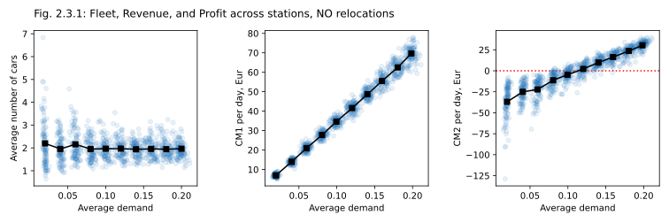

Now let's repeat the same experiment, but this time around every 30th tick we'll perform a relocation (one relocation per approximately 25 rentals), moving a car from a station with lowest demand per car to a station with highest expected demand. How would it change the KPIs? First of all, the average number of cars per station (Figure 2.3.2 below, left panel) looks quite different now! Where in the absence of relocations we had a uniform distribution with 2 cars per station, now we have an upwards-sloping curve, as cars from low-demand stations were regularly relocated to high-demand stations, so at the end of the day, on average, higher-demand stations carried more cars. The plot of CM1 against demand looks roughly the same (although the values are almost 10% higher!), but CM2 again looks very different, compared to a "no relocations" case. Without relocations, we subtracted a flat line of fleet cost from a linear dependency of CM1, making CM2 as a function of demand look linear as well. Now, with relocations, subtract a curvy rising shape (left) from a linear increase (middle), and get a much flatter CM2 profile (right)! The low-demand zones are still unprofitable, but not nearly as bad as before, both in terms of averages and in terms of outliers. The system of stations is now profitable on average, earning 24 €/day. (Note however that for now we assumed relocations to be free; we'll address this point in next section).

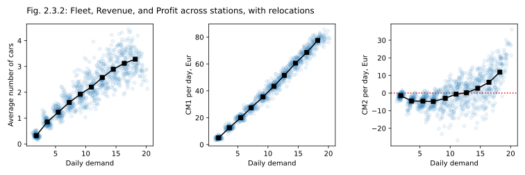

> [!NOTE]
> Relocations make the spatial distribution of cars closer to our desired distribution, with higher-demand locations getting more cars. It makes the distribution of CM2 over stations flatter, and increases overall profitability.

The overall service level (DFR) in the city was also improved by relocations, from 70% to 77%, which is exactly the change that ultimately reduced missed sales (missed rentals), increased the CM1, and thus the CM2, making the system profitable. But relocations also changed the distribution of service levels across zones with different demands (Figure 2.3.3 below). Without relocations, in this simple system, service was flat across all stations (left panel). With relocations, we offered better service in hot zones, and lower service in slow zones (right panel), which was profitable.

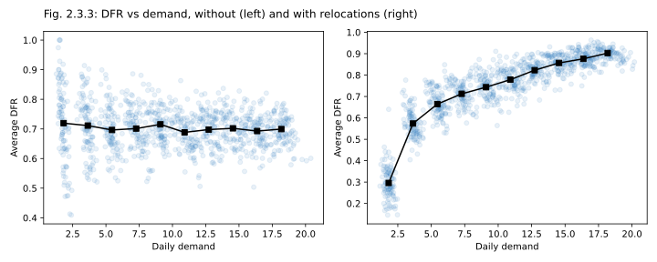

> [!TIP]
>  Relocations improve service levels in hot zones that carry business forward.

# 2.4. Optimal relocation frequency

Now we know that relocations can help with CM2. But at the same time, judging from the figures above, with a rate of one relo per 25 rentals not all the cars were removed from the "really bad zones"! We still had fleet standing in slow hopeless zones, and moreover, these zones were still deeply unprofitable! Did it happen because it was actually better, from the CM2 point of view, to still keep some cars there? Or did it happen only because we did not have enough relocation capacity to clear these slow stations out completely? And how can we tell the difference?

Let us explore this question by running same model that we run in the previous section, but with _different relocation frequencies_, from 1 to 100 relocations per 10000 time ticks (corresponding to a range from about 0 and up to 30 relocations per 100 rentals). As this time around we want to assess the profitability of relocations, and not just their effect on car distribution, we'll now need to assign a cost to them, as in real life we would of course have to pay for relocations, either directly per relocation (to contractors), or indirectly, by having relocations performed by salaried employees. Here, and from now on, we'll be using a rate of 20 €/relocation, which is a roughly balanced value, compared to other numerical values used in our models (see Appendix for a justification of this cost). Let's also reduce the number of cars in the system from 20 to 15, just to make CM2 values a bit more positive.

The result of this experiment (Figure 2.4.1 below) shows that there is indeed an optimal volume of relocations in this system: a frequency of relocations at which the profits are maximized. The curve is extremely disappointing though, as the optimal number of relocations for this system seems to be… zero! While there's a obviously a benefit of moving cars from slow zones to hot zones, in this system in particular the boost in CM1 revenues coming from these relocations is more than offset by the costs of relocations. This is not exactly surprising, given that we made the demand change linearly with station number $d_i = d_{max} - ik$, which means that most zones were not particularly good or bad, but were kind of ok. The stakes are low, we limited the system to only 5 rentals per tick, relocations are expensive, no wonder that the optimal relocation rate here is zero (or rather, probably "almost zero", but still very small).

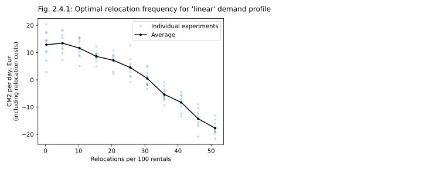
	
Is it always the case though? Can we make relocations profitable in a system of 10 zones and 15 cars, and the same total demand, without decreasing the relocation cost, or increasing the CM1 per relocation? Let's try to model a real city a bit better, as real cities have zones that are extremely hot, and zones that are a clear liability (a tail). Let's raise the stakes of getting a car stuck in a bad zone! Instead of a gentle linear decrease in zone quality, let's consider a system in which 2 zones are good, three are reasonable (at 50% of demand in top zones), four more – horrible, with almost no demand. (If this distribution looks suspicious to you, check the footnotes at the end of this chapter.) The total demand in the system $\sum_i d_i$ is set to the same value as for a linear case. With these adjustments, and repeating the experiments with different relocations frequencies again, we're getting the curve as shown on Figure 2.4.2 left, below. The right panel shows the demand profile we used in this experiment, compared to a linear scale from earlier experiments.

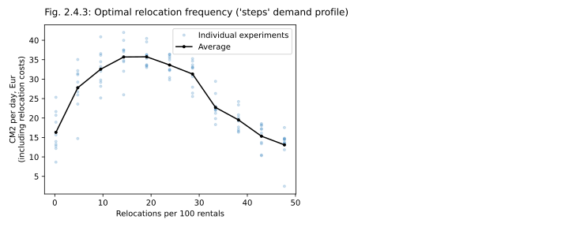

And now suddenly we have the same curve that is observed in most real cities! With no relocations, cars are getting stuck in bad zones. As you increase the relocation rate, you manage to unclog more and more of these unfortunate placements, but at some point the marginal help from each consecutive relocation starts to drop, until at some point the cost of relocations outweighs their usefulness. Meaning that there's an _optimal relocation rate_ in your system, sticking to which would give you the best CM2 value over the long run.

> [!TIP]
> For a given operating area, and a given number of cars in the city, there is an optimal number of relocations to perform per day, and you can assess this number with modeling; both for optimization and budgeting / contracting purposes.

While the system we modeled here is simplistic and artificial, nothing prevents you from modeling your actual operations in an actual city in a similar manner. All you need is to split your operating area into zones, either by pixelating it, or approximating it with polygons, then calculate actual rental frequencies between zones (or build an ML model to predict them, if you want to go fancy), and then directly model the CM2 financials assuming different numbers of daily relocations. Once the curve is ready, you can pick the optimal number, call it your target, and make sure that you have enough capacity (enough drivers) to support this target and actually move the cars around.

# 2.5. Adaptive relocations

Now that we know how to find an optimal relocation rate, we seem to have a minimal set of tools to set up meaningful relocations for our business: we can estimate this optimal rate in a simulation, then repeatedly, every day, pick the worst $k$ cars, relocate them to popular zones, and stay reasonably happy. At the same time, the approach of always triggering the exact same number of relocations per day does feel a bit forced. What if this or that particular day was unusually quiet, or unusually busy? What if, by pure luck, you got cars more smoothly dispersed than usual, or the other way around, parked unexpectedly close to each other? What if there was a party, and 20 families moved 20 cars to a street along the river, then walked home on foot, to compensate for the eaten pizza? What if the airport train was on strike, completely disrupting rental patterns in the city? To cover for these cases, it would be nice to make relocations _adaptive_, and somehow learn to estimate on-the-fly whether any particular relocation is expected to be profitable or not, to only performing those relocations that are. Granted, it may be tricky to follow this adaptive logic in practice: in real life, performing the same number of relocations every day is often easier and cheaper operationally, as people like to plan and budget their activities in advance, but still, it would be very nice to have access to this logic even if just in case! And also, purely for modeling purposes, it would be so helpful to be able to just turn the relocations "ON" in an balanced self-calibrating mode, without having to estimate the optimal relocation rate every time, by building a full profitability curve!

So how to do it? Can we distinguish a profitable relocation from an unprofitable one _before_ performing them? Let's again begin with finding a car that is _least likely_ to be rented at the next tick, and a station where, should we move a car there, it would be _most likely_ to get rented. 

We will start with the simplest formula ever, then gradually add complexity. Consider two stations with demand approximated by a Poisson process: source station with demand $λ_0$ and destination station with demand $λ$. (We'll be using letter $λ$ for demand, instead of $d$ that was used previously, just to make the formulas look more familiar, in case you want to verify them in textbooks later). Now, what is the financial effect of relocating one car from source to destination, assuming $λ>λ_0$?

In the simplest case, we have a single lone car standing in the source station that is then moved to a previously empty destination. The expected idle time in the source station is $1/λ_0$, the expected idle time at destination 1 is $1/λ$, so the expected change in idle time is equal to $ΔT = 1/λ_0 - 1/λ$.

How to translate this change in idle time $ΔT$ to money? The destiny of a single car in both scenarios, with and without a relocation, is random and impossible to predict: it will be rented, then will stand idle, then will be rented again, and so on. However after the relocation the car is expected to start this journey $ΔT$ units of time earlier, so it is expected to find itself in business (rather than idle and useless) for $ΔT$ longer. A fair way to translate this extra business time to money is to look at the amount of money per unit of time that every car is bringing us on average (we'll call it $c$), and then multiply the two values, arriving at CM1 $=c\cdotΔT$.

Now, while this reasoning reads logical, it also feels a bit weird, as the "average CM1 per car per hour" obviously also includes both traveling and "trapped" (idling) cars, ultimately including the very car we are relocating right now (assuming that it got to stand in its current bad location for a while, before we noticed it). Is this circular logic ok? Is it not biased? Or should we attempt to calculate the value of $c$ for some careful mix of trapped and active cars, or introduce some sort of compensatory regression, or whatever?

The answer here is "yes, it's ok", because we probably can't do much better. Immediately after relocation, the car will indeed be injected into a good part of the city, and if upcoming rentals are mostly local, it may stay in the good part of the city for a while, before getting "statistically diluted" among all possible trajectories through the city. Which means that its original contribution to CM1 after the relocation may indeed be a bit higher than $c$. However 1) this original transient boost is hard to estimate, 2) as we already mentioned in section 1.3.2, the locality of rentals in cities is not that strong, with a typical rental easily crossing one third of the city, and 3) being a bit conservative, and underestimating $c$ a little, is better than overestimating it and moving cars that don't need to be moved. Also, a typical expected idle time in a typical bad zone is measured in days, and not hours, and for a different in time $ΔT$ of 1-2 days it feels only fair that we would use the long-term average value of $c$, and not some overengineered short-term guesswork.

But this means that through the value of $c$, our estimation of relocation effect does indeed depend on the effectiveness of past relocations in the city. If we relocate well, the total CM2 per unit of time is higher, and so the $c$ is higher, and relocations become safer (more profitable) on average. Conversely, in a city that was not tended, that got overgrown with weeds and covered with dust, relocations will originally seem less profitable on average. This is an unavoidable "system memory" that we may want to keep in mind, but if you think of it, it is only fair. By using $c$ we are just assuming that the city will behave in the future about the same as it behaved in the past.

Finally, if the city is well balanced in terms of its fleet size, and the business is growing and investing, rather than greedily reaping profits, we can assume that the daily value of $c$ (average CM1 per car per day) is close to the CM2 daily cost of a car. Indeed, a growing business would try to invest most of its profits into expansions (larger operational area, higher service levels), while remaining cash-flow-positive, and thus aiming for a CM2 that is just barely larger than 0 ($c \sim$ CM2 cost per day). And this means that for some back-of-envelope calculations we can use CM2 cost of a car per day as a rough way to translate $ΔT$ into money.

But back to the drawing board. Now that we learned to translate a change in idle time $ΔT$ to money, let's return to the calculation of $ΔT$. So far we only considered a case of a single lone car moved from a station with lower demand to an empty station with higher demand, with $ΔT = 1/λ_0 - 1/λ$. But what if both source zone and target zone had several cars in them, say $n_0$ and $n$ respectively. Will it change our calculation, even if we still concentrate only on the car being relocated?

Of course it would, and for simplicity's sake let's assume that all cars are identical and indistinguishable. It means that every time a demand event is generated at a zone (which, as we remember, happens with a rate of $λ$) the user will pick one of $n$ cars at random, with the probability of $1/n$, effectively reducing the rate of rental events for the car we are considering to relocate from $λ$ to $λ/n$. This in turn means that the expected idle time for any given car standing at this station will be equal to $T = n/λ$, and the total idle time saved by a relocation from one zone to another will be equal to $ΔT = n_0 / λ_0 - (n+1)/λ$. Here we had to use $n+1$ rather than $n$ for the target zone as after the relocation it will have one car more (namely, the car we just relocated). This gives us the following formula for the total CM1 effect of relocation: $\displaystyle \text{CM1} = c \left( \frac{n_0}{λ_0} - \frac{n+1}{λ} \right) - r$ , where $r$ is the cost of the relocation itself (the salary of the driver with all the overheads).

Let's pick some simple numbers and on a piece of paper work our way through one example. Consider a system of 10 stations, 10 cars, and a potential relocation from a station with a rental probability of 0.1 per tick (slow station) and 2 cars in it, to a station with a rental probability of 0.5 (hot station) that is currently empty. Is this relocation likely to be profitable?
* The expected time to the next rental for this car standing at the current "bad" station, is equal to $n_0 / d_0$ = 2/0.1 = 20 time ticks
* The expected time to next rental in a proposed "good" station is equal to $(n+1)/d$ = (0+1)/0.5 = 2 ticks
* Idle time eliminated by this relocation is expected to be: $20-2 = 18$ ticks
* The typical number of rentals per tick in our models so far was about 2 per tick. This number is impossible to guess, but we can get it from the actuals (in this case, modeled actuals). With per-rental CM1 profits of 5 €/rental, over the long periods of time, on average, each of the cars will therefore earn us $5·2/10 = 1$ €/tick in CM1
* We can therefore expect to earn 18€ in additional CM1 rentals, if we perform this relocation. At the same time we will have to pay 20€ as the relocation cost, ending up with an expected total effect of −2€ (a small loss). Which makes this particular relocation unprofitable.
* If however, for the same two stations, with all the same parameters, we would have 3 rather than 2 cars accumulated in the low-demand zone, a relocation of one car would become profitable, yielding 8€ in expected CM1. You can run the calculation itself if you wish 😉

But at this point an observant reader could probably get a bit impatient, as while the logic sounds reasonable, and it even has a name of its own, being known in queueing theory as [Little's law](https://en.wikipedia.org/wiki/Little%27s_law), it seems to be built on a shaky ground of one obviously wrong assumption. Look, we have just explained that the presence of $n$ pre-existing cars in the target zone would reduce the probability of upcoming rentals of our relocated car from $1/λ$ as assumed originally, to $(1+n)/λ$. But surely the opposite is also true: our bringing of a new car in this zone would make cars _already there_ less rentable! The new car would now compete with them! Shouldn't the expected idle time for each _other_ car in the target zone also be increased from $n/λ$ to $(n+1)/λ$, as a consequence of this relocation? And if yes, should not the expected idle time for cars in the source zone be reduced from $n_0/λ_0$ to $(n_0 - 1)/λ_0$, to be later translated to some financial effect?

Yes, it totally should, and we can quantify this! Let's consider the expected _total idle time_ of all $n$ cars standing in a zone with rental frequency of $λ$, the sum of all idle times. The $n$ cars will be rented one by one, and we cannot predict a sequence in which they will be rented (as they are assumed to be interchangeable, and chosen at random), but we can predict the waiting times between consecutive rental events. The first car is expected to go after $1/λ$ of waiting; the second one will be rented $1/λ$ of time after that (so $2/λ$ units of time since the start of observation), the third is expected to follow around $3/λ$ since the start, and so on, up to the last $n$th car that is expected to wait for $n/λ$ since the moment that we started counting. The total expected idle time therefore can be calculated as $\displaystyle T_{total} = \sum_{i=1}^{n} i/λ = \frac{n(n+1)}{2λ}$. Which means that a better formula for the total CM1 saved through a single relocation from a source zone to a target zone should look like this: $\displaystyle \text{CM1} = \frac{c}{2} \left( \frac{n_0(n_0+1)}{λ_0} - \frac{(n+1)(n+2)}{λ} \right) - r$. Should we have used this formula then? Is it a closed-form solution for our problem?

Let's think a bit more and carefully compare two alternative branches of the multiverse, the one where we performed a relocation, and the one where we didn't. There's one more aspect to the story that we haven't discussed yet. Let's say that in both universes there are 3 more cars that are already _in transit_ to the target station, and that will arrive a few seconds after we relocate (or don't relocate) our car there. These cars are invisible to us as we consider the relocation; they are not in the formula above, but they are already in transit, they will arrive in both scenarios, and their expected idle times will be affected by the presence (or absence) of the extra cars in the station, precisely in the same way in which the idle times of existing $n$ cars are affected. Should we account for the cars that are about to arrive as well?? Can we account for them at all?

This seems like a simple "yes or no" question, but in fact there are levels of approximation in how we answer it. It is true that all this time we were only talking about rental events happening with the rate of $λ$, but our stations also experience a similar train of "car arrivals" happening with a frequency of $ϰ$. This means, for example, that in our "total idle times calculations" above, every now and then a rental event is negated by an arrival event, and as a first approximation, and assuming that $ϰ<λ$, we could replace both rental frequencies $λ_0$ and $λ$ with "effective car elimination frequencies of $(λ_0 - ϰ_0)$ and $(λ-ϰ)$ respectively. But then we could go a step further and replace the total numbers of cars $n_0$ and $n$ with their "corrected", higher versions, statistically accounting for the cars still to be deposited at the station. These formulas do exist, but they are fancy, and are known in queue theory as formulas for the [M/M/1 process](https://en.wikipedia.org/wiki/M/M/1_queue). (And by the way, if you decide to click the link and read the Wiki page, please keep in mind that while the math there talks about "customers" and "servers", this notation is exactly backwards to the business situation we are describing. In queue theory, people talk about a queue of "customers" that arrive at the queue, and are served by one (in M/M/1) or several (in M/M/n) "servers", as it happens in call centers or store check-outs. In our case, it translates to a station with a queue of cars that are arriving, and that are removed by a rental process acting as a "server". So our cars are their "customers", and our customers are their "servers". Crossing disciplinary boundaries is not always easy!)

But anyways, if fancy formulas exist, shouldn't we then borrow them use it in our calculations? Well, that's a bit complicated. The formula we would need is called the "Mean time to absorption" for a [birth-death process](https://en.wikipedia.org/wiki/Birth%E2%80%93death_process), which is a sub-field of a yet different mathematical field (Markov chains). This result was proven as a part of a so-called "Karlin's theorem for mean absorption times": you can check [this stackexchange link](https://math.stackexchange.com/questions/4395796/mean-time-to-absorption-in-a-birth-and-death-process-proof-by-samuel-karlin), or try out this paper[^Gomez2023]. But be careful: in birth-death process theory $λ$ is a frequency of births (car arrivals), while we used this letter to denote the frequency of deaths (car rentals). Still, the naming and complexity of formulas is only one part of the problem. More importantly, the solution (a finite mean time to absorption) only exists if the death frequency (the frequency of car rentals) exceeds the birth frequency (the frequency of car arrivals). If cars depart more frequently, on average, than they arrive to the station ($ϰ<λ$), then sooner or later the station will get empty, and you can indeed calculate the mathematical expectation of when exactly it will happen. But if the opposite is true ($ϰ>λ$), cars will get accumulated at the station, making the expected total idle time at the station mathematically infinite! And it's not just a curious edge case that can be ignored, the $ϰ<λ$ assumption is violated all the time!

Think about it: both in real cities, and in our models, the flows of cars are roughly balanced. As the total number of cars in the system doesn't change, we can expect about a half of all zones in the city to be net donors of cars (eventually running empty), and about a half to be net receivers, with a long-term tendency of accumulating cars. Moreover, there are zones that act as super-accumulators, like for example zones near towing yards (those parking spots maintained by the city to which the road police tows illegally parked cars). It is very rare for a person to drive to a towing yard in their own car, and drive back in a rental, while the opposite situation however is quite common! The same is true for streets with several car dealerships in them; streets near car repair stations, and, for whatever reason, streets that border parks and recreation areas. In any case, for many zones in the city the number of cars in the rental queue slowly diverges, approaching the uniform distribution from chapter 1, meaning that the expected total idle time in these zones in the absence of relocations is technically infinite, making a CM1 of a relocation from a zone like that also technically infinite! Which in turn means that it is ok not to have a precise closed-form formula for our relocation algorithm, and in fact it is preferable to use a simpler formula, or a machine learning model that is intentionally limited from above (see section 2.9). We want our estimations for the CM1 effect of a relocation to be simple, consistent, and a little bit conservative; as these loose criteria are satisfied, we should be fine.

Still, one may wonder if there is a way to assess how far our approximate formulas would fall from the "real CM1 effect" of a relocation. In real life we of course cannot do it, as we cannot visit two multiverses at once, and see what would have happened had we not relocated a car, or had we relocated it. In a model however we could in theory freeze the flow of demand events, and directly compare test runs with or without each particular relocation, to look at two alternative destinies of each particular car! Or we can also use a simplified approach: split relocations into classes and start performing (or not performing) each class of relocations, one by one, and then compare the total financial effect on the overall CM1 in the system. What if we only perform relocations where a lone car is moved to an empty zone (encoded as $(1→0$))? Or only relocations where a lone car is moved to a zone with one car already standing in it $(1→1)$? Or relocations where one car out of three is moved to a zone with 2 cars already standing $(3→2)$, etc. After running the model for each of these scenarios for about a month of in-model time, and after accumulating thousands of relocations of every type, we can look at the actual effect these relocations had on our CM1, and compare it to "theoretical predictions". It's not a perfect experiment, as the circular character of the "average profitability per car per day in the city" $c$ would bias our results, but it's a reasonable sense-check. Also, just to be clear, in this experiment we will ignore the cost of the relocation itself (our paying to the driver), as our task here is not to assess relocation profitability, but to verify our formulas for $ΔT$ and ΔCM1.

The result of this experiment are shown in Figure 2.9.1 below, with red markers presenting values for the  $c \left( n_0 / λ_0 - (n+1)/λ \right)$ formula, which only looks at the change in $T$ for the relocated cars, and blue markers showing values for the $\frac{c}{2} \left( \frac{n_0(n_0+1)}{λ_0} - \frac{(n+1)(n+2)}{λ} \right)$ formula that also accounts for existing cars in the zone. The average actual CM1 effects are shown as black markers in the left panel, and are used as x-values in the right panel. Colored lines show linear regression without a free term.

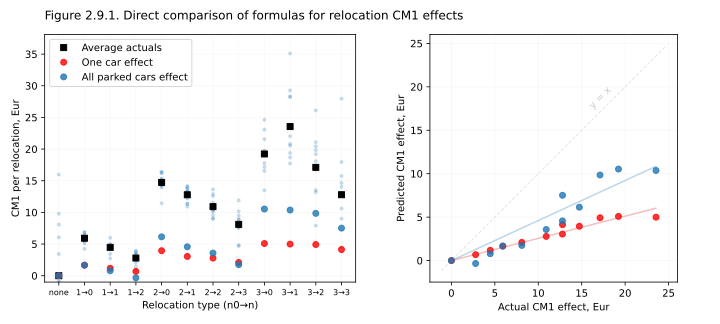

As we can see, both formulas reliably _underestimate_ the actual financial effect of relocations, which is to be expected in a small closed system like that, where the deposition and rental rates are equal ($ϰ=λ$), and so the expected future number of cars slowly diverges. We also see that a single car approximation (red) that we used in sections 2.3 and 2.4 is more conservative than the many-cars approximation (blue), but still both approximations are roughly proportional to the "true values". This suggests that both formulas are good enough for the "proof of concept" models, but in real life you probably want to use a fancier approach, more calibrated to idle times $T$ actually observed in the system (as described in section 2.9). Still, let's stick to the simplest of two formulas (red markers, one-car effects) for now, and play with the adaptive relocation algorithm a bit.

# 2.6. Optimal fleet planning

The adaptive relocations that we now have on our hands open all sorts of opportunities for asking interesting business questions about car-sharing. For example let's see how the ideal volume of relocations depends on the number of cars in the city. Does a need in relocations increase with fleet size, as having more cars means doing more relocations? Or does the need for relocations decrease, as with more cars we get a higher DFR, and so run out of empty zones to relocate our cars to? Or does it stay more-or-less flat? To answer this, we'll run the 10-stations model again, with demand distributed linearly, from 20 rental attempts per day at the hottest station, and down to zero at the slowest one, but this time with adaptive relocations turned on, and changing the number of cars in the system (from 1 and up to 20).

The results of this simulation are shown on Figure 2.5.1 below, left panel. Quite naturally, as we add more cars to the system, they are getting clumped in the same station more often, and we need more relocations to redistribute them. 

Not surprisingly, when the fleet is very low (in the extreme case, consists of 1 car only) relocations are generally not helpful. With very low fleet, relocations are only recommended if you have some stations (or geographical zones) that are _that horrible_ that a car can be stuck in them long enough to miss some 4-5 rentals, and so 20-25$ in missed CM1 revenue (assuming 5€ CM1 per rental), justifying the 20€ relocation cost. Which would beg the question of why these areas are even included in the operating area (we will return to this topic in Chapter 6, when discussing operating area optimization). But as the fleet grows, the chances of two or more cars randomly meeting at the same not-so-good station increase, creating fluctuations of trapped fleet, which are typically profitable to resolve. 

This leads to the first take-away from this simulation:

> [!TIP]
> Typically, the more cars you have in the city, the more relocations you need to redistribute them

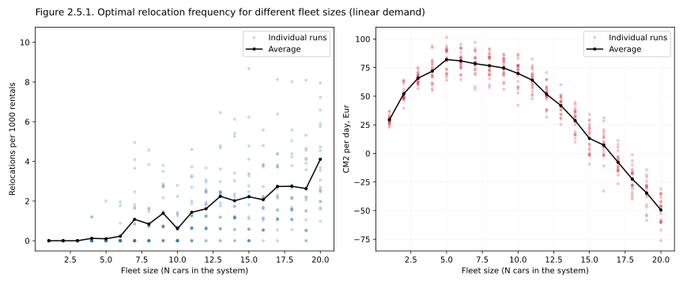

But now that we can vary the fleet size, there is an even more interesting question to ask: **what fleet size is optimal, for a given city, or for given set of rental stations?** For example, for our 10 stations, and this particular linear distribution of demand across them, how many cars would give us the highest profits? At which point the investment in cars (CM2-style losses) would outweigh the growth of operating profits (CM1) that you get with more cars in the system? With relocations automatically and optimally adjusting to the situation, we can attack this question head-on, run a few simulations, and build a curve of CM2 as a function of fleet size! (Figure 2.5.1 above, right)

As we can see, for this particular configuration of 10 stations, the optimal fleet is some 6 or 7 cars, so fewer than a car per station. With lower fleet values we are missing lots of sales, and adding more cars to the system is profitable. After 7-8 cars, the additional CM1 earned no longer outweighs CM2 investments, and profits start to decline. At 16 cars the business becomes unprofitable. (Note however that our model still assumes that all travels, both rentals and relocations, are instantaneous; in a real-life situation, even with the same 10 stations and linearly distributed demands, the optimal fleet size would have been a bit higher.)

> [!TIP]
> Each city (operating area) has the optimal fleet to serve it, and you can find this optimal fleet by modeling rentals in the city, which may be time consuming, but not particularly hard!

That said, in practice, in real life, one may decide to deviate from the optimal fleet for a city, in either direction. Sometimes there may be not enough cars on the market to lease, or cars may be needed elsewhere, or the city may try to regulate the number of carsharing cars operating on its streets. While sometimes one may find themselves in the midst of a "fleet presence war" with a competitor, which is somewhat similar to a pricing war, but is about oversaturating a city with branded cars, in a hope to make the residents associate your brand, and not that of your competitor, with car-sharing. If that's the goal, and one is ready to tolerate a lower CM2 margin in exchange for shaping the public opinion, they would go above the recommended fleet size. You also may want to have some safety in the system, and you would definitely cover (or model) the fleet in transit, including that in long-term rentals. But either way, it is always worth running a model and figuring out how many weekly relocations you would expect to see, for this or that fleet size, and a given your actual demand distribution.

Now, returning to the model, and for the sake of completeness, let's run it with "stepped" distribution of demand across zones (the one we introduced previously in Fig 2.4.1), just to check if the key findings we described above, for a "linear" distribution of demands, replicate for other distributions. They do, qualitatively, as the Figure 2.5.1s below shows. Compared to the "linear" distribution, the "stepped" distribution is more extreme, with more pronounced "hot" and "horrible" zones, which makes relocations more impactful. It means that we run more relocations overall, and also the peak value of CM2 is higher. Still 6 cars remains the optimum for the system, and we become unprofitable at 18 cars, which is about the same values as observed in Figure 2.5.1 before.

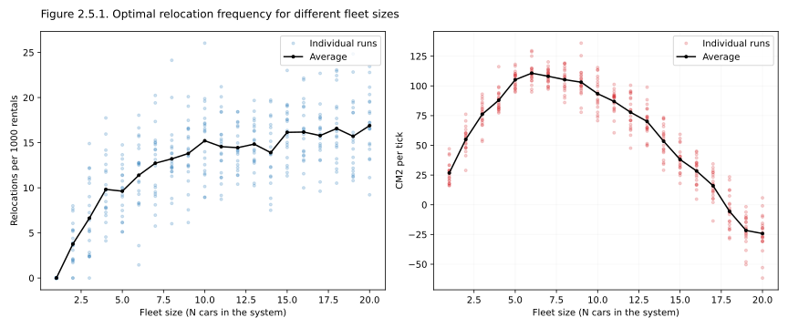

Finally, there's one more practical learning point that we can draw from Figures 2.5.1 and 2.5.1s. Let's reflect on the fact that the number of necessary relocations differed a lot from one experimental run to another: note how widely the dots representing relocations in individual experiments are distributed around the average curve. In the Figure 2.5.1, for a case of 17 cars, after modeling for about two weeks of "in-model time" we observed some individual experiment with zero relocations, as well as some with 8 relocations. The reason for this broad distribution is that the number of cars at each station is a one-dimensional Brownian process, and while it is random, it changes slowly, and does not converge well over time (we have discussed this phenomenon in Chapter 1). This fact has a real life implication: if relocations from a certain zone are low in one month, but high in another, it does not necessarily mean that something changed structurally, in the way that this zone is used. It may just be that by pure luck the cards were dealt slightly differently this time around, and instead of cars coming and going (resulting in a stable fleet), you got a few failed rentals followed by a few consecutive arrivals, leading to a car pile-up that triggered relocations.

This is something one should keep in mind when steering any car-sharing business. From the operations point of view, it is much more desirable to perform the same "reasonable" number of relocations every week: it helps with capacity planning, with budgeting, and it optimizes the utilization of drivers. But this means that even when operations are tuned up perfectly, on some days drivers would probably be performing relocations are are not quite profitable, while on other days some relocation request may remain unresolved because of insufficient capacity. This is unavoidable, and this is ok. It is a minor inefficiency one should be ready to tolerate.

> [!WARNING]
> Don't be too upset with relocation efficiency on any particular day, or even week. Relocation strategy should be optimized only at large time scales, strategically, not tactically; planning at the scale of months, or even quarters!

# 2.7. Imperfect relocations

While we are on the topic of differences between models and real life, let's consider another, related problem. In real life cars will be moved around by real humans, of blood and flesh (at least until or unless, we get robotic self-driving cars relocating at night). And humans will have an incentive to optimize on top of the set of pre-defined relocations ordered from them, or recommended to them. And if you opt not to keep your relocations in-house, but to contract them out, with more than one contractor per city, to keep a healthy competition, you will get better prices, but potentially even more optimization of what is relocated where and why, as both contractors will draw from the same pool of recommended relocations with their interests in mind. Because of that, the relocations you get may not be exactly the relocations you ordered: they would be close to your ideal case, but not exactly the same. Let's consider two typical cases:

1. One common IRL scenario is that out of all cars that need to be relocated, relocations agents pick not the most problematic car (the one parked in the slowest location), but the easier car for which a relocation is barely breaking even. It's easy to see why this could be the case: exactly the same reasons that make a car in need of a relocation (a cursed side-street far from the city center) makes it harder for the relocation agents to reach it. They would spend more time, more effort, more fuel, and thus potentially make a smaller profit on it. In contrast, a car that is barely profitable to relocate is probably parked in a so-so zone somewhere not that far from the center, making it easy for the agent to move it. The net effect of this conflict of interest is that operators often pick not quite the cars that you want them to.
2. Another common scenario is that, when moving a car, the relocation drivers don't position it quite where we would have preferred it to be positioned. Here's the thing: when ordering a relocation, you usually can't be too precise about the destination point, as you don't know the situation "on the ground", you typically don't know where the free on-street parking spots are, and even if you deal with dedicated parking garages and mobility stations, you may not know if any given station has a free spot or not. You have to give some freedom to your relocation agents, for them to judge the situation and leave the car in a reasonable spot, while loosely following your order. But here again we get a conflict of interests: the easiest parking is usually not the one that is most beneficial to the business. For example, the agents may be tempted to cram several cars into the same side-street within a "hot zone", creating a cluster of cars in a non-obvious place, instead of distributing cars more evenly, and in more obvious locations. It's not the end of the world, as people have apps, and they can walk, but it's still not quite what you would have preferred, as a business owner. Or, in more extreme cases, cars may be relocated to a peripheral zone that is not as desperately in need of cars as a zone deeper inside the city, just because it is a shorter drive. Either way, the result is that the cars are placed suboptimally.

To sum up, there are two main types of imperfection with relocations: that "wrong" (or at least suboptimal) cars are picked for relocation, and that cars are placed suboptimally after the relocation. And the interesting question here is: which of these two inefficiencies is more dangerous for the business? If you had to pick one, and fight it using a dashboard with KPIs, which one should you tackle first?

Let's model imperfect relocations, and find an answer to this question. As before, we'll use 10 stations with a reasonable distribution of demands across them (we can try "linear" and "steps" distributions that were described above) and 10 cars. We will also compare four scenarios, calculating an ongoing CM2 profit for each of them:

1. Perfect relocations (the most needy car to the most needy zone)
2. Wrong target zone: we'll pick the same cars as in (1), but move them randomly within the system. This is of course an exaggeration, but it will show us the direction of the effect.
3. Wrong car: every time a relocation recommendation from (1) is generated, we'll pick a random car within the system, but deliver it to the wrong zone.
4. No relocations

One would probably expect the scenarios (2) and (3) to be somewhere in-between scenarios (1) and (4) in terms of CM2, as imperfect relocations are somewhere in-between good relocations and no relocations at all. But will (2) or (3) yield a better CM2? What is more important, to move cars that are stuck, or to bring cars to zones with high demand but no cars in them, that are missing sales? Let's check it out!

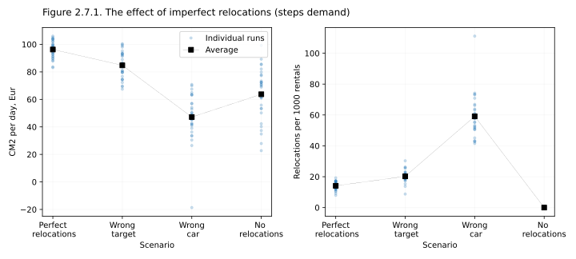

The simulation results are shown in Figure 2.7.1 above, left panel, with pale blue dots representing CM2 values in individual experiments, black squares showing averages, and different x-positions corresponding to four relocation scenarios. The model used "stepped" distribution of demands across zones, introduced previously in Figure 2.4.3, as it offers a more contrasted result, with large differences in CM2. It's comforting to see that runs with perfect relocations (leftmost set of points) still yield higher CM2 than runs with no relocations (rightmost set of points), but the middle clouds are a bit of a surprise. Or rather, the relocations with imperfect targets (in our case, _extremely imperfect_, namely, random) are placed as we expected them to be placed: slightly worse than perfect relocations, but still better than no relocations at all. Relocations with imperfect (random) car selection however are _worse_ than having no relocations at all! How is it possible?

Well, the key difference between the dynamics observed in the 2nd ("Wrong target") scenario, compared to the 3rd one ("Wrong car"), is that in the 2nd scenario, when right cars are relocated to a wrong zone, a problematic car was still taken out of a slow zone, so while the relocation was not perfect, at least it happened! It is true that we picked the target zone randomly, so it was of course possible that a car would be moved to a similarly bad zone, or even to a worse one, and had to be relocated again. Still, as in our model a half of the zones had high demand, the car would be brought to a high-demand zone rather fast (in one relocation with a probability of 0.5, in 3 relocations with a probability of 0.88 etc.) In contrast, in the 3rd scenario ("Wrong car"), even once a call for a relocation was "triggered", we refused to answer to it and moved a random car instead, which means that the problematic car remained in place (with a probability of 0.9), and kept demanding a relocation. It is true that the thirst of the hot carless zone was quenched, but the car that was stuck in an unloved part of the city remained stuck, triggering more and more semi-random relocations, as the right panel of Figure 2.7.1 clearly shows. The vast majority of these extra relocations were unnecessary, and so cost us money.

Which answers our original questions quite clearly. If you cannot perform recommended relocations, it's infinitely better picking the right car (the most "stuck" car) and moving it to a so-so place, rather than picking a so-so car and moving it the hottest and emptiest zone on your map. And as a corollary on that, relocations are good not because they improve DFR in hot zones, but because they reduce idle times in bad zones, and throw idling cars back into the fray of inner-city rentals. The money is saved on the reduction of idle times, not on the improvement of DFR.

> [!TIP]
> In real life relocations, don't worry that much about where your cars are delivered, but be very strict about your drivers picking the most stuck cars, even if they are hard to reach.

Does this recommendation depend on the distribution of demand values across your operating area? As a sense-check, let's build the same kind of a plot for a different (linear) distribution of demands. The results are shown on Figure 2.7.1a below; they are conceptually the same as for the "stepped" demand above, just with subtler differences, as this distribution of demands is particularly undramatic. Even the difference between "perfect relocations" and "no relocations" is barely visible (as we have discussed in section 2.4). And still, relocating wrong cars (not the most urgent cars) is worse than relocating right cars, but moving them to a wrong zone.

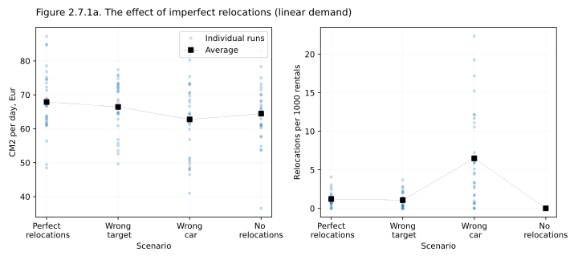

How to combat the problem of imperfect relocations in real life? One way of course would be to create a dashboard and scream at contractors once a month if the values on the dashboard are not high enough (if they consistently relocate easy cars rather than needy cars). Alternatively, one could offer different payments for relocations of different complexity, or share the revenue, assigning higher premiums to cars that are predicted to be most in need of a relocation. One can also use a mix of these two approaches.

Incidentally, the experiments above also answer another practical question that people sometimes have about relocations: can relocations improve DFR? When I worked in carsharing, I was regularly asked if I could "relocate more vigorously to compensate for lower DFR", and so it seems that people unfamiliar with the subject somehow develop an intuition that a car that is constantly in motion can be in two-three places at once, allowing the operator to offer a better service with a lower fleet. This is however untrue, and the plots above illustrate it quite well. Fundamentally, relocations are useful not because they bring cars to empty hot zones, but because they cut out idle times for cars that got stuck in weak zones. 

> [!WARNING]
> Relocations don't improve DFR, but decrease idle times.

When you are low on fleet, and the center of your city has no cars left, it may of course be tempting to relocate cars from the periphery to the center, but would this be profitable? Very roughly, a relocation (~20€) costs some 4 times more than the CM1 we gain from a typical rental (~€5). Which means that you cannot possibly earn money by artificially concentrating cars in the center. Once a car is placed there, it will of course get rented, but it will never be profitable. Contrast these financials with that of a car that is stuck in an unfortunate zone: typical real-life idle times in bad zones are measured in days. With an average activity in a city of 4 rentals per day per car, a day of idling for a single car costs you 20€ in lost revenue, which is what makes relocations profitable. Once you put this car back into the rental pool, you earn money. But the amount of "bad" cars that appear in a city every day is more-or-less fixed, and defined by the shape of your HA and the activity of your customers. Once you have relocated all the new bad cars, there is nothing more to relocate. You cannot cheat by relocating more in advance.

> [!CAUTION]
> Don't try to relocate preemptively. It is not possible.

When an operator is low on fleet, they basically have three options only. They can wait and suffer until the fleet is increased again. They can reduce the operating area, concentrating it to the hot parts of the city (we'll talk more about this in Chapter 3), or they can temporarily increase the prices, reducing demand, but increasing the revenue, and maintaining a higher service for this demand (we'll talk more about it in Chapter 4).

# 2.8. Relocations in a Gaussian City

Before we can try to see the effect of relocations in our Gaussian city (the one introduced previously in Chapter 1 section 3), we need to solve two problems: one that is relatively simple, and another one that is new and rather fundamental. The simple one is about calibrating the model, to keep the numbers it uses at least roughly realistic. A trickier one is about the fact that our rental zones are now either large enough for different cars between them not to be interchangeable, and also close enough to be within a walking distance from each other, making demand in them not independent. But first things first, so let's start with the problem of calibration.

When running out models, we want the basic KPIs to be roughly realistic, and in the case of 10 stations, we just insisted that the most popular station would have about 20 rental attempts a day (corresponding to roughly 100 total daily attempts in the entire system). Now as we switch to a city, and given that we may want to model cities of different sizes, different shapes, and at different levels of granularity (with pixelation of different coarseness), we need a better way of making cities life-like. There are surely many ways to achieve that, but we'll go for a really simple and primitive solution: before generating any images and comparisons, I will just fudge two city parameters to achieve that, first, the **average number of rentals per car per day** is close to 4 (just slightly higher than 4), and, second, the typical CM1 contribution per rental is about 5 €/rental. To hit the first target I'll adjust the proportionality coefficient between the values of pixelated demand and the actual probability of a rental attempt in this pixel, while for the second one I'll wiggle the price per minute of rental. Why are these targets good? For one, the CM1 contribution of 5 €/rental is the same value that we assume everywhere else in this work. These values also roughly match my vague memories of working with real European cities: the number of rentals per car per day is always the main KPI a mobility company is looking at, and indeed, very roughly, 3 rentals/car/day is sad (unprofitable), 5 is great (profitable), while 4 is about mid-level (probably about breaking even). But finally, there's a slightly deeper reason for this empirics: remember that we agreed to assume a single car costing us about 20 €/day in leasing/owning CM2 costs. With 4 rentals/day and 5 €/rental this car would also bring us 20 €/day in CM1 revenue, bringing its marginal CM2 profit to 0. In other words, a city with these parameters is balanced in fleet: if you get rid of some cars you'll get positive profits, if you add more cars you'll be investing more than you earn, but right now you're at 0, perfectly balanced. And in a way that's the best point to test operational efficiency, as it sets the stakes nicely: improve your strategy just a bit, and you'll start earning money.

This solves the first problem of upgrading from a station-based to a distributed model. The other one is trickier. Look, with a station-based model we assumed that all cars within a station are perfectly interchangeable, an also that individual stations are perfectly independent. We imagined a set of compact mobility stations, distributed across a medium-sized city, but now we want to switch to free-floating mode, with a continuous operating area digitized into a set of adjacent zones, making both of these assumptions problematic. The zones are no longer points in space, they are pixels on a map, with some size to them, so even if two cars occupy the same zone, they may still be parked a few houses apart, or even on neighboring streets. But also, zones that are immediately adjacent now fall within a walking distance from each other, making them interdependent! Imagine a 3x3 grid of pixels, each of them 100 meters wide, with the central pixel having 8 cars parked in it, and the surrounding 8 pixels all having no cars in them. Can we really describe the central pixel as "overcrowded", and the 8 surrounding ones as "empty and starving for cars"? Of course not! It takes an average human about a minute to walk a 100 meter distance, meaning that these 9 pixels would very much share the user base. In real life, of course, not every random 100-meter-long line on the map is crossable: there may always be a highway, a tram line, or a building forcing users to take a detour. But even assuming a 5 or 10 minutes detour, cross-zone interactions on a continuous map need to be accounted for.

The good news is that zone independence and car independence rarely become problematic together; rather it's a bit of a "choose your poison" situation. If zones are made small (tiny pixels on a map), they interact very strongly (a user can cross several zones in no time), but at least cars within each tiny zone may be assumed to be parked at basically the same spot. And conversely, if zones are made huge, covering whole parts of the city, we can ignore edge effects, but we can no longer consider all cars as being parked at the same place. Both of these approaches have their pros and cons, but in our relocation model below we will go with the "small pixels approach". As in the section 1.3 earlier, we will break the city into tiny 100-meter-wide pixels, and we will also allow users to walk between these pixels to some degree.

How far would a user of a carsharing service walk to rent a car? This is a major new factor to consider, and from now on we will call the answer to this question **the willingness to walk**. As outlined in a thought experiment above, walking 50 meters (a distance between two light poles) or 100 meters (a typical width of a city block in Barcelona, Berlin, Chicago, or NYC) is certainly OK (barely noticeable). Walking a kilometer (about 10 minutes on foot) is a chore, and so probably too far. We can therefore expect the average distance that a person is willing to walk towards a rentable car they see in the app to be somewhere between 100 and 500 meters. The actual value will of course depend on the time of the day, the availability of other transportation options (trams, subways, taxis, competitors), walkability of the area, the price at which the car is offered etc.: we will return to this topic in Chapter 4, when talking about pricing. But for the sake of our relocations model, let's fix the willingness to walk at some reasonable value; say at 300 meters. And we won't be treating this value as a hard threshold, but will consider it probabilistically.

How to include this "distance-dependent probabilistic aspect" to the model? Let's start with quantifying willingness to walk as an additional probabilistic filter: as the distance between the point of demand (a customer opening an app) and the parked car increases, let the probability of a rental actually happening steadily decrease. We can just pick a reasonable law for this drop-off, and make sure that 300 meters is the average of all distances resulting in a rental. For example, if we assume that the probability scales as  $p(x) = e^{-x/\sqrt{w}}$ with $w=$ 300, the average distance walked falls at 300 meters, as $\displaystyle \int_0^\infty{x e^{-x/a} dx}$ just [happens to be equal](https://www.wolframalpha.com/input?i=Integrate%28x+exp%28-x%2Fa%29%29++) to $a^2$. Now we need to bring this formula into the model, enabling cross-pixel fuzzy matches between pixel-level demand and pixel-level idling cars. There are many ways to do it, but we can for example blur either the demand signal, or the distribution of cars with a kernel $K(x)$ derived from $e^{-x/\sqrt{w}}$; then match the cars and and demand _within_ each pixel, the same as we did before. This idea may take a few seconds to get used to (blurred cars? fractional users?? really?), but consider a simplistic case of only two occupied pixels: one pixel generating a demand of $λ$, and another pixel with $n$ cars idling in it. Now imagine that we get to change the distance between these pixels, from 0 (same pixel) to 1 (neighboring pixels), 2, and so on. Because of the blur, when calculating the probability of a rental event, we'll end up matching $λK(0)$ to $n$ when the pixels overlap; $λK(1)$ to $n$ when they are immediately adjacent, $λK(2)$ to n if they are placed one pixel apart, $λK(\sqrt{2})$ to $n$ when they neighbor diagonally and so on. Because of $K(x)$ decreasing with $x$, the "effective demand" $λK(x)$ from pixel $i$ "felt" at pixel $j$ will decrease with distance $x$. Or, alternatively, we can blur the availability of cars and match the demand $λ$ to the fractional number of cars of $nK(x)$; the end-formulas will end up being the same! We can also try to find some middle-ground and blur both (probably after slightly adjusting $K(x)$).

Despite all these nice-sounding promises, it may not be immediately intuitive that blurred fractional car numbers would even work, so let us give it a try in a one-dimensional case. Let's set "background demand" $λ$ to a "background level" of 0.1 rentals an hour (just to avoid division by zero), except for a few points where it is set to 1 rental per hour. Most pixels have no cars, except for an occasional pixel with one car, and we'll arrange them to go from demand and cars overlapping, to being offset by one pixel, then two pixels, and so on. Finally, we'll calculate the expected idle time after a relocation $t = (n+1)/λ$. The figure 2.8.1a below shows the result without blurring. In all pixels without a parked car, a newly parked (newly relocated, additional) car is expected to get rented after 10 hours ($λ$ of 0.1), while in demand hotspots it is expected to be rented after 1 hour (thus the downwards peak in idle time). In pixels with a car already parked, a relocated car will be rented in about 20 hours (as we will have two equivalent cars competing for the same demand), except for the case where demand pixel and the car pixel overlap (leftmost peak), where we get an expected idle time of 2 hours. So far so good! Even though the chart looks weird, it is easy to explain, but crucially, the demand hotspot and the pre-parked car stop interacting the moment they aren't coinciding in exactly the same pixel, even if they are placed immediately nearby, which is of course completely unrealistic. In real life, with pixel width of 100 meters, most people will happily walk from the hotspot to the car, and our math (the math without blurring) ignores that.

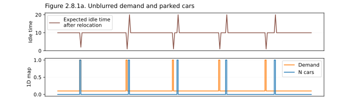

The figure 2.8.1b below shows the same exactly scenario, but with both demand and the "map of parked cars" generously blurred with an exponential kernel. We can make three observations here. One, instead of a single-pixel drop of expected idle times in demand hotspots we now have broader wells, corresponding to the fact that our customers can walk. Second, we have something of an opposite effect for "influence areas of parked cars", as it can be see on the right side of the plot: around an already parked car, the expected waiting times after a relocation are generally larger, as customers will be ready to walk to two different cars, and who knows which one they will pick. And third, notice how in practice there is no much difference between a case when the car and the demand hotspot coincide precisely (the leftmost well) or approximately (second, and maybe even third well). Blurring the maps of demand and parked cars introduces "spatial fuzziness", which is exactly what we want to have in our simulations.

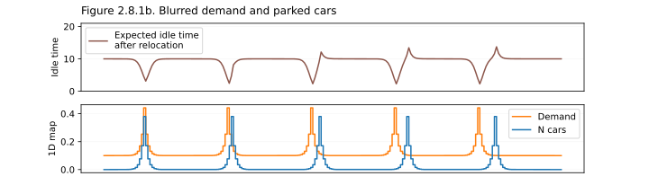

But so, in practice, should we blur demand map only, parked cars map only, or both? The answer depends a bit on the situation. When picking a car to relocate (when looking for the _source_ pixel), we have to work with actually parked cars, as we can't relocate 0.33 of a car! Because of that, we will have to only blur the demand. Which does make sense if you think of it: in this scenario the car to relocate is a specific particular car, and it falls upon the demand map to represent the readiness of customers to walk from the place where they first opened the app (where the demand was generated, and shown on the map), and towards the car. On the other hand, when looking for a place to relocate to (the _target pixel_), we want to account both for the fact that someone can walk to our newly relocated car from a neighboring demand point, _and_ for the fact that parking two cars close to each other is not much different from parking them in exactly the same place. In this case, we want to treat both the demand map and the map of parked cars with spatial flexibility, which means that we should blur both.

But also, on the third hand, in our Gaussian city simulations, the demand map that we use is ridiculously smooth (it is Gaussian!), and we always rely on the "true", "underlying" values of demand for modeling, rather than the noisy pixelated estimations of demand inferred from rental data. Because of that, in our simulation in particular, blurring the demand won't change anything. Still we should remember about the _possibility_ of blurring it: both because it is critical in real-life applications, and because it will become handy in Chapter 03, when we get to talk about operating areas, and the intricacies of their shapes.

The positions of cars however should be blurred even in a Gaussian model, unless our pixel size is much larger than the distance of customers' walks. If we run with 1-km-wide pixels, blurring with a 300m-wide exponential kernel won't change much (Figure 2.8.2 below, 2nd panel). Conversely, if we work with 100m-wide pixels, blurring becomes absolutely critical (Figure 2.8.2, the rightmost panel).

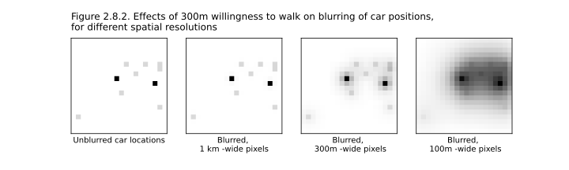
It's time to apply this logic to a gaussian city. Let's start with a reminder, and build the map of CM1, average idle time, CM2, and DFR (car availability relative to demand) for a ___ km -wide city, with ___ cars in it, and the statistics gathered on a square grid with a ___ meter step (Figure 2.8.3 below). As expected, CM1 is mostly generated by the city core, with cars getting rented almost immediately (idle times of minutes). Conversely, cars on the periphery are getting stuck for literally days, making the periphery of the city a burden in terms of CM2.

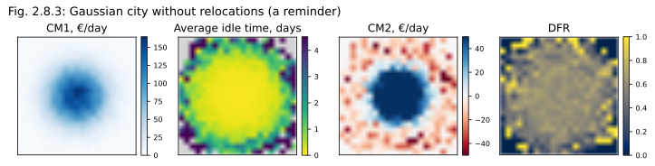
How will the same city look with relocation turned on? (With us only performing relocations when they are expected to be profitable, using the logic described above) The result is shown on Figure 2.8.4 below. The distribution of CM1 haven't perceptually changed, but the hazy ring of cars idling on the deep periphery has disappeared. The distribution of CM2 stays conceptually the same, with the center of the city sponsoring the suburbs, but the total CM2 has increased from ___ to ___, because of the average rentals per car per day shifting from ___ to ____. The availability of cars (right) has not changed much, except for the same disappearance of the noisy periphery. As discussed before, relocations are not about improving availability in hot zones, but about moving cars that are stuck.

🔥 Fix all color scale limits below on same min-max values as above, to make them comparable. Probably make the "visualize" method to return a dict with params, and allso accept this optional dict.

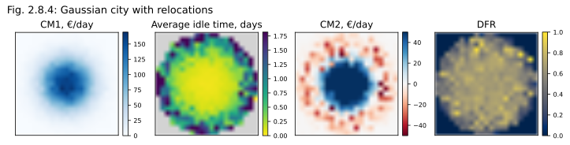
(You may at this point ask yourself, if the change in idle times is so obvious, why the change in CM2 is so mild? That's because relocations cost money, and in this model the full cost of a relocation is applied to the source zone, instead of being split 50/50 between source and target zones, as we do for CM1 contributions. The reason for this different logic is causality: to get a rental, one needs both the origin and the destination; you should have a person wanting to go from point A to point B. With relocations it's slightly different: relocations are driven by long idle times, and so are entirely caused by weak zones. Which makes it fair to apply the full cost of a relocation to the source zone. Which, in turn, means that the map of CM2 changes not as strongly as one could have expected.

Finally, let's look at the distribution of relocation sources and targets on the Figure 2.8.5 below. There's nothing surprising here, but I guess, it's good to double-check. Cars are taken from the periphery and are delivered at the best possible zone in the center of the city, as that's where we expect the idle times be the shortest.

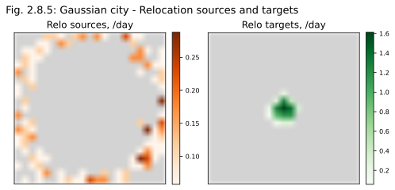

# 2.9. Real-life considerations

## 2.9.1. A better formula

The formula for the expected influence of a single relocation on CM1 which, we introduced above, can be applied not only to a model, but also to real-life, physical, data-driven relocations. But we may have to adjust and improve it a bit. As a reminder, the original formula (the simpler, more conservative version of it), was written as

$\displaystyle m = \bar π_t \left( \frac{n_i}{d_i} - \frac{n_j + 1}{d_j} \right) - r$, 

where, $\bar π_t$ is the average CM1 earned by a single car per unit of time; $n_i$ and $n_j$ are the current numbers of cars in source and target zones respectively; $d_i$ and $d_j$ are demand values in these zones, and $r$ is the cost of a single relocation. Let's now list some changes we'll have to make, to adjust this expression to the real world:

1. Unlike for our simple Poisson-like model, real demand in a real city is very uneven in time, typically with peaks during rush hours (in the morning and in the late afternoon), and sometimes with weaker peaks in the middle of the day, and/or early at night. Conversely, late night and very early morning usually bring virtually no activity. Because of that, the cost of a car idling for 2 hours at 2 am (when nothing is happening), compared to 5 pm (when everyone needs to get somewhere), is very different. This means that to calculate expected waiting times $T$ properly, we need to _integrate_ predicted rental probabilities over time, replacing a fixed term $\bar π_tT$  with $\displaystyle \int_{t=0}^{T}\bar π_t(t)dt$. The result of this change, for real data, may be quite noticeable as the same physical relocation may be profitable early in the morning (before the rush hour); become unprofitable later in the morning, but get profitable again in the early afternoon, before the second rush hour.
2. A relocation is never instantaneous, and typically takes at least an hour to perform (from the moment a relocation opportunity is identified, and to the moment when the car is ready to be rented at the new place). Because of that, our formula needs to include the missed opportunity cost ($\bar π_tt_w$) for the waiting time $t_w$ during which the car is reserved for a relocation, and so is excluded from the active pool. Similarly, some of the time-dependent variables included in the formula need to be offset by this time $t_w$ (e.g. the integral over time should be taken from 0 to $T_i$ for the "no-relocation" scenario, but from 0 to $t_w + T_j$ for the relocation scenario.)
3. The relocation cost may depend on the distance between the source and the target locations; or rather, on the time that it takes to drive from one part of the city to another. It is definitely true for relocations performed by in-house agents (as we are probably paying them per-hour), but even when working with contractors, it makes operations smoother when the incentives are at least somewhat aligned, and more demanding and annoying relocation routes are paid at a higher rate.
4. A worth of a typical rental (the CM1 value generated by it) may be different in different zones: for example, a typical rental from an airport is likely to be priced very differently than a rental from the outskirts of a city. If this is true, and profits from a typical rental $π$ are very different in zones $i$ and $j$, the formula for the financial effect of a relocation should also receive an additional term $+(π_j - π_i)$, to reflect that by performing a relocation we are losing a rental in the source zone, but earning an extra rental in the target zone. (This term is usually positive, as we typically relocate from cheap zones to hot, and thus expensive zones: we'll talk more about it in the chapter "Pricing")
 
Collecting these suggestions into one "enhanced" version of the formula for the financial effect of a relocation, we may get something like this:

$\displaystyle m = \int_{t=T_j + t_w}^{T_i}\bar π_t(t)dt - r_{ij} + (π_j - π_i)$ , 

where $T_i$ and $T_j$ are expected waiting times at zones $i$ and $j$, starting from moments $t=0$ and $t=t_w$ respectively.

To further productionalize this approach to an automated, optimized relocation machine one needs to decide whether it's better to generate relocation decisions on a zone-level (with some fixed "relocation zones" imposed on the city), or to get rid of zones and predict the profitability $m$ based on the exact local environment of each car.
* The benefit of working with fixed zones is that it makes it easier to estimate the parameters going into the formula above: one can just gather statistics for each zone (demand over time, worth of a rental etc.). Also, defining the relocation process in terms of zones makes is easier to communicate with both relocation agents and stakeholders within the company. The instructions become straightforward (e.g. "Please take 3 cars from Bexley and deliver them somewhere in Newham"), scorecards become visual and easily explainable, and one can always fall back to a manual process, if the system malfunctions.
* The downside of working with fixed zones is that one has to define them, and do it well, which introduces an additional layer of complexity to the problem. As the city changes, these zones would have to be updated. In theory, the process of carving the map into zones may itself be automated, either through a fancy machine learning algorithm, or via explicit modeling and brute-force optimization. One could for example calculate demand profiles and usage preferences on a tight spatial grid, then run agglomerative spatial clustering on these values, combining neighboring cells with each other until reasonably sized zones are formed: ideally, with relatively uniform demand patterns within each zone, and similar rental volumes across zones. Still, this sounds like extra work. Most importantly however, even with perfectly defined zones, the very local narrow environment of a car remains to matter fpr predicting its idling time: say, 5 cars tightly parked in a sketchy side-alley will have a hard time attracting customers, even if the zone in general has a high demand. It means that even when working with zones, running a machine learning model with a spatial kernel and individual identification of cars to relocate is highly advisable.

Another practical decision one would have to make when designing an automated relocation system is whether the machine learning solution underlying it, would predict the _financial effects_ of each individual relocation directly (thus bypassing the formula above altogether!); would predict _idle times_ in source and target zones, plugging them in the formula above; or would predict the _demand_ in these zones, recalculating demand into idle times using queuing theory, with either an approximate explicit formula, or numerical integration. All three options are feasible, but come with different levels of complexity and interpretability:

* The catch-all _direct prediction of relocation profitability_ lets the data scientist bypass most of the math, which may be tempting. At the same time, it either increases the complexity space (e.g. for relocation zones we would have to go from predicting values for $N$ zones to predicting values for  $\sim N^2$ zone combinations), or decrease the flexibility of relocation models (if the targets for relocations are fixed to a subset of "hot zones", and only relocation _sources_ are treated as dynamic and flexible). At the first glance, it may seem that the training data for a direct relocation-to-profit model should be easily available, but in practice it's not necessarily true, as we only know the rentals that _happened_, not the rentals that would have happened in the "alternate reality" where relocations were performed differently. Essentially, to train a model that predicts financial effects directly one would have to create an infrastructure for an ongoing A/B testing, performing only a certain share of recommended relocations. It is possible, but is hard. Finally, a catch-all black-box model would offer almost zero observability and interpretability, making it a pain to troubleshoot or fine-tune it.
* The model predicting _idle times_ ($T_i$ and $T_j$ in the model above), is way easier to train, as the parameter space complexity is lower. One still needs to track how the typical waiting times change over time, following yearly, weekly, and daily patterns; spikes during unusual events and peak demand around major holidays). One also still needs to predict the spatial effects on expect idle times, both in terms of locations within the city, and the local environment (other cars parked nearby) for each car or a potential relocation target, but at least the model would not have to be retained in case of a pricing change.
* Finally, predicting the _demand_, and then explicitly recalculating it into expected idle times using numerical integration (in statistics one would speak of an "arrival time" estimation for a non-homogenious Poisson process) is probably the most tempting. The demand does not depend on whether the relocation was taken or not, and good proxies for demand (e.g. app openings) don't even depend on whether the car is present at the location or not, which means that a model for predicting demand does not need to deal with any countrerfactuals or run A/B testing processes: it can be tested directly. Also, a good demand model may be directly integrated with pricing models (see chapter 3), tying different aspects of business operation together. At the same time, accounting for the local environment (the presence of other cars nearby) may be harder, as unless you work with a discrete set of small parking stations, the cars will be distributed across the neighborhood, and so will be only partially competing with each other, meaning that we would have to come up with either some kernel-based heuristics, or a fancier machine learning solution.

This last point, about only partial competition, and partial interchangeability of cars in the city, is further complicated by the fact that most values in the "relocation profitability formula" above depend on the _properties of the car_ that we are considering to relocate. Think about it: cars of different brands and builds may be more or less desired by customers (affecting expected $d$ values); they may be priced differently (again affecting the demand-to-rental convergence), have different use patterns over time, different lengths of a typical trip, and different revenue-to-CM1 conversion ratios (affecting $\bar π_t(t)$ and $π$ values). Moreover, dirty or old cars may be less desirable, compared to recently in-fleeted and recently cleaned cars (affecting $d$ value); the fullness of the fuel tank or a battery may be a concern for some customers (affecting both $d$ and $π$ values) etc. And yet, pools of cars, big vs small, or dirty vs clean, cannot be treated separately from each other, as different builds and brands still do partially substitute for each other, even if the pattern of use is slightly different! A customer going for a longer trip would normally prefer a larger car, but would take a smaller one if larger cars are not available. Moreover, most aspects of "desirability" (tear-and-wear, cleanness) don't divide the pool of cars into categories, but exist on a spectrum. All of that means that car properties can, an should, all serve as features for the ML model in the automated relocation solution.

One potential approach to mitigating this complexity is in following a mixed, modular strategy, where each of the parameters of the "profitability formula" is estimated by a separate expressive ML model, but then the outputs of these model are combined into a final profitability prediction by an explicit formula. This approach, somewhat similar to the "Neural additive model" approach [^Agarwal2020] preserves both interpretability and expressiveness, but allows for independent retraining of different parts of the model. It also allows for simplifying fall-backs in case one of the sub-models becomes problematic, because of a technical issue, problem with data, or a sudden change in business environment. For example, the "average generated profit" $\bar π_t(t)$ can be approximated by either a constant, or a set of 24 simple averages for each hour of the day, or a set of averages for different hours and weekdays, or by a simple regression model, or by a full-fledged tree-based ML solution etc. The same is true for most other values of interest. As long as the relocation tool is designed in a modular way, one can change this complexity on the fly, substituting different sources for one part of the "big formula", without compromising or invalidating any of the other parts.

## 2.9.2 Other optimizable aspects

🛠️ Under construction 🛠️ 

## 2.9.3. Long-term plans and seasonality

🛠️ Under construction 🛠️ 

## 2.9.4. Airport relocations

🛠️ Under construction 🛠️ 

## 2.9.5 Relocations and self-driving cars

One can sometimes read that self-driving "robotaxis" are similar to free-floating car-sharing, just better: safer, cleaner, more reliable. It is of course true in some ways, but there is one crucial difference. Self-driving cars can drive around empty. And while this does sound like a feature, it also presents a huge existential problem.

Let's look at the numbers. In our calculations we always assumed a typical ride to last about 20 minutes, bring our company about 10€ in revenue, and cost us about 5€ in running CM1 costs. These are very approximate numbers, but they are somewhat grounded in reality (see Chapter 06, the Appendix). Now let's imagine that after dropping off a customer your car can keep cruising through the central part of the city. For how long can it be cruising, and still remain profitable? If we stick to the numbers above, we have just earned 5€ in CM1 (10 minus 5), and 20 minutes of driving costs us about 5€, so at the very least we can let an empty car drive for another 20 minutes. As the center of any live city is always full of people and interesting locations, and is always short on parking (which is exactly what makes it dense and full of interesting locations!!), the expected time until the next rental is probably close to 5-10 minutes, so it makes sense for the empty robotic car to just keep driving! Moreover, while a robotic car is more expensive in CM2, it is cheaper in CM1: it is electric, it drives way smoother than a human would, recouping most of the energy through slow engine-driven braking, and it is in no rush while cruising. It is hard to give a precise estimation without studying the technical specifications of robocars, but it is probably a safe bet to say that it is profitable for them to keep driving (cruising) empty for up to 40 minutes or so, if necessary; maybe even an hour. By repeatedly driving through most popular streets, and by carefully spreading around - essentially, by performing relocations "on the fly", you can further increase the chances of a robotaxi to be rented again. Which makes cruising even more appealing! To sum it up, if given a chance, robotaxis would always cruise in the middle of the city, and they would never park. Which is indeed exactly what is happening in real life: depending on the city and the company, between 30% and 80% of driving time of self-driving cars is taking place with no one in the car; just an empty car cruising the streets[^Nair2020][^Henao2019]!

> [!CAUTION]
> If self-driving taxis are allowed to drive empty, it is profitable for the company to keep them driving empty _most of the time_!

We can immediately see what it means for the cities: streets full of cars, most of these cars empty. Unlike for most cases considered in this work, here the interests of the city, of both inner-city residents and visitors to the center of the city, come in a stark contradiction with the interests of the business, with the optimal business strategy. If allowed to roam cities freely, self-driving cars will ruin them. And it is really tragic, as self-driving cars also bring so many potential benefits: they are said to be safer and more environmentally friendly, when driving, because of a more cautious, smoother driving, but more importantly, they solve so many problems described in this paper! You don't need to send a human driver to relocate them, or clean them, or bring them to a repair shop: they can drive there themselves! It would be so nice to reap the benefits of self-driving cars without ruining the cities in the process! Is it possible?

In my opinion, it is of course possible, and there are two solutions here: a slightly more optimal hard one, and a slightly less optimal, but a very simple one. The hard one is to make it illegal for self-driving cars to drive more than 300 meters without a passenger. Imagine a city with mobility centers every 200 meters or so, every other block. You can rent a car at any mobility center, or make it pick you up, but the car never has to drive more than 300 meters empty. You can also exit the car at any point of your liking, leaving it to drive to the parking alone, and self-park there, but the trip from the point of service to the parking spot is again never longer than 300 meters. This approach would hit the best of both worlds! But unfortunately this solution is also rather hard to enforce, as unless you make the provider share the position of every car in real time, or unless you track them in real time with cameras on every intersection, you cannot really check for how long any given car was driving without a passenger. And having this level of real-time tracking would be prohibitively expensive, and also a privacy nightmare.

Fortunately, there is also a much simpler approach that is only marginally worse, and that I have already mentioned once, higher up in this chapter. Make empty rides legal only at night, from 12 am to 6 am, or something like that. Also make them slow if you wish (not more than 20 km/h or so?), and let the cars redistribute, or drive to service centers only at night. We would still have mobility centers every 100 or 200 meters, but now all rides need to start and end at these mobility centers, making it more similar to carsharing than to a taxi service. A person would never have to walk to a car for longer than a minute, the cars would still remain distributed ideally through the city (based on the principles outlined earlier in this chapter), the costs of operating this fleet will still be low, offering better service and lower prices, but there will be no empty robotic cars clogging the streets. It may still be the best of both worlds. But cities need to proactively fight for it, to make it happen.

# Footnotes

In part 2.4 above, when talking about optimal relocation frequency, we switched from linearly decreasing demand to a weirder shape with a longer tail, and I claimed that a shape like that would benefit more from relocations, in terms of total CM1 delivered. It sounded reasonable (or at least I hope so), but is it really a type of demand distribution that benefits most from relocations, or was it just a shot in the dark?

Actually, before picking a "simple" demand distribution to illustrate how relocations work, I ran an experiment in which I took a linearly decreasing demand and started wiggling it a bit, only retaining the "wiggle" if it improved the profitability of relocations. The total demand in the system (the sum of demand values for individual stations) was set to be invariant. It was an inefficient and slow search, but an easy one to code, and over 200 iterations it converged to an interesting "shoe-like" shape with 2 high-demand zones, three medium-demand zones, and 5 low demand zones (the lowest non-zero demand that points were allowed to take in this little optimization problem). The final shape and the optimization trace are shown on the Figure 2.9 below.

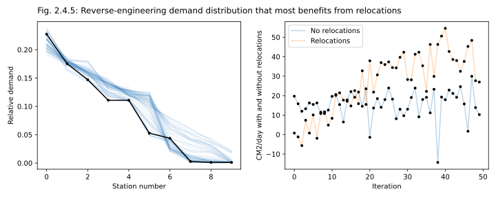

For 10 zones, 15 cars, the financials we assumed for all of our models, and this particular value of total demand in the system, this distribution of demands-per-location seems to maximize the impact of relocations in the system. But it also looks extremely idiosyncratic, so for the experiment on the optimal relocation frequency I used a similar, but simplified demand distribution.

# References

[^Agarwal2020]: Agarwal, R., Frosst, N., Zhang, X., Caruana, R., & Hinton, G. E. (2020). Neural additive models: Interpretable machine learning with neural nets. arXiv preprint arXiv:2004.13912.
https://arxiv.org/pdf/2004.13912.pdf
[^Gomez2023]: Gómez‐Corral, A., Langwade, J., López‐García, M., & Molina‐París, C. (2023). Sufficient conditions for regularity, positive recurrence, and absorption in level‐dependent QBD processes and related block‐structured Markov chains. Mathematical Methods in the Applied Sciences, 46(6), 6756-6766. https://onlinelibrary.wiley.com/doi/10.1002/mma.8938
[^Nair2020]: Nair, G. S., Bhat, C. R., Batur, I., Pendyala, R. M., & Lam, W. H. (2020). A model of deadheading trips and pick-up locations for ride-hailing service vehicles. _Transportation Research Part A: Policy and Practice_, _135_, 289-308. https://www.caee.utexas.edu/prof/bhat/ABSTRACTS/RidehailingEmptyTrips.pdf
In the literature review, it cites estimations of 35% to 55% of empty rides, by time.
[^Henao2019]: Henao, A., & Marshall, W. E. (2019). The impact of ride-hailing on vehicle miles traveled. Transportation, 46(6), 2173-2194. https://link.springer.com/article/10.1007/s11116-018-9923-2
The article claims 70% of empty miles traveled, 84% increase in total miles traveled.
