# 2. Relocations

🔥 Define what a relocation is

Why would a carsharing company spend its own money to move cars from one area of the city to another? Why would we pay someone to do so? Sure, every now and then we need to run all sorts of service drives, bringing cars to a workshop, returning them back to the city, moving cars to charging poles to charge, or to gas stations to refuel. But what about cars that are clean and sound, and are just standing somewhere, waiting for a rental? Surely, if a customer ended a trip in some particular location within a city, sooner or later either they, or another similar customer, will want to start a trip nearby and bring the car back in the game. Should not we just wait? Would not the "natural" distribution of cars in the city be the best one for the business?

From the Chapter 1 we know that the answer to this rhetorical question is a resonding "NO"! The default, "natural" distribution of cars within the city is horrible for business, and can easily ruin a carsharing company by rendering it unprofitable. Until carsharing becomes a dominant form of car-use, making high service level (DFR) the top priority, cars have to be redistributed to optimize profits. This last phrase may sound annoyingly capitalist and exploitative, but even from the most altruistic point of view, to have the highest societal impact, in terms of reducing the carbon footprint of the city, carsharing companies should invest in the efficiency of their operations, and pump any spare money they have into expansions. It's much better for everyone if companies can bring carsharing to smaller towns, instead of letting their cars idly rust and rot in forgotten backstreets, parking lots, and alleyways.

Moreover, even putting the average distribution of cars in the city aside, from Chapter 1 we know that the distribution of cars across different parts of a city is inherently volatile, and that rental cars are prone to spontaneous pile-ups at random points on the map. These fluctuations of fleet density within the city obviously hurt fleet utilization and business efficinency, as every pile-up of cars in one part of the city means that some other part doesn't have enough vehicles, with customers getting underserved and frustrated. To maximize the positive impact (and also, to survive financially), a good carsharing company should identify these "pile-ups" early on, and redirect idling cars to where they are most needed at the moment. The presence of relocations in a city is not a sign of inefficiency; on the other hand, it's a sign of a responsible mobility company, fighting a never-ending fight against entropy.

There are of course also other, more complicated reasons to relocate a car. For example, a single car may be trapped in an unfortunate, barely reachable location, somewhere in a park, under a bridge, or in some industrial zone. Shared cars may also be used by customer to retrieve their own, private vehicles from towing yards and workshops, in which case some of our shared car would never see a drive back. Or maybe, in a nightmare scenario, a whole district of a city would have access to a good comfortable train to bring people to work in the morning, but no good train to bring them back home in the evening (or the other way around). In a situation like that, day after day, customers would tend to take a train to work, but a shared car back home, accumulating them in one particular partof the city. Situations like that exist, and a good relocation system should be able to automatically identify and rectify them, maintaining the optimal distribution of cars in space.

Let us now return to three previously described models: the "One station" model (aka a city and a village), the "Multiple stations" model, and finally to a "Gaussian city", to see how the presence of relocations can change the financials of a "virtual company" operating in these "model universes".

# 2.1 One station

In chapter 1 we discussed how even a very small station, once opened, starts to accumulate fleet: first linearly and quite rapidly, then slowing down more and more, but still approaching a ridiculously unfair share of the total fleet that is not proportional to demand, but follows a uniform distribution across the points of rental. We also mentioned that relocations may be one potential answer for this problem. So, what will happen if we repeat the simplistic experiment from chapter 1.1, but now with a hard limit on the maximal number of cars at the station?

A visual answer to this question is shown on Fig 2.1.1 below. Here a small "village parking lot" is, again, opened near a large city, and the village is offering 1% of the total demand in the area. As before, attempts to travel by a shared car form a poisson process, but a travel cannot happen if the lot is empty, and there is no car to rent. The only difference is that now the fleet at the village parking lot is capped from above at 10 cars. If the 11th car enters the lot via stochastic rentals, it is _immediately_ relocated back to the city at our expense.

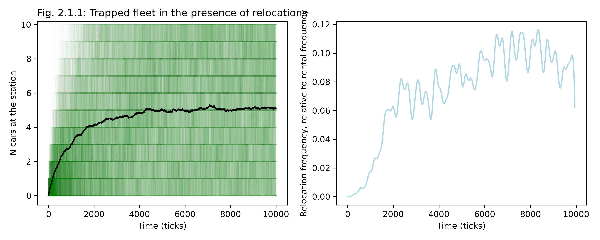
In the left panel we can see 500 random traces that a model like that can follow (green), and an average of all these traces (black), representing the most probable evolution for the number of cars in the parking lot. The curve takes off from 0 as rapidly as in an "unconstrained" model, but then gets very quickly saturated at 5 cars, which is exactly a half of the maximal occupancy (10 cars) that we allow to the lot in this model. This makes sense: in the presence of relocations, the number of cars at the lot also presents a "one-dimensional bordered random walk with a reflective barrier", but now the upper border for the number of cars at the lot is not equal to the total number of cars in the system, but to the artificial limit we imposed. The trajectories of $N_V(t)$ randomly move between 0 and 10, eventually occupying every state (every number from 0 to 10) with equal probability, placing the expected number of vehicles $E(N_V(t))$ at half the limit $N_{\max}$. 

The right panel shows a plot of average relocation frequency over time, and similarly to the average $N_V(t)$ curve, once the system stabilizes, the expected relocation frequency becomes roughly constant (even if more variable). It turns out that there is a simple formula for the average frequency of these relocations. Let's say that the flow of cars to this small parking space happens at a rate $λ$, and as discussed, a discrete one-dimensional bordered random walk is equally likely to visit all points from 0 to $N_{\max}$. Then the probability that a new arriving car will find the parking lot at top capacity of $N_{\max}$ will be equal to $P(N_V=N_{\max}) = 1/(N_{\max}+1)$, and the rate of relocation, relative to the rate of inflow $λ$ will be equal to $\frac{λ/N_{\max}}{λ} = 1/(N_{\max}+1)$. And just in case you don't believe this calculation (as strictly speaking we never proved that a random process like that will lead to uniformly distributed values of $N_V$), Fig 2.1.2 below shows an "experimentally" observed chart of relative relocation frequencies from a simulation (500 experiments per point, 6500 time points per experiment), together with a "theoretical curve" of $1/(1+N)$.

🔥 TODO: fix the title here below, it has a typo. The title should be "Expected relication rate". Also change "hub" to "station" in figures

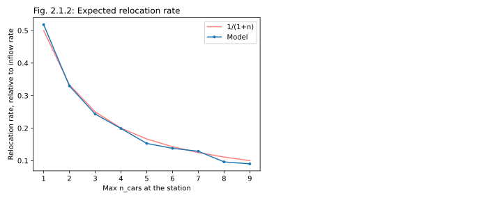

> [!TIP]
> The lower the target number of cars at the station, the more you will have to relocate to maintain it.

Having this simple equation at our disposal, we can now tackle a new type of problems: instead of modeling our "village parking lot" explicitly, with an agent-based model, we can directly calculate the avergae profitability of its "stable state", over a long period of time. Assuming that the number of cars at the parking lot is limited at $N_{\max}$, we can expect its financials to have the following components:

* **Rental profit** coming from $λ$ incoming and the same number of outgoing trips per day (on average, as $λ$ is a rate of a stochastic process). Assuming that each trip brings us $π$ in CM1, we can expect an average rental profit of $2λπ$. 
* With the number of cars limited at $N_{\max}$, we can expect to have $N_{\max}/2$ cars at the parking lot on average, and so will bear a **CM2 loss** (through car costs / leasing rate) of $CN_{\max}/2$, where $C$ is a daily cost of having an extra car in the fleet.
* To limit the number of cars, we'll have to relocate cars back to the city at the rate of $λ/(1+N)$, and so will be spending on average $λr/(1+N)$ on relocations, where $r$ is **relocation cost** (the amount of money we'll have to pay to contractors, or our own people, to relocate this car)
* Finally we need to account for the fact that when the parking lot has no cars in it, it is impossible to rent a car from it back to the city, so some rentals that we already counted in the $2λπ$ formula above will in fact be lost (**missed sales**). How many rentals will be lost? We can use a little trick here, and remember that once the number of cars $N_V$ is trapped in the $[0, N_{\max}]$ interval, it will visit every space with the same probability, meaning that the rate of attempted decreases in $N_V$ when the lot is at zero (attempted outgoing rentals) will be the same as the number of attemped increases in $N_V$ when the lot is full (incoming rentals when the lot is at $N_{\max}$). The situation is fully symmetrical! Except that when the lot is full, we are paying a relocation cost $r$, but when the lot is empty, we are _missing a rental_, which is equivalent to losing one CM1 contribution of $π$.  Therefore, the total loss from missing rentals will be equal to $πλ/(1+N)$.

Combining these 4 components in a single formula we get an equation for the average long-term a single station profitability (CM2), as a function of plot use, maximal number of cars tolerated at the plot, and a set of financial coefficients:

$\displaystyle CM2 = 2λπ - C \frac{N_{\max}}{2} - \frac{λ}{N_{\max}+1}(r + π)$

A few reasonable curves for this equation, assuming our standard values for the financial coeffients ($π$ of 5 €/trip, $C$ of 20 €/car/day, and $r$ of 20 €/relocation), are shown on Figure 2.1.3 below. We can see that a small parking spot can hope to break-even if it generates about 8 rentals/day in one direction, on average (or 16 rentals in+out), and for this to happen, we need to limit the number of cars at this lot at 3-4 cars. If we relocate less often, cars will accumulate, and we will start losing money because of idling cars. If we relocate too eagerly, we will lose too much in wasterful relocations and missed rentals. For more popular locations ($λ > 8$) the curve becomes flatter, and we can afford to relocate way less often. For less popular locations ($λ <8$), it is impossible to achieve profitability.

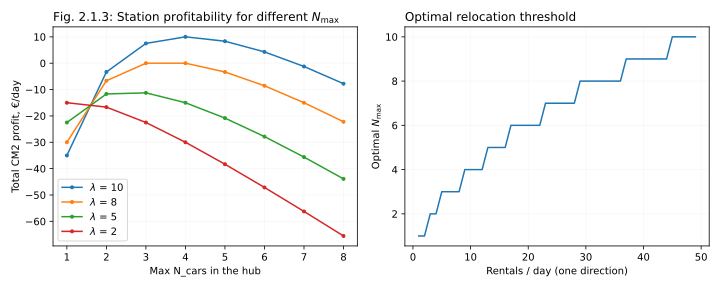

We can also see from these four curves on the left that the optimal number of cars at the parking grows with the rate of rentals generated by this parking. For a "dead" location with only 2 rentals a day (one direction), technically, the "best" number of cars is 0 ($N_{max}$ of 1). Every single car trapped in this horrible place means wasted money. For a slightly more active plot with 5 rentals a day, the optimal maximal number is 3. For plots with 8 and 10 incoming rentals a day, the optimal $N_{\max}$ is 4. In short, for any given set of financial coefficients $(π, C, r)$, we can build a curve (right panel on Fig. 2.1.3 above), or rather a step-plot, of optimal triggers for relocation as a function of plot popularity (the average demand rate $λ$). A curve like that may even be used practically, for manual relocations, in case an automated system (see below) is for some reason unavailable.

The profitability formula above is simple enough to find optimal relocation trigger values analytically, without a need for explicit modeling. Let's temporarily "forget" that the formula for CM2 above is written for an integer process (that the value of $N_{\max}$ is technically an integer), let's instead "pretend" that it's a continuous variable, differentiate by it, equate the resulting expression to 0 and solve it for $N_{\max}$. This exercise gives a formula below, which can then be rounded to the nearest integer value, producing the same ladder of values that we already saw on Fig 2.1.3 (right).

$\displaystyle N_\text{opt} = \sqrt{\frac{2 (r + π) \lambda}{C}} - 1$

Equipped with this formula, we can find the optimal relocation rate (or rather, relocation threshold) for an isolated parking with any observed or expected demand, put this optimal relocation rate to the formula for CM2 above, and get a curve of _maximal possible profitability_ of a parking station, as a function of demand at this station. The curve for the same financial parameters as before (20€/car/day of leasing/ownership costs, 20€/relo, 5€/trip CM1 in profit; see "Appendix" for comments) is shown below (Fig 2.1.4). It below zero, as for a no-demand location every car needs to be relocated "to the mainland", then counterintuitively dips even further down (as the rate of relocations increases, but the rentals don't yet contribute much to the economy of the parking lot). At some point however the curve starts to recover, and at some critical demand (for these parameters, at about 8 rentals/day _in one direction_) the parking lot breaks even, and then becomes steadily more and more profitable.

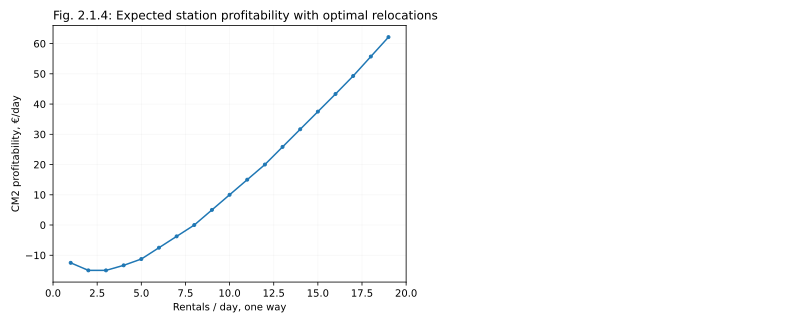
> [!TIP]
> 10 rentals/day one direction (from the station to the city) is a good "Rule of thumb" threshold for a newly opened location to be profitable. If you have reasons to expect the new location to generate 10 rentals a day on average, you can open it.

Calculating a curve like that for your actual CM2 cost, relocation cost, and CM1/trip in a city would give you a very good starting point for deciding which locations are worth opening or retaining. If a location doesn't offer enough demand, it will be a burden for business, but once it breaks even, it can become a good investment for the future. In Chapter 4 we will talk more about the concepts of shrinking and expanding the operating area, one location at a time.

If your company has a dedicate "sales" department, with people trying to negoatiate with businesses and municipalities about opening a station at their premises, it's also useful to communicate this approximate ballpark value to them, so that they could prioritize their projects. 2 rentals a day are not worth fighting for. 15 rentals a day is a no-brainer. 5 rentals a day is a borderline case where assumptions and long-term projections suddenly become important.

## Autonomous vehicles

Before we return back to "normal" scenarios let's indulge in a little aside here. How could anotonomous vehicles (should they ever  happen) change this picture? Usually when people think about autonomous vehicles, they hink about a person sleeping or working in a car while a car is wheezing along a highway. But in case of urban mobility that is another interesting application to autonomous driving: slow, safe, driverless and _userless_ relocations in the middle of a night. Imagine a city in which every car parked in a dark God-forsaken alley would carefully crawl out of this alley at about 2 am, when there's almost no one on the streets, and slowly, carefully move itself towars a target parking station, to be picked up by humans in the morning. How would this change the economics of relocations?

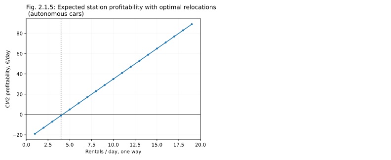
Above is a version of the same graph as before, but for a scenario where cars are very expensive (50 rather than 20 €/day in CM2 costs), but the relocations are very cheap (3 rather than 20 €/relo, accounting for electricity costs and amortization, see Appendix). The non-linear dip for small stations is gone; there is still a clear threshold, but this threshold is now way smaller, at 4 rather than 8 rentals a day (one direction). In other words:

> [!TIP]
> If autonomous relocations are ever available, they will make free-floating car-sharing more profitable, and more accessible, as operators will be able to cover smaller, less popular stations.

# 2.2 Several stations

🔥 ADD CLEAR CONCLUSIONS EVERYWHERE HERE, AS RIGHT NOW IT"S RATHER CONFUSING

Before we upgrade our models from one location to a set of several locations, lets talk some more about the logic of relocations. To perform a relocation, both in real life and in the model, we need to find the best car to relocate, and a good destination to move it to (a station, a zone, a parking spot, or a certain position deep within the city). Let us assume that our goal here is to maximize profits (as opposed to, for example, promoting our services, undercutting competition, or achieving a certain level of customer experience). Let's also agree that we are going to maximize these profits by maximizing revenue: we don't want cars to stand idly in some forgotten side alleys without serving customers; we want them to be rented again and again, as often as possible. (In real life we may also be concerned about reducing losses, such as vandalism and theft, or by optimising costs, such car cleanness, recharging and refueling etc., but for the sake of this exercise let us ignore everything except the profits received from rentals).)

Under these assumptions, the task of maximising profits is roughtly equivalent to the task of minimizing the average idle time for the city. Every time the car is idling without bing rest, we are potentially incurring an opportunity cost, as somewhere in a different part of a city a customer may be looking for a car, and not finding any. We can therefore try to find a car that is idling in a low-demand zone, and move it to an empty or nearly-empty high-demand zone. Even better, we can try to estimate the expected boost in CM1 from this move, and only perform the move if the boost is higher than the relocation cost.

How to identify a car that is stuck in a bad zone? The first intuition that you may have is that we need to look for a car that is already idling for a long time. It is definitely a reasonable  thing to do, as a car that is sanding in place for 2-3 days without any rentals is mostly likely to be in some sort of trouble, but at the same time what we are really after is the car that is expected to be idling in the future, not the car that was idling in the past. The two things are related, but may nevertheless be quite different in practice: if two cars have just arrived in a horrible God-forsaken zone, you'd better relocate one of them immediately, even if for now they are standing there for only a few minutes, compared to a few hours of idling for some of the cars in average, or even good zones. We need to predict the future, not look into the past.

In real life, it would probably mean creating a predictive machine learning solution (see below), but in a model we can use a simpler solution. The expected future idle time $t$ for a car will be highest if the probability per unit of time for a car to be rented $p$ is lowest (for a homogenious Poisson process, $t = 1/p$). If we assume that we serve customers veia stations (as in exercise 1.2 befor that), and that all cars within a station are equivalent and interchangeable, then the frequency of renting events per car is just the frequency of demand events distributed over the number of cars in the station $p = d/n$. It means that to find a good car to relocate, we need to just pick a station with lowest demand per car $d/n$ value, and pick any car from this station.

To find the best target station we need to find a station withthe  _lowest_ expected idle time _after_ the car is relocated to it, which is the same as finding a zone with highst demand per car $d/(n+1)$ (we need to add 1 to the current number of cars at the station $n$, to get the value of demand per car _after_ the relocation). Which gives us a good algorithm to follow: 
1. sort stations by expected demand without a relocation $d/n$ 
2. find a source station with the smallest value of expected demand
4. sort all stations by expected demand after potential relocation $d/(n+1)$
5. find a target station with the highest value of expected demand
6. pick a random car at the source zone and relocate it to the target zone
 
Had we tried to relocate several cars at once, the formulas and the algorithm would have become a bit more complicated, but for the sake of this exercise let's relocate at most one car per tick.

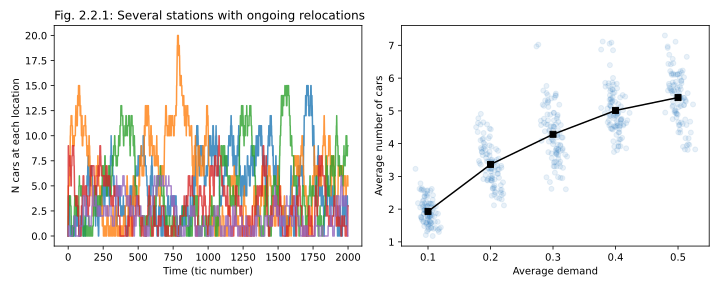

The results from a relocation model (script `02relos_02ring` with `few_stations` scenario) are shown in the figure above. Here all model parameters were exactly the same as in the corresponding model from Chapter 1 (5 stations with demand linearly decreasing from 0.5 to 0.1;, 20 cars), but this time around every 20th tick an idle-time-based relocation was performed. We can see the cars are no longer distributed uniformly, as cars from low demand stations are regularly relocated to high-demand stations.

Unfortunately for our model, in this case relocations don't really help to increase the profits (see the figure below; it assumes 20 trips/day from the hottest zone in the model, 5 €/trip in CM1, and 20 €/day as the car cost). 🔥 _Describe what we are supposed to see on this figure_ That relocations are not helpful for this model in particular is not really surprising, given that with this set of parameters (20 cars per 5 stations) our "city" is oversaturated with "cars", as the way the code is written, at any given moment at best 5 cars may be "used", and no car is rented for longer than one tick of time (all trips are instantaneous), so 15 out of 20 cars are always idling. To make relocations profitable in this model we'll need to change the distribution of demand values, and also reduce the fleet (lower the DFR).

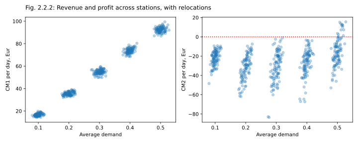

Let's now change the model, to make sure that some of the stations are really bad, so that cars could really "get stuck" there (we'll give them ~10 times lower demand, compared to "good stations"), and also that there are not enough "cars" to cover all the stations. The figure below corresponds to 10 stations, half of them with demand of about 0.4, half of them with demand of about 0.03, and only 5 cars to serve the city; a relocation is performed every 20th tick (see `02relos_02ring` script for details, scenario `suburbs`). We can infer from the left plot that relocations were used to move cars from bad (low demand) stations to good ones, maintaining a DFR of about 20% at bad stations, and about 55% at good stations. The bad stations remain unprofitable, but not as unprofitable as they wold have been with the uniform distribution of fleet. in the absence of relocations!

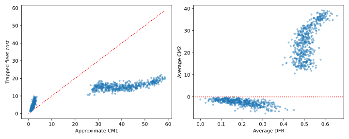

🔥 DFR vs demand?

🔥 An aside on how carsharing cannot replace public transit, and should never be positioned as such, because we fundamentally depend on cars being a cherry on top, a preferred, but not the only means of transportation. By nature of statistics above, we cannot guarantee both a good service (availability), a good price, and a good coverage. To guarantee a good service and a good price we would have to limit our offerings only to high-demand areas of the city, essentially becoming a fancy "Drive-it-yourself" shuttle between a few fixed points in space, which is not that interesting. We can still offer a good price and a wide coverage of "hotter" and "cooler" locations, as in simulations above, if we allow ourselves to drop DFR at weaker... _or long-term rentals without releasing the car, which guarantees a trip, but is expensive_ ??????????? 🔥🔥  _Is it even true? is it worth to say it? How to phrase it? Think again later...._ 🔥 🔥

# 2.3 Optimal number of relocations

From the previous figure we can see that in our model, with a constant rate of relocations of one relo per 100 rentals (every 20th tick) not all cars were removed from "really bad zones". Did it happen because it was actually better, from the CM1 point of view, to keep some cars there? Or did it happen only because we did not have enough relocation capacity to clear these stations out completely? Let us explore this question by running the model with _different relocation volumes_, from 1 to 200 relocations per experiment (which would correspond to a range from 2000 to 10 time ticks per relocation). As we want to assess resulting profitability of our "city", this time around we will also assign a fixed cost for every relocation task (20 €/relocation).

The result of this experiment (below) shows that there is indeed an optimal volume of relocations to serve this "city": a relocation frequency at which the profits are maximized. (Strictly speaking we modeled CM1 profits, but as the number of cars in the city is fixed, this optimum also corresponds to optimal CM2 profits). With too few relocations, too many cars end up being trapped at bad zones, and thus effectively excluded from rental business. With too many relocations, on the other hand, too many relocations ended up being unprofitable (we moved a car to a better zone, but it didn't yield enough gain  in rental CM1 to offset the cost). 

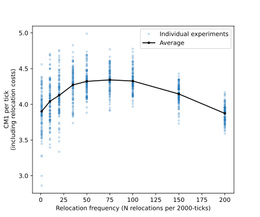

While the system we modeled here was simplistic and artificial, nothing prevents you from modeling your actuall operations in a similar manner. All you need is to split your operating area into zones, either by pixelating it, or by approximating it with polygons, calculate actual rental frequencies between zones (or build an ML model to predict them in the future, if it is our thing), and then directly model the financials of the city with different numbers of daily relocations. Once the curve is ready, pick the optimal number, and secure enough in-house or contracted relocators to move your cars around.

> [!TIP]
> For a given operating area, and a given number of cars in the city, there is an optimal number of relocations to perform per day, and you can assess this number with modeling; both for optimization and budgeting / contracting purposes.

# 2.4 Fleet size planning

Let's now investigate how the ideal volume of relocations depends on the number of cars in the city. Does a need in relocation increase with fleet size, does it decrease, or does it stay more-or-less flat? To answer this question, we'll run the same model repeatedly, but with different numbers of cars in the system (from 1 to 40). Also, instead of forcing a relocation every several rentals, regardless of whether it is profitable or not, as we did before, let us sketch a simplistic logic that could be used in an actual city, for actualy daily operations: at every time tick we will find the best possible relocation to perform (which is definitely more relocation capacity than we will use in practice!), but only perform a relocations if it is expected to be profitable. 

How to do it? Can we identify profitable relocations _before_ performing them? Let's again begin with finding a car that is _least likely_ to be rented at the next tick at the station where it is currently located. Then we will find a station where, should we move a car there, it would be _most likely_ to be rented. The probability of being rented from a "bad" (source) station $i$ is equal to  $d_i / n_i$ (demand $d_i$ shared across the $n_i$ cars trapped there), while the probability to be rented from a "hot" (target) station $j$ after a relocation is equal to $d_j / (n_j + 1)$; we need to add 1 to $n_j$ as we're about to add an extra car to this spot. In the script, the demand values $d$ are defined as discrete probabilities of a ar being rented at the next time tick, but for formula-writing purposes let's work with the expected average numbers of rental attempts per the unit of time (the intensities of the rental Poisson processes). 

Assuming that $d$ values are Poisson process intencities, if we now choose to move one car from station $i$ to station $j$, the expected waiting time till the next rental for this car will be reduced from $n_i / d_i$ to $(n_j + 1)/d_j$. Which, in turn, means that the car will be expected to spend more time in a "rented" state, generating revenue for the company. How to estimate the financial gain here? We can assume that every car that is not trapped, but that is currently in the active rental pool, is collecting some typical, average, constant _profit per unit of time_ (total CM1 profit generated by an "untrapped" car, spread over a large enough period of time). This average CM1-generating rate $c$ is of course lower than the profits generated during a rental, as even an "unstuck" car is still standing still between rentals, but at least we will know that it is now "unstuck"; that we pushed it from a "definitely idling" state to a "mixed state of average activity for the city". This approach is a bit tricky, but think about the expression "back into the fray", and hopefully you can get the vibes of it. The total financial gain (or loss, if the value is negative) from a relocation is therefore described by a formula:

$\displaystyle m = c\left( \frac{n_i}{d_i} - \frac{n_j + 1}{d_j} \right) - r$

where $c$ is the average CM1 earned by a tyipcal car in our city per unit of time, and $r$ is the cost of a single relocation.

Let's work through one example. A relocation from a station with 2 cars and a rental probability of 0.1 per tick, to a station with 0 cars, and a rental probability of 0.5, is not expected to be profitable in our model (assumign the fleet of 10 cars). Here is the calculation:
* The expected time to the next rental for a car standing at a "bad" station is equal to $n_i / d_i$ = 2/0.1 = 20 ticks
* The expected time to next rental in a proposed "good" station is equal to $(n_j+1)/d_j$ = (0+1)/0.5 = 2 ticks
* Time won by this relocation: 20-2 = 18 ticks
* The typical number of rentals per tick in our model (`few_stations` model with 10 cars), is about 2 rentals/tick. This number is impossible to guess, but we can get it from the actuals (in this case - modeled actuals).
* With per-rental CM1 profits of 5 €/rental, on average (over the long period of time!) each of cars will earn us 2·5/10 = 1€/tick in CM1
* We can therefore expect to earn 18€ in additional CM1 rentals, if we perform this relocation, but at the same time we willl definitely lose 20€ on the relocation cost, ending up with an expected total effect of −2€ (loss), making this relocation unprofitable.

If however, for the same two stations, with all the same parameters, we would have 3 and not 2 cars accumulated in the low-demand zone, a relocation of one car will become profitable (yielding +8€ in revenue). You can run the calculation itself if you wish 😉

Actually running the model for different fleet sizes, for the same collection of stations, featuring 5 decent zones with rental probability of ~0.3, and 5 horrible zones rental probability of ~0.03 (scenario `suburbs`, described above), produces the curves below. One shows the optimal number of relocations as the function of fleet size, and the other one - the expected CM2 profitability of this "city" as a function of fleet size:

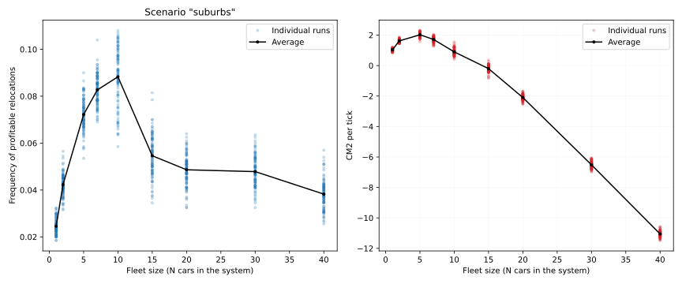

From the left curve we can learn that, not suprisingly, when the fleet is very low (in the extreme case, consists of 1 car only) relocations are generally not helpful. With very low fleet, relocations are only recommended if you cover stations (or geographical zones) that are _that horrible_ that a car can be stuck in them for more than a day, missing some 4-5 rentals, and thus 20-25$ in CM1, which would justify the 20€ relocation cost. Which begs the question of why these bad areas are even covered by our business!? We will definitely return to this topic in Chapter 6, when discussing operating area optimization.

As you grow the fleet, you increase the chances of two or more cars randomly meeting at the same not-so-good station, creating a fluctuation of trapped fleet, which is often profitable to resolve. At fleet size continues to increase, the expected frequency of relocations goes through a maximum, but then starts to decrease again, as when the system is overloaded with cars, some of the cars are never getting rented anyways, and therefore it does not matter that much where exactly they are idling. By pure coincedence, for this model the curve of the optimal relocation frequency drops down at about the same fleet (15 cars) at which the CM2 curve for the model as a whole becomes negative, but there is no deep truth in this (the left signifies the fight of better car placement with a fixed relocation cost, while the right curve manifests the fight of CM1 profits with CM2 car costs; the parameters that control the shapes of these two curves are only partially shared).

> [!TIP]
> Each city (operating area) has the optimal fleet to serve it. You can find this optimal fleet by monte-carlo modeling, which is time consuming, but not particularly hard.

Another practical learning point that we can draw from the left curve is that the number of profitable relocations identified and performed by the model differs a lot from one run to another (note how wide the point "clouds" are!) The reason here is that the number of cars at each station is a one-dimentional brownian process variable, and while it is random, it changes quite slowly (we have already discussed this phenomenon in Chapter 1). If in real life relocations from a zone are low in one month, but high in another, that does not necessarily mean that something structurally changed in the way this zone is used; it may as well be that by pure luck the cards have being dealt slightly differently this time around.

This last point also has an interesting consequence. Among 100 individual experiments that were run to produce the figure above, some required almost 2 times more profitable relocations than some other (say, for a case of 10 cars, we have one experiment with relocation frequency of about 0.06 per tick, and another one - with almost 0.12 per tick). Yet in real life, from the operations point of view, it is much more desirable to perform the same "reasonable" number of relocations every week: it helps with capacity planning, budgeting, and optimizes utilization of drivers. Which in turn means that even when operations are tuned up perfectly, on some days drivers would be performing relocations are are not quite profitable, while on other days some relocation request may remain unresolved for capacity issues. This is unavoidable, and this is ok.

> [!WARNING]
> Don't be too upset with relocation effeciency on every particular day, or even week. Relocation strategy should be optimized only at larger periods of time: months, or even quarters.

Finally, let's reiterate: the right curve on the figure above spells a very important message. It introduces that concept of an **optimal fleet size**: the number of cars that, for a given operating area, demand, prices, and relocation logic, offers the best CM2 profitability.

For the sake of  completeness, below you can also find the same curve for the original "stations" model (called `few_stations` scenario in the Python script), with 5 zones of similar, linearly decreasing demand. The curve is conceptually similar, but has a less prominent peak, as in this specific case all zones are basicaly "OK", and it is only an occasional random overconcentration of cars at some of the zones that needs to be solved by relocations. Still it is encouraging that even this simple model we see a smooth peak of an optimal fleet size (on the right plot).

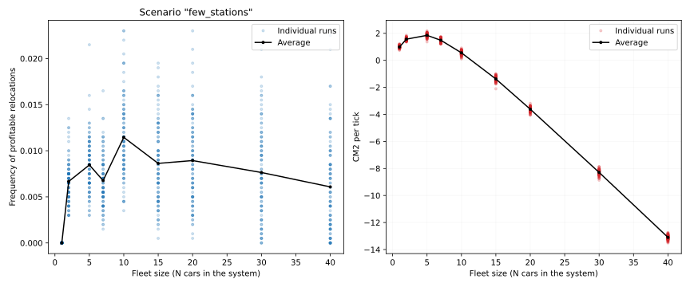

In practice, in real life, we may decide to have a bit higher fleet in a ciy, to gradually shape customer behavior, and to be able to expand quickly. For example, when two competitors co-exist in a city, they may be involved in a sort of a "fleet presence war", somewhat similar to a pricing war, but using a different strategy. By oversaturating a city with cars, you can hope to make its citizens associate your brand, and not the brand of your competitor, with car-sharing. If that's the goal, if you want to risk your CM2 margin for shaping the public opinion, you may gove above the recommended fleet size, and adjust the optimal relocation frequency accordingly. Conversely, on some months you may have to operate on a lower fleet, for purchasing or political reasons (as some cities attempt to regulate the number of carsharing licenses they issue). In this case, again, it's worth running a model and figuring out how many weekly relocations you would expect to use.

# 2.5 Imperfect relocations

🔥 Explain the IRL situation when relocaiton agents either don't want to, or cannot follow the instructions, and so are tempted to either grab easier cars (those closer to their last target), or deliver to zones closer nearby, instead of those that were strictly speaking recommended.

## In space: Is it more critical to get the sources, or the targets right?

🔥 Explain that while this model doesn't have a proper spatial compoentn, we'll be modeling the end-effect of spatial imperfections: that either wrong cars are picked to be delivered to proper zones, or proper cars are delievered to suboptimal zones.

🔥 Model 4 scenarios: good relos, random sources, random targets, random both.

## In time: What if we don't relocate for some time?

🔥 Run a city without relocations. Then turn "optimal relocations" on for some time (step response). Then turn them off again. Make a plot of the number of relocations over time - how quickly it stabilizes, and at what level?  Make a plot of CM2 per day - how much of a change do we observe, and how quickly it deteriorates afterwards?

## Can relocations improve DFR?

🔥🔥🔥 _edit the thing below_

When I worked in carsharing, I was regularly asked if I could "relocate more vigorously to compensate for lower DFR". It seems that people unfamiliar with the subject somehow develop an intuition (a wrong and baseless one!) that a car that is constantly in motion can be in two-thre places at once, and can thus offer a better service for a lower fleet. This is however untrue, as fundamentally, relocations are useful not because they help to improve DFR, but because they help to reduce idle times. 

The saving  saving bad cars, rather than about injecting good cars.  You cannot magically make people rent cars just because you moved them a lot immediately before that.

🔥 Esimate marginal improvemens of DFR in a hot zone vs improvement of idle times in a bad zones. DFR doesn't change that much, while idle time plummets.

Basically, very roughly, a relocation (~25€) costs some 5 times more than the CM1 we gain from a typical rental (~€5). So you cannot earn money by relocating cars to good areas with low DFR. You'll place a car there, it will get rented, but it will never be profitable.
What relocations do is they help you to save cars that are stuck. Because while they are stuck, they are missing rentals (~ 5 rentals/day). A car lost somewhere in the outskirts can easily be stuck for a day or more. And that means missing rentals. So if you put this car back into the pool, you'll  earn money.

But the amount of "bad" cars that appear in a city every day is kinda fixed, and defined by the shape of your HA and the activity of your customers. Once you relocate all bad cars for a day, at some point, there is nothing more to relocate (for a given relocation price). You cannot cheat by relocating more

# 2.6 City model

🔥 Compare the distribution of cars and the CM2 map with and without relocations

# 2.7 Real-life considerations

🔥 Describe the biggest difference: that we need to run this formula iteratively to generate several relo recommendations together. Or, alternatively, instead of predicting a +1 situation for every zone, predict +2, +3 etc situations, and then identify N worst cars, and N best targets, to then try to pair them into something that can be in practice relocated relatively efficiently.
* 🔥 terms for parking costs, charging, overflow costs. The case of airports and overflow charges
* 🔥 Simulation as a way to enhance the training dataset
* 🔥 3 car at once
* 🔥 Star principle of route optimization
* 🔥 That Streetcroud shouldn't be possible, if people do relocations right

The formula for the expected CM1 effect of a single relocation that was introduced above can also be applied to real-life, physical, data-driven relocations. As a reminder, the original formula was written as

$\displaystyle m = \bar π_t \left( \frac{n_i}{d_i} - \frac{n_j + 1}{d_j} \right) - r$, 

where, $\bar π_t$ is the average CM1 earned by a single car per unit of time, $n_i$ and $n_j$ are the current numbers of cars in source and target zones respectively; $d_i$ and $d_j$ are  $r$ is the cost of a single relocation. But it is possible to make the relocation process even more efficient if the formula is extended and fine-tuned in the following ways:

1. Unlike for our simple poisson-like model, real demand in a real city is very uneven in time, typically with peaks during rush hours (in the morning and in the late afternoon), and sometimes also with weaker peaks in the middle of the day, and/or early at night. Conversely, late night and very early morning usually come with virtually no activity. Because of that, the cost of a car idling for 2 hours at 2 am, compared to 5 pm, is very different, and so for longer expected waiting times $T$ one needs to integrate predicted rental probabilities over time, replacing a fixed term $\bar π_tT$  with $\displaystyle \int_{t=0}^{T}\bar π_t(t)dt$. The result of this change, for real data, may be quite striking as the same physical relocation may be profitable early in the morning (before the rush hour); become unprofitable later in the morning, but get profitable again in the early aftrenoon, before the second rush hour.
2. A relocation is never instantaneous, and typically takes at least an hour to perform (from the moment a relocation opportunity is identified, and to the moment when the car is ready to be rented at the new place). Because of that, the formula needs to include the missed opportunity cost ($\bar π_tt_w$) for the waiting time $t_w$ during which the car is excluded from the active pool, and is expecting a relocation. And also, some of the time-dependent variables that are included in the fomula for the relocation scenario need to be offset by this time $t_w$ (e.g. the integral over time from point 1 may be taken from 0 to $T_i$ for the "no-relocation" scenario, but from 0 to $t_w + T_j$ for the relocation scenario.)
3. The relocation cost often depends on the distance between the source and the target zones; or rather, on the time that it takes to drive from one zone to another. It is definitely true if relocating with in-house agents (paying per-hour), but even when working with contractors, it makes operations much smoother when the incentives are at least somewhat aligned, and more demanding relocation routes are paid at a somewhat higher rate.
4. A worth of a typical rental (the CM1 value generated by it) may be different in different zones: for example, a typical rental from an airport is likely to be priced very differently than a rental in the middle of a city. If this is true, and profits from a typical rental $π$ are very different in zones $i$ and $j$, the formula for the financial effect of a relocation should also receive an additional term $+(π_j - π_i)$, to reflect that with a relocation we are losing a rental in the source zone, but earning an extra rental in the target rental.5. 
 
Collecting some of these suggestions into one "enhanced" version of the relocation profitability formula, we may for example get something like the following:

$\displaystyle m = \int_{t=T_j + t_w}^{T_i}\bar π_t(t)dt - r_{ij} + (π_j - π_i)$ , 
where $T_i$ and $T_j$ are expected waiting times at zones $i$ and $j$, starting from moments $t=0$ and $t=t_w$ respectively.

To further productionalize this approach to automated, optimized relocations one needs to decide whether it's better to generate relocation decisions on a zone-level, with some fixed "relocation zones" imposed on the city, or to get rid of zones and predict the profitability $m$ based on the local environment of each car.
* The benefit of working with fixed zones is that getting reasonable estimates for most parameters going into the above formula becomes relatively easy: one can just gather statistics for each zone (typical demand over time, typical worth of a rental etc.). Also, thinking in terms of zones makes relocation management and process tune-up eaiser, and it allows for the creation of relatively straightforward instructions for the relocation agents (e.g. "Please take 3 cars from Bexley and deliver them somewhere in Newham"). Finally, well-designed zones allow for a manual back-up process, in case the system malfunctions.
* The downside of working with fixed zones is that one has to define them, and do it well, which introduces an additional layer of complexity to the problem. As the city changes, they then would have to be updated. In theory, these processes may be automated either through a fancy machine learning algorithm, or via explicit modeling and brute-force optimization. For example, one can calculate demand profiles and usage preferences on a tight spatial grid, then run agllomerative spatial clustering on these values, combining neighboring cells with each other until reasonable zones are formed; ideally, with relatively uniform demand patterns within each zone, and similar rental volumes across zones. Finally, even with well-defined zones, the very local narrow environment of a car may be relevant for predicting its idling time (say, 5 cars parked as a group in a sketchy side-alleywill have a hard time attracting customers, even if the zone in general has a pretty high demand). If this concern is an issue, running a machine learning model with a spatial kermel may be more advisable.

Another practical decision to make is whether the machine learning solution, underlying the relocation system, wold predict the financial effects of each individual relocation (thus baypassing the fomula above altogether), would predict idle times in source and target zones, or would predict the demand in these zones, and then recalculate it into idle times using an approimate explicit formula, or numerical integration.

* The catch-all direct prediction of relocation profitabilities lets the data scientist bypass most of the math, which may be tempting. At the same time, it either increases the complexity space (in case of relocation zones, we have to go from predicting values for $N$ zones to predicting values  $\sim N^2$ zone combinations), or decrease the flexibility of relocation models (if the targets for relocations are fixed to a subset of "hot zones", and only relocation sources are dynamic and flexible). It may seem at the first glance that the training data for a direct relocation-to-profit model should be easily available, but in practice, it's not necessarily true, as we only know the rentals that happened, not the rentals that would have happened in the "alternate reality" where relocations were performed differently. Essentially, to train a model like that one would have to create an infrastructure for an ongoing A/B testing, performing only a certain share of recommended relocations. Which is possible of course, but is not necessarily simple. Finally, a catch-all black-box model would offer almost zero observability and interpretability, making its troubleshooting and fine-tuning extremely hard.
* The model predicting idle times ($T_i$ and $T_j$ in the model above), is a little easier to train, as the parameter space complexity is lower. One still needs to track how they change in time (accounting for yearly, weekly, and daily patterns, as well as, potentially, handling peak demand events around major holidays), and one still needs to predict these times in space, both in terms of location within the city, and the local environment (other cars parked nearby), but at least the model would not have to be retained in case of a pricing change.
* Finally, predicting demand, and then explicitly recalculating it into expected idle times using numerical intergration (a task known as expected "arrival time" estimation for a non-homogenious Poisson process) may be the most tempting. As demand does not depend on whether the relocation was taken or not, training a model for predicting demand may be easier (there is no need for an "ongoing A/B testing process"). Also, a demand model may be shared with pricing (see chapter 3). At the same time, accounting for the local environment (the presence of other cars nearby) may be harder, as unless you are working with a discrete set of small parking stations, the cars are probably distributed across the neighborhood, and so are only partially competing with each other. As the cars are not completely interchangeable, we won't be able to use a simplified $n_i/d_i$ formula, but would have to come up either with some kernel-based heuristics, or an additional machine learning solution.

This last point, about only partial interchangeability of real cars in a real city, is further complicated by the fact that most values in the "relocation profitabilithy formula" also depend on the properties of the car that we are considering to relocate. For example, cars of different brands and builds may be more or less desired by customers (affecting expected $d$ values); they may be priced differently, have different use patterns over time and in space, or have differenet revenue-to-CM1 conversion ratios (affecting $\bar π_t(t)$ and $π$ values); dirty or old cars may be less desirable, compared to recently infleeted or recently cleaned cars (affecting $d$ value); the fullness of the fuel tank or a battery can concern some customers (affecting both $d$ and $π$ values) etc. At the same time, these pools of cars cannot be treated completely separately from each other, as different builds and brands still do partially substitute for each other, even if the pattern of use is slightly different (a customer going for a longer trip would typically prefer a larger car, but would take a smaller one if larger cars are not available etc.). And moreover, other aspects of "desirability" (wear, cleanness) don't divide the pool of cars into clear subgroups or categories, but exist on a spectrum. All of that means that the brand and the state of the car that is considered for relocation, as well as the brands and states of other cars near it, can all serve as potential input variables for the ML model in the automated relocation solution.

One potential approach to mitigating this complexity is in following a mixed, modular strategy, where each of the parameters of the "profitability formula" is estimated by a separate expressive ML model, but then the outputs of these model are combined into a final profitability prediction by an explicit formula. This approach, somewhat similar to the "Neural additive model" approach [^Agarwal2020] preserves both interpretabitiliy and expressivenss, and allows for independent retraining of different parts of the model. It also allows for simplifying fall-backs in case one of the sub-models becomes irrevant; for example, because of a sudden change in business environment. For example, the "average generated profit" $\bar π_t(t)$ can be approximated by a constant, by a set of 24 simple averages for each hour of the day, by a set of averages for different hours and weekdays, by a regression model, by a combination of regression models that takes both the time and the car build into account, or by a full-fleged tree-based ML model. As long as the relocation tool is designed in a modular way, one can change this complexity on the fly, substituting different sources for one part of the "big formula", without compromizing or invalidating any of the other parts.

## Seasonal demand for relocations

On performance of peripheral hubs in August (a weak month) 🔥🔥 _EDIT BELOW_

Essentially, peripheral hubs have a bit of this "threshold" quality to them, if you will. When the fleet is low (relative to demand), it can be sucked away from the hubs both by relocations and by vin-based pricing. But when the fleet is high, then VIN-based pricing doesn't help, as there's no real urgency to move the cars (so the price doesn't drop that low), and there's even less demand to actually act on this price (so the cars aren't moved). So in a situation when fleet (aka average DFR) is different in different cities, and then suddenly August happens, whether the periphery reports a very bad month depends almost entirely on the fleet-demand situation, and not on the fine details of how VIN-based pricing works.

🔥 _So a low-demand month is equivalent to a high fleet month_

WIth relocations it should in theory be different, as our relocations right now don't shut down when there's nothing profitable to relocate; they keep proposing cars, even if these are now breaking even, or even if they were unprofitable. So with relocations running high, peripheral hubs should never accumulate fleet, even at low demand it's better to have the fleet in the center than on the periphery... But oddly, in a situation of low demand (aka August) the financial effect would be the same, as relos would have just moved the fleet form the periphery to the center, which would probably break even, but not bring much value. So while peripheral hubs do underperform on low demand months when relocations are turned off, paradoxically, it's not bad, it's fine. Having relocations wouldn't have saved it.

🔥 Another extreme example - airports. Describe when and how.

## Airport relocations

🔥 Maybe add some basic info about how a real scenario is always between the worst and the best scenario? And how we're trying to move the needle within this band of opportunities?

🔥 Think if an airport "ideal" algorithm is presentable here.

The airport is usually empty in the evenings, and relocations are usually least effective in the evenings, as the lost revenue is minimal in the evenings (given that night is low on activity). So if your agents addressed the most unfortunate cars during the day (those that more than 12 hours expected idle time), then evening relocations to the airport shouldn’t be that profitable. (Very roughly: a car with some 10 hours expected idle time in the evening would miss only, what, 1-2 night rentals? Let’s optimistically say 10€ in CM1 revenue. You relocate it to the airport, lose some 25€ or so in relo costs, so you are 15€ down. A single rental from the airport is probably about 20€, of which some 25%, very roughly, is fuel cost. So you earn 15€ back, arriving at net 0. Is it worth the hassle?) But it’s up to you; I can open the zone as a potential target if you prefer; just let me know!

# Footnotes

[^Agarwal2020]: Agarwal, R., Frosst, N., Zhang, X., Caruana, R., & Hinton, G. E. (2020). Neural additive models: Interpretable machine learning with neural nets. arXiv preprint arXiv:2004.13912.
https://arxiv.org/pdf/2004.13912.pdf