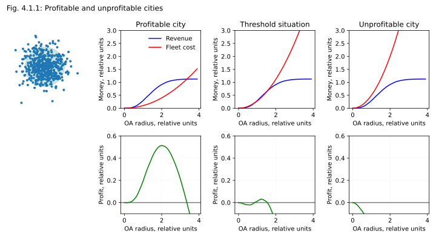
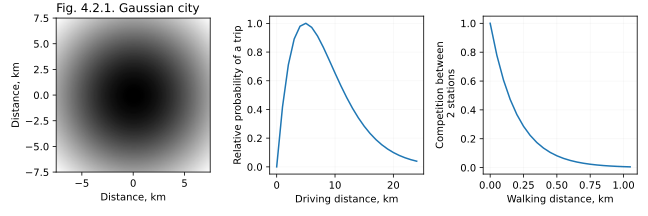
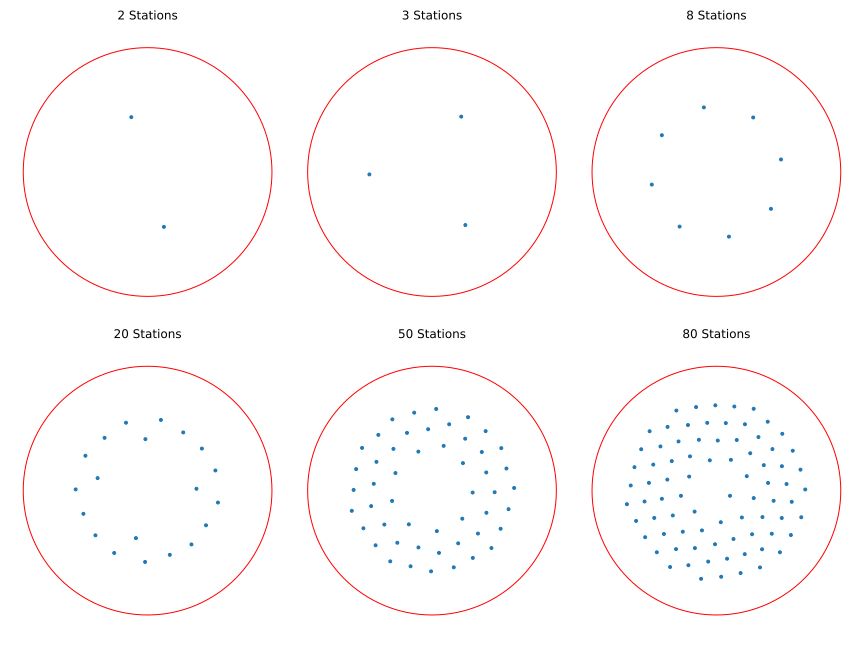
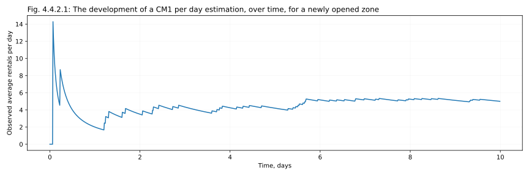
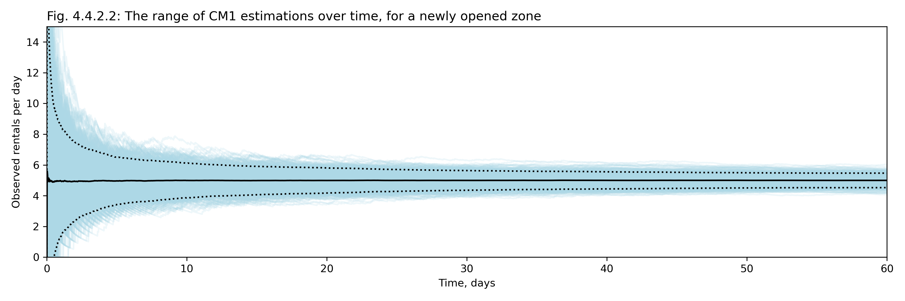
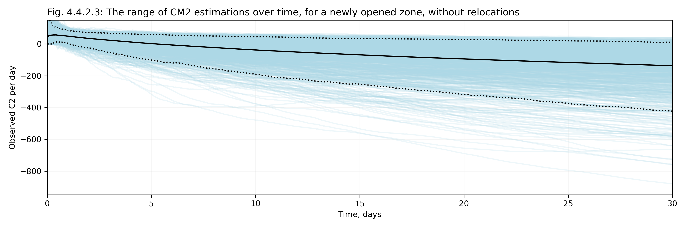
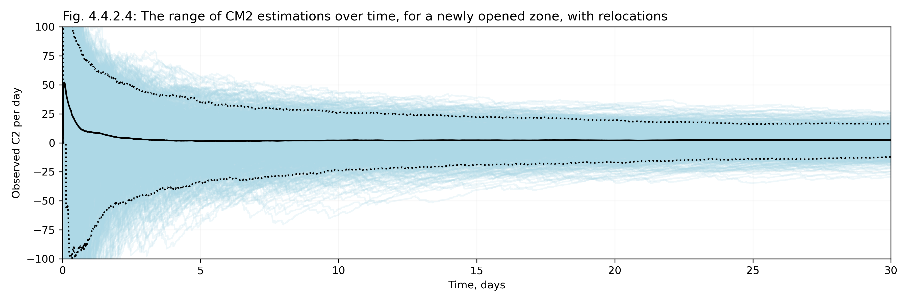

# 3. Operating Area

Every car sharing business has an effective operating area; they may be called differently in different companies, but it is typically defined as the area on the map within which a rental can be ended. It is OK if a car leaves the operating area during the rental, but once the rental is over, you want it back in the operating area. In some cities, and for some providers, these may look more-or-less like blobs on the map, covering the center of the city. For some, an operating area may consist of a few point-like "parking stations", or, in the most extreme case, of a single parking station in the middle of a city. Still, the concept is rather inevitable, and therefore universal.

In this chapter we will discuss how to optimize an operating area (OA), how to analyze and visualize the profitability of different parts of the operating area; how to expand it (how to grow the business), and how to shrink it (if necessary).

# 3.1. The idea of an optimal OA

Let's start with a simple question: does the exact shape and size of an operating area even matter? Is it critical to "get it right", and if yes, what is the leeway? We'll start with the simplest conceptual model ever: let's consider a Gaussian city in a vacuum (yes, I know), with a circular home area smack in the center of it. We will gradually increase the size of this home area (change its radius), while tracking CM1 profits and CM2 fleet costs.

How does the CM1 profit change, as the area increases? Let's "populate" the city with "locations", distributed with Gaussian density (those points on the plot below). Once the point is covered by the OA, people can travel from this point to all other points covered by the HA, and the revenue generated by these trips is proportional to the pairwise distances between the points. If we model this process, we'll get the blue curves on the plot below: they start slow (as at this point the OA covers a lot of density, but all the trips are very short), then switches to almost-linear growth, and finally platoes, as most of the density is covered.

CM2 costs however are simply proportional to the area of the OA, as to run a reliable business you need to guarantee a certain minimal level of service (demand fulfillment rate, or DFR: the share of those attempts to rent a car that were possible to fulfill, as there was a car standing relatively close to the customer). The CM2 cost grows parabolically as the OA size increases (red lines).



Whether a profitable HA is possible; that is, whether there is a range of OA radius values in which the CM1 profits curve (blue) lies above the CM2 costs curve (red) depends on the balance between the revenues generated, and the cost of the car. Picking cheaper cars is equivalent to scaling the red curve down. Having a higher population density, higher rental prices, or lower service costs (CM1 costs) is equivalent to scaling the blue curve up. Depending on their relative positions, we can have three quantitatively different scenarios, and three different "stylse" of profitability curves (lower row, green).

If a city is profitable (left column), there is wide overlap between the curves, and thus the wide range of OA size values in which the city is profitable. If the city is deeply unprofitable (either your cars are too expensive, or the city consists mostly of low-density suburbs with high car ownership share, which is sadly the case for most North American cities), it may be impossible to make it profitable (at least not with a "blob"-shaped home area; it may still be profitable if you cover it with a few "service points", but it is not a scenario we are considering here). As you move from a "non-profitable" to a "profitable" scenario, at some point the curve "touch" (middle column), giving you a situation when with a rather specific size of a home area you can run the city in a "breaking even" mode.

Which brings us the first important take-away point:

> [!TIP]
> Profitability of a city is an all-or-none thing, akin to a phase transition. Some cities simply cannot be made profitable, at least not until you radically change your business model here. While some cities are good.

The statement above also has a corollary. For a profitable city, the curve of total CM2-level profit as a function of OA size looks a bit like an upside-down parabola, and has a flat top, rather than a sharp maximum. Which means, that perhaps counter-intuitively, if a city is profitable, and your OA is decent, you probably cannot earn a lot of money by optimizing it. And even if a city is a "borderline case", from the middle column of plots, in practice you will almost never get a situation when making it profitable is a matter of finding a "perfect home area". As the curves touch, they kinda touch with their "flat parts", and so even as you transition from never-profitability to possible-profitability, you immediately get a _range_ of OA sizes at which your city will break even.

Don't get me wrong, optimizing OA is important for growth (recruiting new users), for marketing (improving the image of carsharing in the city), and it is extremely important for relationships with the city (that won't take you seriously if you only cover 2-3 small rich neighborhoods). It is also important that you don't cover "bad" (low-density, or unsafe) areas. But beyond that, if you manage to find a roughly-optimal OA size, and then grow slowly and naturally, most expansions will probably have a 0 effect on CM2 profits at first. And it is fine. That's what you want to happen. You can even afford them to be mildly negative at fist, if you believe that the volumes will grow as new users are recruited. Changing people's habits is a slow process, and making people get rid of private cars to switch to public transportation and car-sharing is an even slower one. But little strokes fell great oaks.

> [!TIP]
> The best growth strategy for an operating area is to optimize it once, then slowly grow it with expansion projects that are barely breaking even at first.

Another interesting side effect of this model: if in doubt, pick an OA of about about 2 sigmas in size, after approximating population density in this city with a Gaussian. That's about the size at which the OA becomes profitable for the first time.

One obvious limitation of this model is that it doesn't take into account any high-density hubs away from the city center, such as city satellites, urbanized remote neighborhoods, or airports. Some of these cases may in turn be covered by a simple "single station" model we considered in Chapter 2. Or we can switch to a fancier, spatial profitability models below. Let's start with considering a model that is, in a way, the opposite of the one we just considered: we will still work with a "gGaussiancity", but instead of covering it with a blog of an operating area, we will fill it with a set of scattered point-like "parking stations".

# 3.2. Strategic placement of stations

🔥 DESCRIBE Minimalistic stations: a model that optimizes stations within a Gaussian city via explicit optimization of locations.

```python
city_width = 15 # km
grid_step = 0.1 # km
walking_distance = 0.2 # 200 meters of walking distance
sigma = 10 # Gaussian sigma
```

🔥 The rules of the game:


🔥 The results:



# 3.3. Mapping the OA

🔥🔥🔥 Before we do anything, an alternative CM2 visualization: with grays

🔥 Example for a simple gaussian city

🔥 That we will be assuming no round-trips, so our estimations will be conservative, as essentially we are looking only at short-term car-sharing, and some long-term car-sharing will be always happening "on top", and also potentially grow with the growth of the operation area (as it will become convenient for ore and more people)

It is also important to note that in practice, depending on the business model of a car sharing provider, somewhere between 10 and 50% of rentals are relatively long-term rentals (from several hours to several days). Because of that, the actual distribution of rental times (or rental driving distances, or revenues per rental) is typically bi-modal, with a second "peak" that is very broad and shallow, but financially significant. For these rentals the concepts of "origin" and "destination" don't quite make sense, as the majority of these rentals are close to round-trips (customers starting from home, and returning home a day or two later), and the concept of Home Area becomes important only insofar it allows an easy and painless rental, and a good customer experience. It means that for all "city models" that we explore here, our estimations for CM2 profitability are intentionally conservative (we can always assume that a good measure of long-term rentals are happening on top of the short-term rentals discussed here), and that the actual share of round-trips at each location will be higher than what one can conclude from the trip length distribution introduced above. Fortunately, the presence of long-term trips does not affect any of the results discussed here, except that the long-term trips would consume part of the available fleet, and so compared to our simulations, in real life, the fleet in the city should be increased proportionally.

## 2.2.1. Marginal vs fair CM2

🔥 Raise a question about how to allocate revenues and transit times. Introduce and build a fair CM2 map (half-half). 

🔥 Explain that red on this CM2 map doesn't mean that this part needs to be closed - an example of marginal CM2 map + the idea of active users

🔥 I strongly suggest to only use one type of a map, a fair map, and provide marginal estimations for proposed closures or opening only as text. The grayscaled map is very rich in info, and it is pretty, bu it is already hard to process. If you try to maintain two different _types_ of a map on top of it, it's not likely to end well. People will just be confused to no end.

## 2.2.2. Edge effects

🔥 Model edge effects by blurring demand, but also adjusting the values at the edge so that after masking demand is redistributed as it should. Carefully design and describe just how it needs to be adjusted in order to give the desired result. It's a bit of a hack, but it's easy, and works correctly (from the common sense point of view) near the edge.

🔥 Compare the CM2 map with and without relocations on this new type of a visualization, side by side

 🔥two gaussians with Perlin noise, full map and one with a very roughly thresholded OA

🔥 Predicted map for Berlin, based on population density

# 3.4. Shrinking the OA

🔥 Return to the idea of marginal CM2 values. Deciding to close the zone. Link back to the CM2 per zone formula, but rewrite it in marginal cases. Then discuss how not all waiting times are equal (night, rush hour). Discuss Acitivity-weighted, with 2 options: missed CM1 or weighted CM2. Argue that CM2-based is better, as preserves consistency with other formulas and city-level estimations (as arguably, it's the one that estimates the actual effect if we close the zone and re-optimize the fleet).

🔥 The algorithm of Shrinking

# 3.5. Concentrating fleet

🔥 The benefit of tendrils and stations (??? - at least describe the idea / hypothesis)

# 3.6. Expanding the OA

🔥 The main idea: Rework into a series of options:

1. Models based on demographics. Present as the most natural intuition; outline weak sides (dependency on stats data, hard to get, demographics is often secret etc.)
2. Pilots. (Or, in an extreme ase, expand drastically, then cut everything that didn't work)  Put here this story about how long to wait till numbers are clear. Customers are unhappy when closing. While it's good to be able to close, it's not a good idea to rely only on that.
3. Voting with feet. Stopovers + app activity. Either predicting CM2 directly, or predicting demand fo each pixel, and then running an optimization of OA (potentially with stations), with a fixed formula from "catchment demand" to CM2 (as already modeled above)
4. Placing some cars intentionally, bayesian updates for estimated demand, improve model
5. Continuous drop-fee. Although in a way relying stop-overs (above) can be considered an extreme case of this idea, as in this case we make the customer pay both for the drives there, and back, and waiting time. The moment we offer an OA there, some of the longer stop-overs will disappear, as customers would stop the rental, thus truly an upper estimate.

That I personally recommend 3.

But even withthis fancy model, there's a problem of extension from a narrow hub or sharp border (cannibalsation; a contradiction with the idea of concentrating fleet). Tricky; some other model is needed.

🔥 Can we sketch such a model, or would it be too weird? Using willingness to walk to map the decay?

## 3.6.1. Pilot projects

🔥 The process. That from the customer pov it's better to never close, so one has to be conservative. But also that it takes a while to build a following (even when competing prividers are present, and people are familiar with the business model!)

## 3.6.2. How long does it take to measure station performance?

🔥 Set up the story

🔥 Add some stuff on decision making, AB testing-inspired optimality. Essentially, the tldr may be that counter-intuitively we don't want to use actuals for making decisions about borderline hubs because they take forever to converge. Unless we run relocations of course. With relocations - sure, use actuals. Without relocations, model average profitabitility based on demand statistics.

As a mathematically simple, but practically important topic, let us check how many rentals are needed to make a good guess about the profitability of a newly opened station (or zone).

First, let's look at how a typical curve of "rentals rate to date" looks for a Poisson process. Below we can see one such curve, for a process with 5 rentals/day on average, accumulated over a course of the first 10 days. We can see that the estimation gradually improves, but it can have wild peaks (especially in the beginning) and deviations from the mean.



Let's now roll the dice again and again, generating 1000 runs of this kind, for the first 60 days after this "new locaiton" was "opened"; then show all these runs on the same graph (below; light teal lines), together with a mean across all runs (solid black), and a 90% confidence interval around it (dotted lines). As expected, the spread of estimations for the "rentals/day" value becomes narrower with time. Still even after 60 days, or (in this case) about 300 rentals, we may easily be some 5-10% off in terms of estimating the "true" underlying demand in the new loation (the 90% confidence interval by the end of this curve consistutes ±9% of the mean value).


As our estimation for the rentals-per-day converges, so will converge the estimations for revenue-per-day and CM1-per-day, as both are proportional to the number of rentals, at least when averaged over a longer period of time. But what about the development of our best estimations for CM2-per-day, for every day after a new location went live? Let's first model these curves for the first 30 days after opening, looking at 1000 different newly opened stations, **in the absence of relocations**. All of the stations have the same true average demand of 10 trips/day in one direction, and as usual, assuming that each trips generates 5€/trip in CM1. The solid black line shows the average; dotted lines show the 5% and 95% percentiles.


As discussed in Chapter 1, in the absence of relocations a new station tends to quickly accumulate an unfair number of cars, and until some sort of a long-term equilibrium is reached, different random curves for the number of cars at the location effectively diverge. As the cost part of the CM2-per-day formula is proportional to the number of cars at the location, it means that the estimations for CM2 at different, otherwise identical, "new stations" diverge as well! For a small station, of a kind modeled here, it means that this station quickly becomes unproftable, but also the scale of this "unprofitability" can range by 2 orders of magnitude from one experiment to another. The graph above may be described as the results of profitability tracking in 1000 identical new locations, but we can also think of it as profitability tracking of _one_ and same location in 1000 "alternative universes", characterizing our chances to measure the "true" potential profitability of a newly opened location correctly. With curves diverging like that, a meaningful measure is impossible. Putting it differently, in the absence of relocations, any spatial analysis of profitability of different parts of the city becomes completely unreasonable, as you end up detecting areas where relocations were not working, and that are now desperately in need of some intervention, to distribute random fluctuations of trapped fleet. The "actual" values of "spatial CM2" observed in different pats of a no-relocations city over a course of a month will give you almost no information about the potential performance of this area under ideal conditions. Without relocations, it is better to make decisions based on maps of CM1, and not CM2 values. as at least CM1 values will gradually converge.

With relocations enabled, we put an upper limit on the number of cars in each location, and the curves for consequtive estimations of CM2-per-day start to converge again. An example of 1000 such curves, for the same exact new location as above, but with relocations limiting its highest fleet at 2 cars, are shown below. We picked the value of 2 cars here, as in Chapter 2, section 2.1, we have shown that for a station receiving the average of 10 rentals a day, this is the optimal fleet limit to set, and that it is supposed to achieve the highest possible profitability, just above 0€/day in CM2 (so just above breaking-even).


The graph above illustrates three important intuitions. 
* One, that with relocations doing their job, the CM2 values in different runs do indeed converge, and on a value that is not as ridiculously negative as in a laissez-faire city. 
* Second, that this convergence is nevertheless very slow. In the example above, the expected CM2/day for this station is about 2 €/day, but the actual 90% confidence interval extends from −13 to +16 €/day. It means that even though in theory, in the long-term, this new location is expected to be weakly profitable, in about half of cases we would see it losing money (in CM2) after a month of operating. 
* And finally, third, it is interesting that the very few days that the new location is started, it is more likely to seem profitable (the solid black line starts high, and only then decreases). The reason for this is rather straightforward: once you get your first rentals, you will have some profit generated, but it will take a few more rentals until the fleet trapped in the location increases from 0 to 1, to 2, and the first relocations kick in, making it likely that the very first days of operation for the hub would be profitable. However this phenomenon does not manifest itself in a real business: first, because it takes a while before customers notice that a new location appeared, so the first few rentals are alwas relatively slow to materialize, and second, because in practice companies often intentially relocate 1-2 vehicles TO a new station before opening it, to make it seem occupied and buzy, and to make it noticeable in the rental app.

The main learning point from this entire exercise is therefore rather cynical and underwhelming, but nevertheless very important. When starting a new location that is likely to be only slightly profitable, don't try to pronounce a judgment on it after a month or two. Let it be for at least 3 months, better half a year, or a year, then assess. The chances of "bad luck" during the first 1-2 months of activity, even under the assumption of _ideal_ operations, is quite high (in the extreme case of a breaking-even location, about 50%). So unless the new location seems horrible, or a superstar, it's better to be patient, and to wait for a few hundreds, maybe even thousands rentals to happen.

## 3.4.3. Probing customer interest

🔥 The idea of "Relocations as tests"

🔥 Continuous drop-fees

## 3.4.4. Predictive model

🔥 Sketch the predictive model

# Footnotes