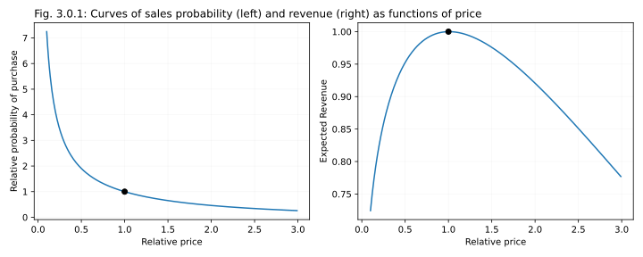

# 3. Pricing

## Brief introduction to pricing

The basic idea of pricing elasticity is that changing the price up and down compared to some "base value" can change the sales of the product: as the price increases, fewer and fewer people will buy the product, while as price decreases, more people may end up buying it. Obviously, this logic has its limitations: people will only buy less of a product if they can survive without it, or if they can switch to a competitor, or a substitute; and conversely, they will only buy more of a cheaper product if they can still use it. Applied to the world of transportation, we can think of several competing car-sharing companies, a public transportation option located a bit further away, an option to rent a scooter, a bike, or to walk by foot. In this situation, we can expect that changing the rate that we charge to customers would affect their behavior, and we can have either more or less rentals, depending on the price.

While we can be sure that under the normal circumstances the number of rentals (sales) will decline as the price of a single rental grows, the exact shape of this declining curve may of course be modeled in different ways. The simplest formula assumes that in a small vicinity of every fixed price $P_0$ a relative change in demand $(D-D_0)/D_0$ is proportional to the relative change in price $(P-P_0)/P_0$:

$\displaystyle \frac{D-D_0}{D_0} = -L\frac{P-P_0}{P_0}$

(The minus sign on the right makes the demand decrease as the price increases) This formula can be integrated over $P$ to give a closed-form expression for demand as a function of price [^1]:

$\displaystyle D = D_0 (P/P_0)^{-L}$

The coefficient $L$ is called "price elasticity". If $L$ is close to zero, demand is called inelastic, as it does not change much regardless of changs in price; in the world of car-sharing this may for example happen if people need to get out of a certain location, and have no other choices but to rent a car (at least at the present moment). If, on the other hand, the $L$ is large, the demand would change a lot even in response to small changes in price, which is called an elastic demand. This situation may be observed, for example, in a presence strong and effective competition, when people can easily oprimize their expenses by picking the best option out of those available.

The optimal business logic in the presence of elastic and inelastic demand is famously different. The total revenue $R$ that one can get from sales of a product is equal to the demand multiplied by price, $R=DP$, and so this total revenue can be expressed by a formula:

$R = DP = D_0 P (P/P_0)^{-L} = aP^{1-L}$, where $a$ is a constant: $a = D_0 / P_0^L$. 

This means that the revenue $R$ increases with price $P$ when $L<1$, and the elasticity is low. When choices are limited, customers would be willing to pay more money for the service, and so increasing the price would also increase the profits. Conversely, if $L>1$, the revenue wold decrease with price, as the sales would drop as the price increses. In this case it would be more profitable to drop the price somewhat, to boost the sales. If $L=1$, the increase in price is perfectly compensated by a decrease in sales, and the revenue stays the same regardless of price adjustments.

In practice, for any real business, elasticity $L$ is on itself a function of the price, and $L(R)$ slowly traverses from small $L<1$ values (when price is objectively speaking too low, and increase it also increases the profits), through $L=1$ (when the price is about right, and the profits go through a flat optimum), and to $L>1$ (when the price becomes too high, and volumes start to plummet). To pick the simplest model, let us for example assume that $L$ decreases linearly with R, according to the following oddly specific formula:

$L(R) = 0.8 + 0.06(R-0.30)$

🔥Try to make the numbers even simplier? Can we replace 0.8 with 1 for example?

$L_0$ changes from 0.8 for the price insensitive area, -2.0 for the sensitive area
D_0 would be the initial demand level at price R0

Assuming this is price per minute for the elas(p) part hence the 0.30, it should give more or less the average carsharing price for Berlin for 2023. Sensitivity increases as the price increases. otherwise you’d put price to +inf for elasticity -0.8 if you tried to optimize revenue (R * D(R))

Assuming this is price per minute for the elas(p) part hence the 0.30, more or less the average price in Berlin. this makes sure sensitivity increases as the price increases. otherwise you’d put price to +inf for elasticity -0.8 if you tried to optimize revenue (R*D(R)) (edited) 

For more info, see for example: Yang, H., & Huang, H. J. (2005). Mathematical and economic theory of road pricing. Emerald Group Publishing Limited.

## Asymmetric prices (drop-off fees)

🔥 A note on how a drop-fee becomes a burden once the demand is high

🔥🔥🔥 DROP-OFF SIMULATION

## Destination-based rebates

🔥 The idea

🔥 The example of Zity. However that it may be hard for customers to remember which parts of the inner city offer them a rebate. While you can reward customers for certain behaviors by offering them a payback _after_ they have finished a ride in a target area, it is hard to inform them of this target area _before_ the ride, as at this point you don't yet know where in the city center they are going, or if they are going to the city center to begin with. Promoting these "ideal target areas" in a non-invasive, non-obtrusive ways presents an interface problem.

Interestingly, the idea of inner-city rebates synergizes well with natural tendencies in city development and urban planning, such as congestion pricing and dedicated inner-city mobility hubs. As congestion pricing is promoted, and as well-labeled dedicated parking spaces in the inner city are becoming a new normal, it creates a useful psychological framework on which a cars-sharing compay can easily latch. Instead of trying to introduce a novel idea of a target area that offers a rebte, a car-sharing company can advertise the fact that a customer would not have to pay the congestion fee if they use shared transportation and park in a mobility hub (compared to if they use a private car). It seems that this narrative would be simpler, and more relatable, and thus may influence customer behavior more.

Mansourianfar, M., Gu, Z., & Saberi, M. (2024). Joint Routing and Pricing Control in Bimodal Mixed Autonomy Networks with Elastic Demand and Three-Dimensional Passenger Macroscopic Fundamental Diagram. Transportation Research Record, 03611981241243080. https://journals.sagepub.com/doi/pdf/10.1177/03611981241243080

At the same time, congestion areas obviously present a challenge for business development and public reltionships departments within a company, as it may be not obvious to city officials why would they give a car-sharing service an exceptinon from the congestion fee. But maybe that's where this document, and the logic described here, may become useful. A car-sharing company needs its cars to be returned to central hubs to operate. A financial insentive makes it easier for customers to return these cars. Together, it improves the cars-sharing coverage and service, and reduces the number of privately cars owned cars in the city (REF: Amsterdam?). Hopefully if repeated often enough, these theses would improve the collaboration between mobility providers and modern cities.

🔥 A possibility of fuzzy, automated asymmetric prices

## Competition dynamics

1.  Start with a simpler elasticity curve, build revenue curve, find optimal price for CM1   
2.  Now let it be a hub, find optimal price for CM2    
3.  Now add a competitor who operates at    
    1.  Fixed optimal price
    2.  A bit lower
    3.  A bit higher
    
For competitors, let P(car) = P(min(prices)), and then once the decision to take a car is taken, either linearly normalize P(price) for both competitors, or do softmax (with exponentiation)

* Let probability of picking a competitor be also proportional to their car stock (like, just multiply both probabilities by n_i(sum(n)) before renormalizing. What is the best price now?
* What will happen if both competitors optimize their prices? What's the stable-state?
* Now assume that there's also a drop fee, and both prices show the same sensitivity. What is the optimal drop-off (for CM2) if a competitor doesn't have it?
* What if our competitor has it, and it's optimal?
* What is the end-state if both competitors optimize their prices iteratively?

Optionally: (Mansourianfar 2024) for "nested logit" mode choice formulas.

## Optimal drop-fees for a model city

🔥 

1.  Measure the effect (how many relos can be avoided?)   
2.  Old maps (DFR etc.) - do they change? (probably not, right? we're just doing fewer relos?)    
3.  A map of drop-fees    
4.  Sample maps on population distributions of some typical cities (from public data)
5.  A discussion on paying back (reference Zity), and on how in theory it can make expansions way more flexible, as long as people are willing to remove drop-fees when they are no longer needed. Reference Streetcrowd (if they pay, so can the company).
1.  At the same time, comment how Streetcrowd cannot work in the gig economy format, as in a competitive market fluctuations of fleet distribution should somewhat clear on themselves, while patterns (demand-driven) do not allow for a closed loop.

Compare outputs on a Gaussian city and Fake Berlin.

🔥 If enough time - maybe we can try to use an agent-based model (in the style of 3, but without optimization, except for relocations) to verify the results of approach 2? (That we really got to the minimum?) Just do some simple 1D cross-section around the minimum from 2, and see if we're at the true bottom (or at least nearby).

🔥 How many relocations can be avoided by asymmetric pricing? Can we compare the size of effects?

## How to draw pricing zones

🔥

🔥 On pricing in a city, 3 different approaches:

1. Cut into zones, then calculate by zone. Roughly equivalent to "stations" approach, and can be optimized explicitly (e.g. via random walk search). But note that zones are an approximation, and also that with these kinds of data getting a reliable estimate is inherently noisy (see section OA for estimations), so this part may be tricky and noisy (but maybe it's ok, at least for a rough picture). And then on top of that IRL we'd have to calculate it for every hour, probably.
2. Work on pixels, but come up with explicit formula with flows, and thus avoid doing agent-based modeling, and do gradient descent of some sort. For each pixel set the prices, using sensitivity calculate the flows, from the total flow and expected delta cost calculate the target stock and expected flow (this part needs some thinking, as average expected relo targets and relo costs depend on the pixel, and we'll probably need some simplification here). But once this is done, we can iterate, and maybe even calculate the gradients.
3. Realtime optimization, relying on relo-like formulas (at every point for a given price calculate the expected probability of leaving, and explicitly optimize the price). Warnings on practical stability, weird effects, necessity to limit effects irl by sanity borders. Alternatively, we can also use this approach in an agent based-model, and then look at the median achieved prices. That's the type of stats we'll use for the formulas anyways.

## Next steps: Dynamic pricing

Zheng, N., Rérat, G., & Geroliminis, N. (2016). Time-dependent area-based pricing for multimodal systems with heterogeneous users in an agent-based environment. *Transportation Research Part C: Emerging Technologies*, *62*, 133-148. https://www.sciencedirect.com/science/article/pii/S0968090X15003745?casa_token=tq__IPTB2qAAAAAA:XEqQV2c2KnF5NlJ2mXRf9IBidhMxVTtFFsK1HYpRGwCu0cR7VfNtgBIqlwH8Eht_ILffNLX3
Here they show that one can optimize stuff, except that they optimize for a different thing, congestion; and also don't care about cognitive friction, as they are not trying to sell "good cars" to people, they are trying to dynamically punish them for using "bad", private cars.

Gu, Z., Shafiei, S., Liu, Z., & Saberi, M. (2018). Optimal distance-and time-dependent area-based pricing with the Network Fundamental Diagram. Transportation Research Part C: Emerging Technologies, 95, 1-28.
Adaptive pricing approach to tolls: how to optimally price a toll, as a function of where people go after passing a toll. In a way, car-sharing may be considered a similar problem, except each car has a unique "toll" that you pay as you start the rental. The price you're going to pay may theoretically depend on the statistics of where customers typically go to, from this point at this time. Seems to be a more complicated approach though, compared to what we are proposing. An alternative?

## Measuring price elasticity

🔥 A model with 2 equivalent providers - show the curve
🔥 How does the curve change if one provider becomes preferable
🔥 Mention that if you can track the competitor, you can measure customer preference directly, using the Bradley–Terry model model (🔥ref), but if you cannot track them, you have to rely either on pricing experiments, or on this curve.

## Willingness to walk

1.  Distribution of walking distances: One competitor, same price
2.  Same, but different prices 
3.  How willingness to walk changes with price   
4.  How willingness to walk changes with DFR

# Footnotes

[^1]: See for example: https://demonstrations.wolfram.com/ConstantPriceElasticityOfDemand/
