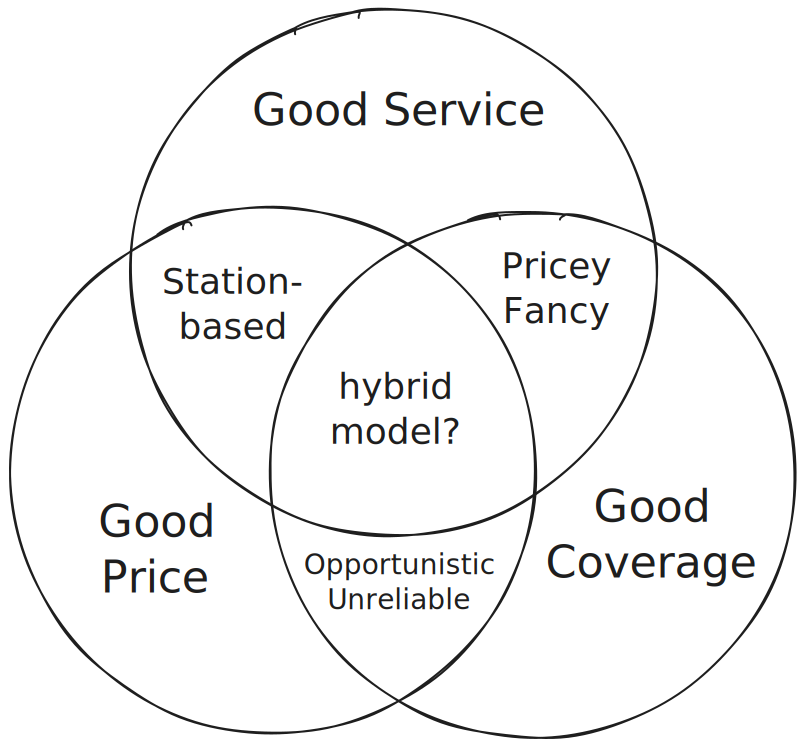

# 5. Conclusions

Throughout this work we have been zooming into the details of carsharing, but in this short last chapter I want to take a step back and think about some of the more abstract and general questions about carsharing as a business. And we'll start with a question about the role of carsharing in a modern city.

If you think of everything that we discussed, one thing should become painfully clear: despite what people often think and say, **carsharing and public transportation never compete with each other**. They belong to entirely different categories of urban mobility; carsharing can never replace public transit, and should never be positioned as an alternative to it. Carsharing companies fundamentally depend on cars being a "cherry on top" of a stable, reliable transportation network. True, cars often seem attractive to users, as they offer greater privacy, speed, and flexibility that public transportation typically lacks; and it is also true that carsharing companies reap unusually high profits during transportation union strikes and subway breakdowns, but shared cars _cannot_ become the only, or even the main means of transportation within the city. It is contrary to the very nature of carsharing!

Think about it. By the nature of how cars are used, and how they are "naturally" redistributed in space (something that we discussed in chapters 1 and 2), it is impossible to guarantee a good **service** (availability), a good **price**, and a good **coverage** at the same time. The logic here is quite simple:

* To guarantee a good service and a good price we would have to limit our offerings only to high-demand areas of the city, becoming a fancy "Drive-it-yourself" shuttle between a few fixed mobility stations.
* To offer a good service and high coverage with on-street parking, we would have to increase the fleet, and then somehow recuperate the costs, making the service expensive.
* Finally, we can offer a good price and a wide coverage by dropping the DFR and resigning to a shadow existence of a fun but unreliable means of transportation.

You can pick any two, but you cannot get all three!

The pairwise intersections of circles offer three business strategies for carsharing companies. An "opportunistic approach" (an intersection of affordable pricing and reasonable coverage) works only if the company doesn't guarantee that a car is waiting within a short walking distance of every potential user (high service), as the necessary fleet would become prohibitively expensive to maintain. This approach relies on teaching loyal customers a behavior in which they check whether the car is standing nearby, and if not, sigh and take a train. This approach becomes particularly profitable if it's coupled with long-term rentals and car pre-booking, essentially becoming a "standard" rental car service with a usability perk: you can rent a car for a few days, from a random point within the city, and then eventually drop it off almost anywhere within a city. This is how most companies operate in most European cities as of 2026.

A mobility stations approach (at the intersection of high service and reasonable price) seems to be the most promising option in the long term, as it is better aligned with the progressive trends in urbanism. As modern planners deprioritize cars, they also acknowledge that cars can cover use cases that are not easily supported by public transportation, such as rare or unusual trips for most people, or regular service for a smaller circle of people with special needs. To make sure these services are provided, a city would want a limited number of shared cars to idle in a limited number of municipally owned parking spots, creating a niche for a profitable carsharing business.

Finally, the third pairwise intersection of service and coverage, at the expense of a much higher price, does not seem to be working that well in practice, as at this point it probably becomes easier to get a taxi and be driven by someone else. Or maybe I just don't like cars to such an extent that it has become hard for me to understand the psychology of a driver? But either way, what is clear is that in all three cases, whether we are talking about opportunistic, unusual, or luxury trips, carsharing mostly competes with taxis, rather than with buses or trains.

And the main reason for this is that (fortunately!) it is impossible for modern carsharing to get into the inner, middle, "full intersection" part of the Venn diagram. High service and broad coverage inevitably mean high fleet and low rental frequencies, and thus high prices. And it is because of this fact that carsharing is not a threat to urbanism.

There is however one giant footnote to this statement: a footnote we have already briefly discussed at the end of the chapter on relocations. This logic is only true as long as the relocations are relatively expensive, and also the cars cannot cheaply be brought to customers on demand. But modern self-driving, robotic cars disrupt this logic, as they can relocate _themselves_ practically for free, and can easily bring themselves to the waiting customer on demand, after being called from an app. Because of that, unlike classical carsharing, self-driving cars do pose a genuine risk to urbanism, and to the livability of cities. My main hope here is that cities are aware of this risk, and so can address it through regulation. It is quite possible that well-regulated self-driving cars that are forbidden from driving long distances empty during the day, but that are allowed to relocate between stations at night (and potentially allowed to pick up and drop off patients before returning to the station) could eventually find themselves in the middle part of the diagram above without destroying the urban nature of cities.

# How lean does a carsharing business have to be?

Let me finish this book with a quick calculation that is a bit of a joke, but that I think is also genuinely instructive. The question is: how many data scientists can a data science-driven carsharing business afford? How lean does it have to be?

Suppose we are building a lean team of skilled, highly motivated professionals to run the data science side of a carsharing city. A typical gross salary for a mid-tier DS in Germany, in 2026, is at least 5000 €/mo (a bit less for junior hires, more for senior and lead positions). Add on top of that the employer-side social security contributions (about 40%), health insurance and pension (roughly 20% more), and the full cost per person settles at about 8000 €/mo. This estimate applies reasonably uniformly across the roles such a company needs: data scientists, software engineers, operations specialists, middle managers.

Now, how many cars are needed to support one office specialist of this kind? A car in a well-managed profitable city generates about 5 €/day in net CM2: roughly 5 rentals at 5 €/rental in CM1 profit, minus the ~20 €/day in leasing and operating costs (see appendix). That comes to about 150 €/mo per car. Dividing 8000 by 150 gives roughly 53 cars per employee.

A mid-sized city with 200 cars can therefore support only 4 skilled office employees from its own CM2 margin! That is not many people for everything the central office is expected to cover: relocations, pricing, area optimization and city relationships, fleet planning, and ongoing optimization of operations. In practice, either the city needs to be huge (no longer mid-sized), or the team needs to share most of its work and infrastructure across many cities in many regions, or the company has to accept thin EBIT during the period of regional growth. All three strategies are observed in the wild.

And I think there's something almost darkly paradoxical about all of this. Carsharing looks, from the outside, like a quintessentially data-oriented business: hundreds of cars on the streets, thousands of daily trips, a constant flurry of data with rich opportunities for smart operational optimization. And yet, because of the thinness of margins, most carsharing companies cannot afford a large data team, and are completely at the mercy of the personal dedication of a few motivated professionals who effectively make or break the entire business, with hundreds of employees and millions in assets. On the positive side, however, Bsky managed to build with 5 employees what Twitter could not do with a thousand, so there is always hope!
